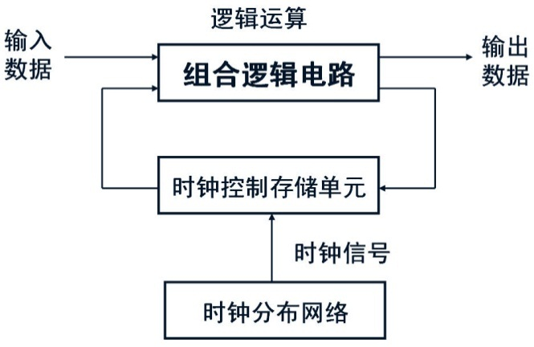

title: 如何用 Markdown + Pandoc 写毕业论文
class: animation-fade
layout: true

.bottom-bar[ {{title}} ]

---

class: impact
## {{title}}

陆伟成

2018-09-11

---

### 摘要

本文用简明的样例，介绍如何使用 Markdown 和 Pandoc 等自动化工具帮你处理数学公式、参考文献引用、图片交叉索引等学术论文写作中常见的棘手问题。

**关键词：** pandoc pandoc-crossref markdown

---

### Abstract

This is a tutorial file for writing a undergraduate thesis using Markdown and `pandoc`.

**Keywords:** pandoc, pandoc-crossref markdown


---

绪论
===========

---

### `pandoc`

Pandoc is a Haskell library for converting from one markup format to another, and a command-line tool that uses this library. It can read Markdown and write Word docx.

---

### `pandoc-crossref` filter

With this filter[^1], you can cross-reference figures (see @fig:figure0), display equations (see @eq:eqn1), tables (see [@tbl:table1]) and sections ([@sec:sec1; @sec:sec2; @sec:caption-attr; @sec:table-capts])

There is also support for code blocks, for example, [@lst:captionAttr; @lst:tableCaption].

Subfigures are supported, see [@fig:subfigures; @fig:subfigureB]

[^1]: This file is generated by the command:

>    pandoc -F pandoc-crossref -F pandoc-citeproc --bibliography=reference.bib --csl=chinese-gb7714-2005-numeric.csl --reference-doc=fd_bylw_t.docx --toc demo.md crossref.yaml -o temp.docx

---

### `pandoc --reference-doc`

Use the specified file as a style reference in producing a docx file. For best
results, the reference docx should be a modified version of a docx file produced using pandoc. The contents of the reference docx are ignored, but its stylesheets and document properties (including margins, page size, header, and footer) are used in the new docx.

---

### List Items

List items may include other lists. In this case the preceding blank line is optional. The nested list must be indented four spaces or one tab:

```markdown
- fruits
    1. apples
        - macintosh
        - red delicious
    2. pears
    3. peaches
- vegetables
    + broccoli
    + chard
```

---

### List Items

Pandoc also pays attention to the type of list marker used, and to the starting number:

```markdown
9) Ninth
10) Tenth
11) Eleventh
    i. subone
    ii. subtwo
    iii. subthree
```

---

### Definition List

Pandoc supports definition lists, using the syntax of PHP Markdown Extra with some extensions.

```markdown
Term 1
: Definition 1

Term 2
: Definition 2
```

---

图、表、公式
============

---

### 图

An image occurring by itself in a paragraph will be rendered as a figure with a caption. 

```markdown
{#fig:figure0}
```
---

### 图

If you just want a regular inline image, just make sure it is not the only thing in the paragraph. One way to do this is to insert a nonbreaking space after the image:

```markdown
\ 
```

---

### 表

Simple tables can be generated using Markdown.

```markdown
|              |      28nm     |      20nm       |
|--------------|:-------------:|:---------------:|
| Fab Costs    | \$3B          |  \$4B - \$7B    |
| Process R&D  | \$1.2B        | \$2.1B - \$3B   |
| Mask Costs   | \$2M - \$3M   | \$5M - \$8M     |
| Design Costs | \$50M - \$90M | \$120M - \$500M |

: Table example {#tbl:table1}
```

---

### 公式

Display equations are labelled and numbered:

```markdown
$$P(x) = \sum_i a_i x^i$$ {#eq:eqn1}
```

```markdown
Those can also appear in the middle of 
paragraph $x^2 = 0$ like this.
```

---

### Code blocks

There are a couple options for code block labels. Those work only if code block id starts with `lst:`, e.g. `{#lst:label}`

---

### `caption` attribute 

`caption` attribute will be treated as code block caption. If code block has both id and `caption` attributes, it will be treated as numbered code block.

~~~markdown
```{#lst:captionAttr .haskell caption="Listing caption A"}
main :: IO ()
main = putStrLn "Hello World!"
```
~~~

---

### Table-style captions

Enabled with `codeBlockCaptions` metadata option. If code block is immediately
adjacent to paragraph, starting with `Listing: ` or `: `, said paragraph will be treated as code block caption.

~~~markdown
Listing: Listing caption B
```{#lst:tableCaption .haskell}
main :: IO ()
main = putStrLn "Hello World!"
```
~~~

---

### Subfigures

It's possible to group figures as subfigures:

```markdown
<div id="fig:subfigures">
{#fig:subfigureA}

{#fig:subfigureB}

Caption of figure
</div>
```

---

### Subfigures

To sum up, subfigures are made with a div having a figure id. Contents of said div consist of several paragraphs. All but last paragraphs contain one subfigure each, with captions, images and (optionally) reference attributes. Last paragraph contains figure caption.

---

### 文献综述

王国成阐述了大数据的特性变迁过程[@王国成2017从]。

其他学者讲述了大数据的价值和处理方式[@于晓龙2014大数据的经济学涵义及价值创造机制;@徐计2015基于粒计算的大数据处理]。

---

### 附表一：`crossref.yaml`

.small[
```yaml
---
cref: False
chapters: True
chaptersDept: 2
codeBlockCaptions: True
figureTitle: "图 "
tableTitle: "表 "
listingTitle: "列表 "
tableTemplate: "*$$tableTitle$$ $$i$$*$$titleDelim$$ $$t$$"
autoSectionLabels: True
figPrefix:
  - "图"
eqnPrefix:
  - "公式"
tblPrefix:
  - "表"
lstPrefix:
  - "列表"
secPrefix:
  - "§"
...
```
]

