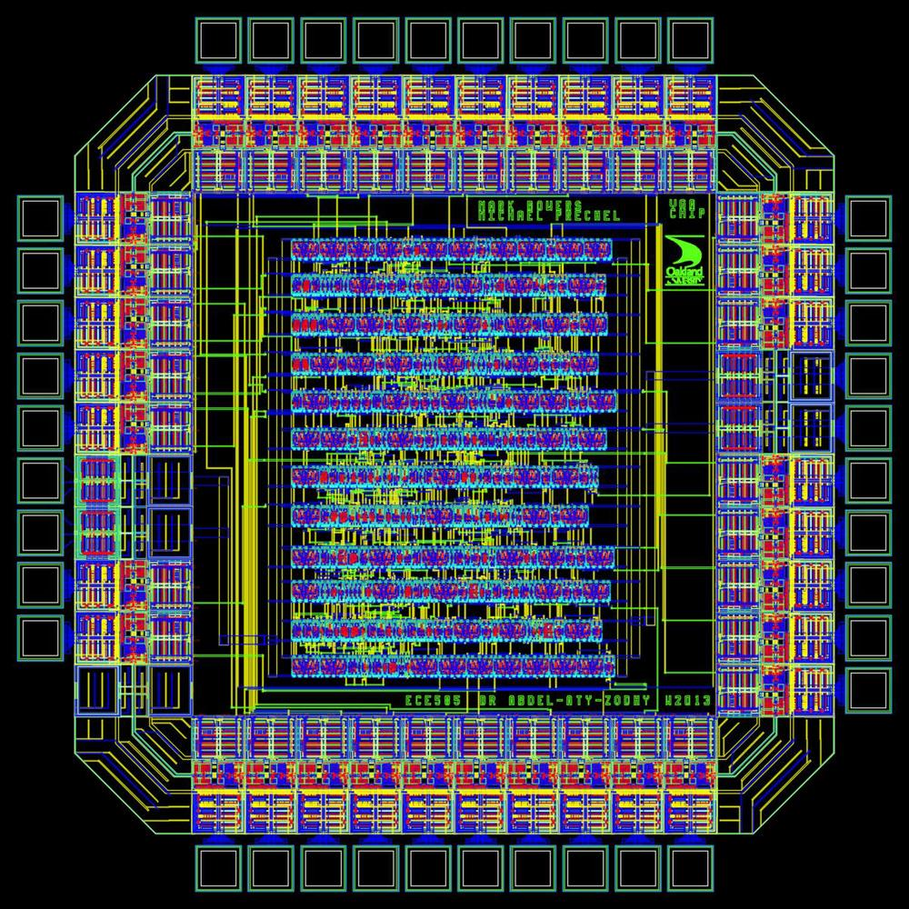

layout: true
class: typo, typo-selection

---

count: false
class: nord-dark, middle, center

# Some thoughts on global placement 💡

## @luk036

2021-10-26

---

## Who should be blamed for the congestion problem?

--

A1. Analytic placer's smooth approximated HPWL is to blame.

- Analytic placer is a wirelength-driven global placer.
- convex -> analytical placement (gradient can be computed analytically)
    - note 1: quadratic approximation: can be solved efficiently by the conjugate gradient method.
    - note 2: non-quadratic approximation: such as log-sum-exp technique.
    - fixed position constraints
    - density constraints
- non-convex -> simulated annealing
- legalization -> detailed placement

--

- But the original objective function has since been used.

---

## Who should be blamed for the congestion problem?

A2. HPWL wirelength model is to blame

--

- But some compensation factor (e.g. Rent's rule) has since been used.

--

A simple fact that has been ignored for 50 years? 🤔

---

## What did I learn from timing optimization?

- "不患寡而患不均"
- "不均" means "unfair", not "unevenness"
- Cantonese: "均真"
- **As long as the objective is to minimize the total wirelength, the problem will not go away.**

---

## How to achieve fairness while reducing total wirelength

- Min-max fairness： minimize the worst wire-length (still convex)
- Min-max is usually (but not always) easier to solve than min-sum.
- Impose proportional fairness by weighted cost
- Related paper:
    A. Kahng, S. Mantik and I. L. Markov, Min-Max Placement For Large-Scale Timing Optimization, ISPD'03. (minimize the worst delay path, non-convex?)

---

## Optimize x- and y-directions separately. Why?

---

---

## Flow-based Optimization

- 1D Placement can be formulated as a network flow (dual) problem
    - Min-sum objective: min-cost flow problem
    - Min-Max objective: parametric network flow problem
    - Advantage:
        - Faster than LP
        - Allow discrete solution
    - Disadvantage:
        - Difficult to impose additional constraints.
- 2D, 3D: alternating directions

---

class: nord-dark, middle, center

Q & A 🗣️️
========
