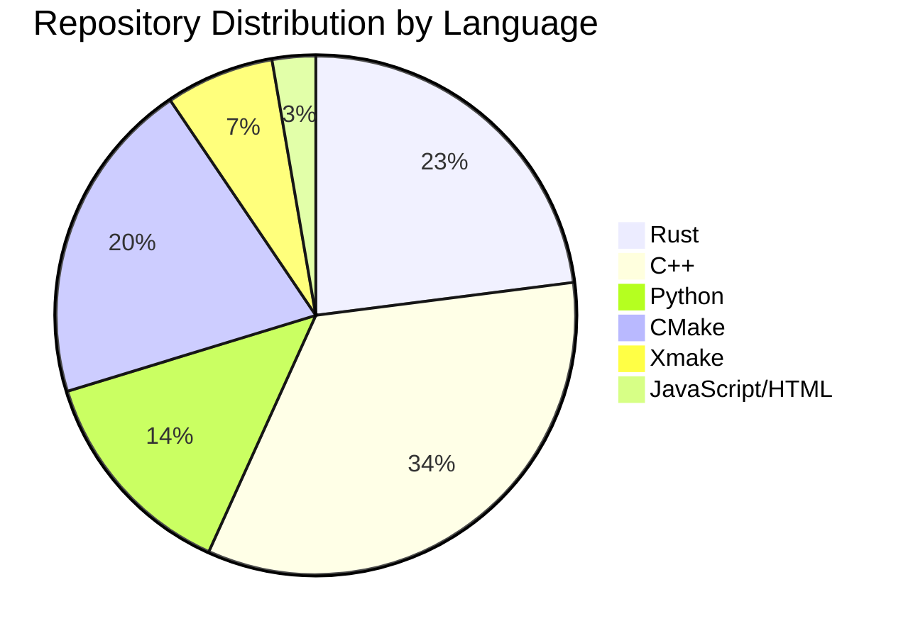
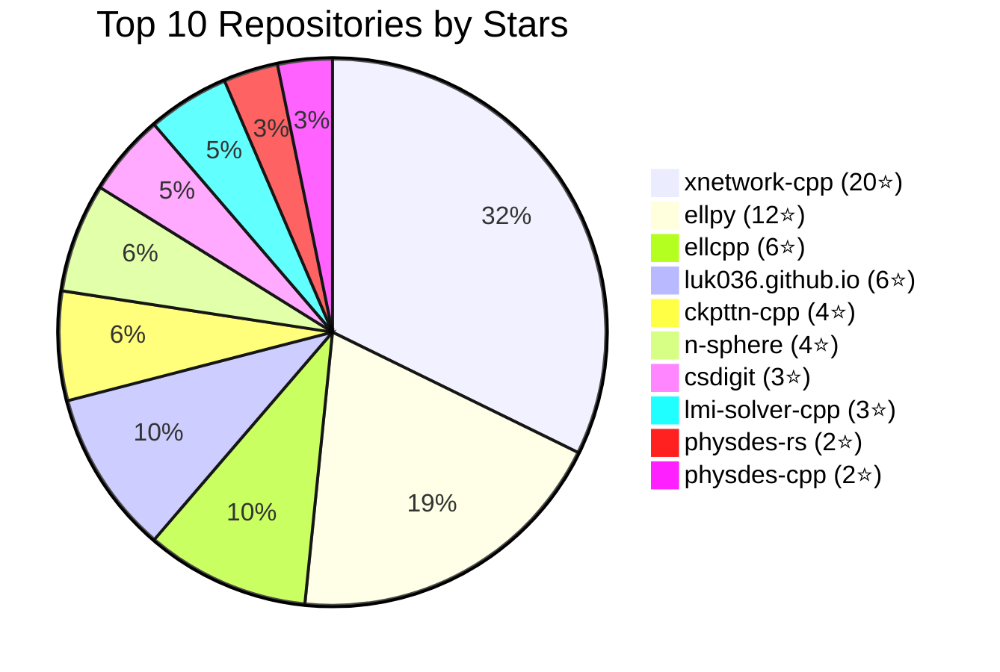
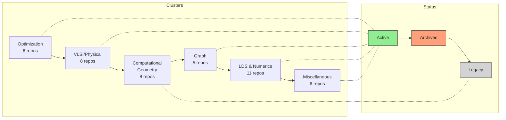
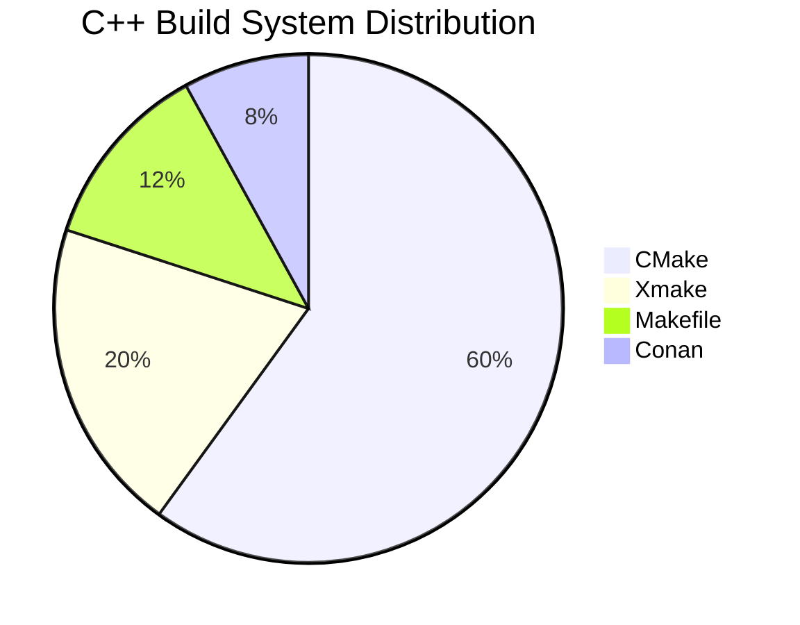
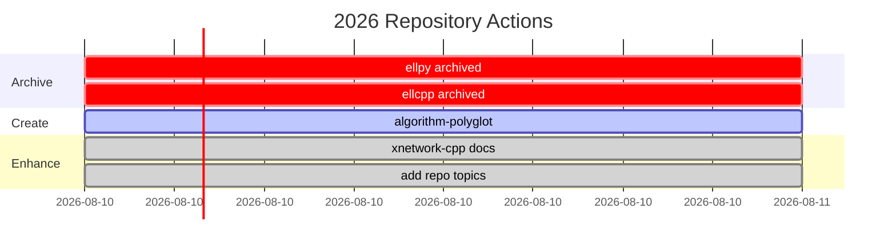
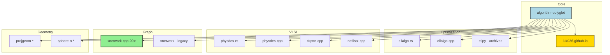

# GitHub Repository Report: luk036

**Generated:** April 3, 2026
**Total Repositories:** ~189
**Active in 2026:** 28 repositories

---

## Executive Summary

This report provides a comprehensive analysis of the GitHub presence for user `luk036`. The repositories span computational mathematics, optimization algorithms, VLSI physical design, and graph algorithms across C++, Rust, and Python.

### Key Findings

1. **Polyglot Strategy**: Multi-language parallel implementations of core algorithms
2. **High Performer**: `xnetwork-cpp` (20⭐) - NetworkX-inspired C++ graph library
3. **Active Migration**: Ongoing Rust porting effort (17+ Rust repos updated in 2026)
4. **Fragmented C++ Ecosystem**: Multiple build systems (CMake, Xmake, Conan)
5. **Legacy Cleanup Needed**: Several repositories predate current work

---

## Repository Overview

### Repository Counts by Language



| Language        | Estimated Repos | Notes                     |
| --------------- | --------------- | ------------------------- |
| Rust            | 17+             | Active development (2026) |
| C++             | 25+             | Multiple build systems    |
| Python          | 10+             | Mixed with C++/JS         |
| CMake           | 15+             | Primary C++ build system  |
| Xmake           | 5+              | Alternative build system  |
| JavaScript/HTML | 2+              | Homepage and docs         |

### Top Performing Repositories



| Repo                                                           | Stars | Language    | Last Push  | Description                     |
| -------------------------------------------------------------- | ----- | ----------- | ---------- | ------------------------------- |
| [xnetwork-cpp](https://github.com/luk036/xnetwork-cpp)         | 20⭐  | C++         | 2026-03-24 | NetworkX-inspired graph library |
| [ellpy](https://github.com/luk036/ellpy)                       | 12⭐  | Python      | 2024-02-12 | **Archived** - Ellipsoid method |
| [ellcpp](https://github.com/luk036/ellcpp)                     | 6⭐   | C++         | 2022-12-01 | **Archived** - Ellipsoid method |
| [luk036.github.io](https://github.com/luk036/luk036.github.io) | 6⭐   | HTML/CSS/JS | 2026-04-02 | Personal homepage               |
| [ckpttn-cpp](https://github.com/luk036/ckpttn-cpp)             | 4⭐   | C++         | 2026-03-23 | Checkpointing algorithms        |
| [n-sphere](https://github.com/luk036/n-sphere)                 | 4⭐   | Python      | 2020-12-24 | LDS on n-sphere                 |
| [csdigit](https://github.com/luk036/csdigit)                   | 3⭐   | -           | 2026-03-20 | Digit conversion                |
| [lmi-solver-cpp](https://github.com/luk036/lmi-solver-cpp)     | 3⭐   | C++         | 2023-05-08 | LMI solver                      |
| [physdes-rs](https://github.com/luk036/physdes-rs)             | 2⭐   | Rust        | 2026-03-30 | Physical design                 |
| [physdes-cpp](https://github.com/luk036/physdes-cpp)           | 2⭐   | C++         | 2026-03-24 | Physical design                 |

---

## Repository Clusters

### Repository Cluster Relationships



### 1. Optimization & Linear Programming

| Repo                   | Languages | Stars | Status       |
| ---------------------- | --------- | ----- | ------------ |
| ellalgo-rs             | Rust      | 1⭐   | Active       |
| ellalgo-cpp            | C++       | 0⭐   | Active       |
| ellpy                  | Python    | 12⭐  | **Archived** |
| lmi-solver-cpp         | C++       | 3⭐   | Active       |
| primal-dual-approx-py  | Python    | 1⭐   | Active       |
| primal-dual-approx-cpp | C++       | 0⭐   | Active       |

**Analysis:** The ellipsoid method implementations show the polyglot strategy in action. The Python version (`ellpy`) was the most popular but is now superseded by the Rust version (`ellalgo-rs`).

### 2. Physical Design / VLSI

| Repo               | Languages | Stars | Status |
| ------------------ | --------- | ----- | ------ |
| physdes-rs         | Rust      | 2⭐   | Active |
| physdes-cpp        | C++       | 2⭐   | Active |
| physdes-py         | Python    | 0⭐   | Active |
| ckpttn-cpp         | C++       | 4⭐   | Active |
| ckpttn-rs          | Rust      | 0⭐   | Active |
| netlistx-cpp       | C++       | 0⭐   | Active |
| netlistx-rs        | Rust      | 0⭐   | Active |
| multiplierless-cpp | C++       | 0⭐   | Active |

**Analysis:** Strong parallel implementation coverage for VLSI physical design algorithms. Circuit partitioning (`ckpttn-*`) and netlist/hypergraph operations (`netlistx-*`) are well-represented.

### 3. Computational Geometry

| Repo         | Languages | Stars | Status |
| ------------ | --------- | ----- | ------ |
| projgeom-rs  | Rust      | 0⭐   | Active |
| projgeom-cpp | C++       | 0⭐   | Active |
| projgeom-py  | Python    | 0⭐   | Active |
| rat-trig-rs  | Rust      | 0⭐   | Active |
| rat-trig-cpp | C++       | 0⭐   | Active |
| sphere-n     | Python    | 4⭐   | Legacy |
| sphere-n-cpp | C++       | 0⭐   | Active |
| sphere-n-rs  | Rust      | 0⭐   | Active |

**Analysis:** Projective geometry and rational trigonometry have C++ and Rust implementations but low visibility. The n-sphere topic has legacy Python code that predates the recent C++/Rust efforts.

### 4. Graph Algorithms

| Repo         | Languages | Stars | Status |
| ------------ | --------- | ----- | ------ |
| xnetwork-cpp | C++       | 20⭐  | Active |
| digraphx-rs  | Rust      | 0⭐   | Active |
| netoptim-cpp | C++       | 0⭐   | Active |
| netoptim-rs  | Rust      | 0⭐   | Active |
| xnetwork     | Python    | 2⭐   | Legacy |

**Analysis:** `xnetwork-cpp` is the standout success story - 20 stars makes it the most popular repo. The directed graph implementations (`digraphx-*`) and network optimization (`netoptim-*`) have parallel C++/Rust coverage.

### 5. Low-Discrepancy Sequences & Numerics

| Repo         | Languages | Stars | Status |
| ------------ | --------- | ----- | ------ |
| lds-rs       | Rust      | 0⭐   | Active |
| lds-cpp      | C++       | 0⭐   | Active |
| lds-py       | Python    | 0⭐   | Active |
| gray-code-rs | Rust      | 0⭐   | Active |
| gray-code    | Python    | 0⭐   | Active |
| csd-rs       | Rust      | 0⭐   | Active |
| csd-cpp      | C++       | 0⭐   | Active |
| fractions-rs | Rust      | 1⭐   | Active |
| ginger-rs    | Rust      | 0⭐   | Active |
| ecgen-rs     | Rust      | 0⭐   | Active |
| ecgen-cpp    | C++       | 0⭐   | Active |

**Analysis:** Strong coverage of numerical algorithms across languages. CSD (Canonical Signed Digit) conversion and ECGen (Enumerative Combinatorial Generation) have full polyglot implementations.

### 6. Miscellaneous

| Repo         | Languages | Stars | Status |
| ------------ | --------- | ----- | ------ |
| mywheel-rs   | Rust      | 1⭐   | Active |
| mywheel-cpp  | C++       | 0⭐   | Active |
| bingo-cpp    | C++       | 0⭐   | Active |
| bingo-py     | Python    | 0⭐   | Active |
| bairstow     | -         | 0⭐   | Active |
| bairstow-cpp | C++       | 0⭐   | Active |

---

## Build System Analysis

### C++ Build Systems



| System   | Repositories | Percentage |
| -------- | ------------ | ---------- |
| CMake    | ~15          | ~60%       |
| Xmake    | ~5           | ~20%       |
| Makefile | ~3           | ~12%       |
| Conan    | ~2           | ~8%        |

**Recommendation:** Standardize on CMake for consistency and wider ecosystem support.

### Rust Infrastructure

All Rust repositories use:

- **Cargo** - Package manager and build tool
- **docs.rs** - Documentation hosting
- **crates.io** - Package registry
- **GitHub Actions** - CI/CD (most have CI workflows)

---

## Repository Health Assessment

### Active Repositories (Updated in 2026)

28 repositories have been updated in 2026, indicating active maintenance:

1. luk036.github.io
2. physdes-py
3. fractions-rs
4. physdes-rs
5. netoptim-rs
6. sphere-n-rs
7. rat-trig-rs
8. projgeom-rs
9. netlistx-rs
10. mywheel-rs
11. lds-rs
12. lds-color
13. gray-code-rs
14. ginger-rs
15. ellalgo-rs
16. ecgen-rs
17. digraphx-rs
18. csd-rs
19. xnetwork-cpp
20. py2cpp
21. projgeom-cpp
22. physdes-cpp
23. netoptim-cpp
24. multiplierless-cpp
25. ellalgo-cpp
26. ecgen-cpp
27. csd-cpp
28. corr-solver-cpp

### Archived Repositories

| Repo   | Archived Date | Reason                    |
| ------ | ------------- | ------------------------- |
| ellpy  | 2026-04-03    | Superseded by ellalgo-rs  |
| ellcpp | 2026-04-03    | Superseded by ellalgo-cpp |

### Legacy Repositories (>1 year old)

Many repositories have not been updated since before 2025:

- ellpy (last: 2024-02) - **Now archived**
- ellcpp (last: 2022-12) - **Now archived**
- xnetwork (Python wrapper)
- n-sphere (2020-12)
- Various xmake/conan variants

---

## Recent Actions Taken

### Recent Actions Taken



### 2026-04-03 Improvements

1. **Created Meta-Repository**

   - [algorithm-polyglot](https://github.com/luk036/algorithm-polyglot)
   - Documents the polyglot implementation strategy
   - Cross-links all parallel implementations

2. **Archived Legacy Code**

   - `ellpy` (superseded by `ellalgo-rs`)
   - `ellcpp` (superseded by `ellalgo-cpp`)

3. **Improved Documentation**

   - Enhanced `xnetwork-cpp` README with features and usage
   - Added cross-links to `physdes-rs`, `ellalgo-rs`, `projgeom-rs`

4. **Added Repository Topics**
   - xnetwork-cpp: graph-algorithms, networkx, cpp, algorithms
   - physdes-rs: algorithms, vlsi, rust, physical-design
   - physdes-cpp: algorithms, vlsi, cpp, physical-design
   - ellalgo-rs: algorithms, optimization, rust, linear-programming
   - netoptim-cpp: algorithms, optimization, cpp, network-flow
   - ckpttn-cpp: algorithms, graph-algorithms, cpp, vlsi
   - And more...

---

## Recommendations

### High Priority

1. **Promote xnetwork-cpp**

   - Most starred repo (20⭐)
   - Needs showcase/benchmark page
   - Consider creating a dedicated website or documentation hub

2. **Standardize C++ Build System**

   - Pick CMake as the single standard
   - Deprecate Xmake variants
   - Migrate existing Xmake projects

3. **Consolidate Build Variants**
   - Merge csd-cpp, csd-xmake, csd-conan into single repo
   - Same for ecgen-_, ellalgo-_, lds-\*, etc.

### Medium Priority

4. **Create Benchmark Dashboard**

   - Compare C++ vs Rust vs Python performance
   - Host on luk036.github.io
   - Updates automatically via CI

5. **Add CI to Remaining Rust Repos**

   - Some repos already have GitHub Actions
   - Ensure consistent CI across all Rust projects

6. **Improve Documentation**
   - Add usage examples to low-star repos
   - Create API documentation pages
   - Add benchmark results

### Low Priority

7. **Star Your Own Repos**

   - Increases discovery ranking
   - Signals active ownership

8. **Create Blog Content**
   - Share algorithm comparisons
   - Document performance insights
   - Host on luk036.github.io

---

## File Structure



```
luk036/
├── algorithm-polyglot/          # Meta-repo (NEW)
├── luk036.github.io/           # Personal homepage
├── xnetwork-cpp/              # Most popular (20⭐)
├── physdes-*/                 # Physical design (3 languages)
├── ellalgo-*/                 # Ellipsoid method (3 languages)
├── netoptim-*/                # Network optimization (2 languages)
├── projgeom-*/                # Projective geometry (3 languages)
├── ckpttn-*/                 # Checkpointing (2 languages)
├── lds-*/                    # Low-discrepancy sequences (3 languages)
├── csd-*/                    # CSD conversion (2 languages)
├── ecgen-*/                  # ECGen (2 languages)
├── netlistx-*/               # Netlist/hypergraph (2 languages)
├── sphere-n-*/               # N-sphere LDS (3 languages)
├── fractions-*/              # Fractions (2 languages)
├── ginger-*/                 # Polynomial root-finding (2 languages)
├── digraphx-*/               # Directed graph (Rust)
├── gray-code-*/              # Gray code (3 languages)
└── [various legacy repos]
```

---

## Appendix: All Repositories by Stars

| Repo                  | Stars |
| --------------------- | ----- |
| xnetwork-cpp          | 20    |
| ellpy                 | 12    |
| ellcpp                | 6     |
| luk036.github.io      | 6     |
| ckpttn-cpp            | 4     |
| n-sphere              | 4     |
| csdigit               | 3     |
| lmi-solver-cpp        | 3     |
| physdes-rs            | 2     |
| physdes-cpp           | 2     |
| xnetwork              | 2     |
| fdbylw                | 2     |
| fractions-rs          | 1     |
| netlistx              | 1     |
| algo4dfm-mdbook       | 1     |
| mywheel-rs            | 1     |
| ellalgo-rs            | 1     |
| primal-dual-approx-py | 1     |
| corr-solver-cpp       | 1     |
| lds-gen-cpp           | 1     |
| + many 0-star repos   |       |

---

## Conclusion

The `luk036` GitHub profile represents a substantial body of work in computational mathematics and algorithms. The polyglot implementation strategy demonstrates expertise across C++, Rust, and Python. Key opportunities include:

1. Better promotion of the highest-performing repositories
2. Consolidation of build variants
3. Standardization of C++ tooling
4. Creation of benchmark and showcase content

The recent creation of the `algorithm-polyglot` meta-repository provides a foundation for better discoverability and documentation of the overall project ecosystem.
