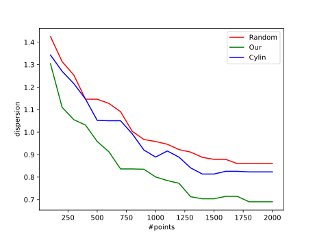

---
title: "Sampling with Halton Points on n-Sphere"
author:
  - "Wai-Shing Luk"
bibliography:
  - "n-sphere.bib"
...

# Abstract

## Abstract

- Sampling on $n$-sphere ($S^n$) has a wide range of applications, such as:

  - Spherical coding in MIMO wireless communication

  - Multivariate empirical mode decomposition

  - Filter bank design

- We propose a simple yet effective method which:

  - Utilizes low-discrepancy sequence

  - Contains only a few lines of Python code in our implementation!

  - Allow incremental generation.

- Numerical results show that the proposed method outperforms the randomly generated sequences and other proposed methods.

# Motivation and Applications

## Problem Formulation

Desirable properties of samples over $S^n$

- Uniform

- Deterministic

- Incremental

  - The uniformity measures are optimized with every new point.

  - Reason: in some applications, it is unknown how many points are needed to solve the problem in advance

## Motivation

- The topic has been well studied for sphere in 3D, i.e. $n=2$

- Yet it is still unknown how to generate for $n > 2$.

- Potential applications (for $n > 2$):

  - Robotic Motion Planning ($S^3$ and SO(3)) [@yershova2010generating]

  - Spherical coding in MIMO wireless communication [@utkovski2006construction]:

    - Cookbook for Unitary matrices

    - A code word = a point in $S^n$

  - Multivariate empirical mode decomposition [@rehman2010multivariate]

  - Filter bank design [@mandic2011filter]

## Halton Sequence on $S^n$

- Halton sequence on $S^2$ has been well studied [@cui1997equidistribution] by using cylindrical coordinates.

- Yet it is still little known for $S^n$ where $n>2$.

- Note: The generalization of cylindrical coordinates does NOT work in higher dimensions.

# Review of Low Discrepancy Sequence

## Basic: Van der Corput sequence

- Generate a low discrepancy sequence over $[0,1]$

- Denote $\mathrm{vdc}(k,b)$ as a Van der Corput sequence of $k$ points, where $b$ is the base of a prime number.

\begin{figure}[hp]
\centering
\input{vdc.tikz}
\caption{Example of Van der Corput sequence}%
\label{fig:vdc}
\end{figure}

## Python 🐍 code

```python
def vdc_basic(n, base=2):
    vdc, denom = 0.0, 1.0
    while n:
        denom *= base
        n, remainder = divmod(n, base)
        vdc += remainder / denom
    return vdc

def vdc(n, base=2):
    '''
    n - number of vectors
    base - seeds
    '''
    for i in range(n):
        yield vdc_basic(i, base)
```

## Halton sequence on $[0,1]$

\columnsbegin

\col{0.45\textwidth}

- Halton sequence: using 2 Van der Corput sequences with different bases.

- Example:
  $$[x,y] = [\mathrm{vdc}(k,2), \mathrm{vdc}(k,3)]$$

\col{0.45\textwidth}

\begin{figure}[hp]
\centering
\input{halton.tikz}
\caption{Example of Halton sequnce}%
\label{fig:halton}
\end{figure}

\columnsend

## Halton sequence on $[0,1]^n$

- Generally we can generate Halton sequence in a unit hypercube $[0,1]^n$:

  $$[x_1, x_2, \ldots, x_n] = [\mathrm{vdc}(k,b_1), \mathrm{vdc}(k,b_2), \ldots, \mathrm{vdc}(k,b_n)]$$

- A wide range of applications on Quasi-Monte Carlo Methods (QMC).

## Unit Circle $S^1$

\columnsbegin

\col{0.6\textwidth}

Can be generated by mapping the Van der Corput sequence to $[0, 2\pi]$

- $\theta = 2\pi \cdot \mathrm{vdc}(k,b)$

- $[x, y] = [\cos\theta, \sin\theta]$

\col{0.4\textwidth}

\begin{figure}[hp]
\centering
\input{circle.tikz}
\caption{Sequnce mapping to a unit circle}%
\label{fig:circle}
\end{figure}

\columnsend

## Unit Sphere $S^2$

\columnsbegin

\col{0.6\textwidth}

Has been applied for computer graphic applications [@wong1997sampling]

- Use cylindrical mapping.
- $[z, x, y]$\
  = $[\cos\theta, \sin\theta\cos\varphi, \sin\theta\sin\varphi]$\
  = $[z, \sqrt{1-z^2}\cos\varphi, \sqrt{1-z^2}\sin\varphi]$

- $\varphi = 2\pi\cdot\mathrm{vdc}(k,b_1)$ % map to $[0,2\pi]$

- $z = 2\cdot\mathrm{vdc}(k,b_2) - 1$ % map to $[-1,1]$

\col{0.4\textwidth}

{width="80%"}

\columnsend

## Sphere $S^n$ and SO(3) {#sub:sphere*s_n_and_so_3*}

- Deterministic point sets

  - Optimal grid point sets for $S^3$, SO(3) [@mitchell2008sampling;@yershova2010generating]

- No Halton sequences so far to the best of our knowledge.

- Note that cylindrical mapping method cannot be extended to higher dimensions.

## SO(3) or $S^3$ Hopf Coordinates

\columnsbegin

\col{0.6\textwidth}

- Hopf coordinates (cf. [@yershova2010generating])

  - $x_1 = \cos(\theta/2) \cos(\psi/2)$

  - $x_2 = \cos(\theta/2) \sin(\psi/2)$

  - $x_3 = \sin(\theta/2) \cos(\varphi + \psi/2)$

  - $x_4 = \sin(\theta/2) \sin(\varphi + \psi/2)$

- $S^3$ is a principal circle bundle over the $S^2$

\col{0.4\textwidth}

{width="80%"}

\columnsend

## Hopf Coordinates for SO(3) or $S^3$

Similar to the Halton sequence generation on $S^2$, we perform the mapping:

- $\varphi = 2\pi\cdot\mathrm{vdc}(k,b_1)$ % map to $[0,2\pi]$

- $\psi = 2\pi\cdot\mathrm{vdc}(k,b_2)$ % map to $[0,2\pi]$ for SO(3), or

- $\psi = 4\pi\cdot\mathrm{vdc}(k,b_2)$ % map to $[0,4\pi]$ for $S^3$

- $z = 2\cdot\mathrm{vdc}(k,b_3) - 1$ % map to $[-1,1]$

- $\theta = \cos^{-1}z$

## Python Code

```python
def sphere3_hopf(k, b):
    vd = zip(vdc(k, b[0]), vdc(k, b[1]), vdc(k, b[2]))
    for vd0, vd1, vd2 in vd:
        phi = 2*math.pi*vd0   # map to [0, 2*math.pi]
        psy = 4*math.pi*vd1   # map to [0, 4*math.pi]
        z = 2*vd2 - 1         # map to [-1., 1.]
        theta = math.acos(z)
        cos_eta = math.cos(theta/2)
        sin_eta = math.sin(theta/2)
        s = [cos_eta * math.cos(psy/2),
             cos_eta * math.sin(psy/2),
             sin_eta * math.cos(phi + psy/2),
             sin_eta * math.sin(phi + psy/2)]
        yield s
```

# Our approach

## 3-sphere

- Polar coordinates:

  - $x_0 = \cos\theta_3$

  - $x_1 = \sin\theta_3 \cos\theta_2$

  - $x_2 = \sin\theta_3 \sin\theta_2 \cos\theta_1$

  - $x_3 = \sin\theta_3 \sin\theta_2 \sin\theta_1$

- Spherical surface element:

  $$dA  = \sin^{2}(\theta_3)\sin(\theta_2)\,d\theta_1 \, d\theta_2 d\theta_3$$

## n-sphere

- Polar coordinates:

  - $x_0 = \cos\theta_n$

  - $x_1 = \sin\theta_n \cos\theta_{n-1}$

  - $x_2 = \sin\theta_n \sin\theta_{n-1} \cos\theta_{n-2}$

  - $x_3 = \sin\theta_n \sin\theta_{n-1} \sin\theta_{n-2} \cos\theta_{n-3}$

  - $\cdots$

  - $x_{n-1} = \sin\theta_n \sin\theta_{n-1} \sin\theta_{n-2} \cdots \cos\theta_1$

  - $x_n = \sin\theta_n \sin\theta_{n-1} \sin\theta_{n-2} \cdots \sin\theta_1$

- Spherical surface element:

  $$d^nA  = \sin^{n-2}(\theta_{n-1})\sin^{n-1}(\theta_{n-2})\cdots \sin(\theta_{2})\,d\theta_1 \, d\theta_2\cdots d\theta_{n-1}$$

## How to Generate the Point Set

- $p_0 = [\cos\theta_1, \sin\theta_1]$ where $\theta_1 = 2\pi\cdot\mathrm{vdc}(k,b_1)$

- Let $f_j(\theta)$ = $\int\sin^j\theta \mathrm{d}\theta$, where $\theta\in (0,\pi)$.\

  - Note 1: $f_j(\theta)$ can be defined recursively as:

    $$
    f_j(\theta) =
    \begin{cases}
      \theta          & \text{if } j = 0 , \\
      -\cos\theta     & \text{if } j = 1 , \\
      (1/n)( -\cos\theta \sin^{j-1}\theta + (n-1)\int\sin^{j-2}\theta \mathrm{d}\theta) & \text{otherwise}.
    \end{cases}
    $$

  - Note 2: $f_j(\theta)$ is a monotonic increasing function in $(0,\pi)$

- Map $\mathrm{vdc}(k,b_j)$ uniformly to $f_j(\theta)$:\
  $t_j = f_j(0) + (f_j(\pi) - f_j(0)) \mathrm{vdc}(k,b_j)$

- Let $\theta_j = f_j^{-1}(t_j)$

- Define $p_n$ recursively as:\
  $p_n = [\cos\theta_n, \sin\theta_n \cdot p_{n-1}]$

# Numerical Experiments

## Testing the Correctness

- Compare the dispersion with the random point-set

  - Construct the convex hull for each point-set

  - Dispersion roughly measured by the difference of the maximum distance and the minimum distance between every two neighbour points:
    $$
    \max_{a \in \mathcal{N}(b)} \{D(a,b)\} -
                \min_{a \in \mathcal{N}(b)} \{ D(a, b) \}
    $$
    where $D(a,b) = \sqrt{1 - a^\mathsf{T} b}$

## Random sequences

- To generate random points on $S^n$, spherical symmetry of the multidimensional Gaussian density function can be exploited.

- Then the normalized vector ($x_i/\|x_i\|$) is uniformly distributed over the hypersphere $S^n$. (Fishman, G. F. (1996))

## Convex Hull with $600$ points


Left: our, right: random

## Result for $S^3$

Compared with Hopf coordinate method.

{width="90%"}

## Result for $S^3$ (II)

Compared with cylindrical mapping method.

{width="90%"}

## Result for $S^4$

Compared with cylindrical mapping method

{width="90%"}

# Conclusions

## Conclusions

- Proposed method generates low-discrepancy point-set in nearly linear time

- The result outperforms the corresponding random point-set, especially when the number of points is small

- Python code is available at [here](http://github.com/luk036/n-sphere/)

## References {.allowframebreaks}
