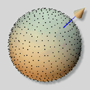

# Low Discrepancy Sampling Method on higher dimensional Spheres

@luk036

---

## Abstract

This notes presents a discussion of the generation of low discrepancy sampling methods for n-dimensional spheres. Low discrepancy sequences are important and have been used in a variety of applications, including numerical integration, optimization, and simulation. This paper addresses the desirable properties of samples over an n-sphere, including uniformity, determinism, and incrementality. Subsequently, the proposed method for generating low discrepancy sequences over higher dimensional sphere is presented, which is based on the van der Corput sequence. We provide a comprehensive account of the algorithm and its implementation. Furthermore, the paper presents the results of numerical experiments conducted to evaluate the performance of the proposed method, including a comparison with randomly generated sequences and other proposed methods such as the Hopf coordinate method and the cylindrical coordinate method.

---

## Motivation

- Low discrepancy sequences (LDS) play a pivotal role in numerous fields of mathematics, computer science, and engineering. These sequences.

- While low discrepancy sampling methods have been extensively studied in lower dimensions, there is an increasing need for efficient sampling techniques in higher dimensions.

---

## Advantages over random sampling methods

- Uniform distribution: They provide a uniform distribution of points, which reduces the occurrence of computational errors in a variety of applications.

- Determinism: They provide a deterministic sequence of points, which is essential for reproducibility and consistency in simulations and experiments.

- Incrementality: They allow for the efficient addition of new points to an existing sequence, which is useful in applications where the number of points required to solve a problem is not known in advance.

---

## Advantages over random sampling methods

{width="80%"}

---

## Potential Applications

- Robot Motion Planning [@yershova2010generating]: In high-dimensional spaces such as $S^3$ and $SO(3)$, Halton sequences provide uniformly distributed point sets, which are suitable for robot path planning and attitude control. This allows for the optimization of computational efficiency and the accuracy of motion trajectories.

- Wireless Communication Coding [@utkovski2006construction]: Spherical coding in MIMO systems employs the dots generated by Halton sequences as codewords to enhance the stability and anti-interference capacity of signal transmission, and to improve the data transmission rate and quality.

- Multivariate Empirical Mode Decomposition [@rehman2010multivariate]: In multivariate empirical mode decomposition, Halton sequences can be used to construct more accurate signal models and improve the accuracy of signal processing.

- Filter Bank Design [@mandic2011filter]: In the context of filter bank design, the utilization of Halton sequences has the potential to facilitate the construction of more precise filter parameters, thereby enhancing the accuracy of signal processing.

---

# Overview of Low Discrepancy Sequences

---

## Basic: van der Corput sequence

The van der Corput sequence is a mathematical sequence that is employed to generate a series of evenly distributed numbers between 0 and 1. This function is of particular utility in a multitude of fields, including but not limited to computer graphics and numerical analysis. The van der Corput sequence is a low-discrepancy sequence used to generate uniformly distributed points in the interval [0,1]. It is constructed by means of a specific base (usually prime).

\begin{figure}[hp]
\centering
\input{vdc.tikz}
\caption{Example of van der Corput sequence}%
\label{fig:vdc}
\end{figure}

---

## Python Implementation

```python
def vdc(k: int, base: int = 2) -> float:
    res = 0.0
    denom = 1.0
    while k != 0:
        denom *= base
        remainder = k % base
        k //= base
        res += remainder / denom
    return res
```

---

## VdCorput class

```python
class VdCorput:
    def __init__(self, base: int = 2) -> None:
        self.count = 0
        self.base = base

    def pop(self) -> float:
        self.count += 1  # ignore 0
        return vdc(self.count, self.base)

    def reseed(self, seed: int) -> None:
        self.count = seed
```

---

## Halton sequence on $[0,1]^2$

The Halton sequence is a deterministic sequence of points that are distributed uniformly in a multidimensional space. The Halton sequence is named after the mathematicians Halton and Rutishauser, who developed it in the 1960s. The Halton sequence is constructed by combining two or more the van der Corput sequences, which are generated using different prime numbers as the base. 

\begin{figure}[hp]
\centering
\input{halton.tikz}
\caption{Example of Halton sequnce}%
\label{fig:halton}
\end{figure}

---

## Python Implementation

```python
from typing import List, Sequence

class Halton:
    def __init__(self, base: Sequence[int]) -> None:
        self.vdc0 = VdCorput(base[0])
        self.vdc1 = VdCorput(base[1])

    def pop(self) -> List[float]:
        return [self.vdc0.pop(), self.vdc1.pop()]

    def reseed(self, seed: int) -> None: ...
```

---

## Halton sequence on $[0,1]^n$

The concept of the Halton sequence can be extended to higher dimensions through the combination of multiple one-dimensional sequences, each generated using a distinct prime number as the base. This approach permits the generation of points that are distributed uniformly in a multidimensional space. There are a multitude of potential applications for quasi-Monte Carlo methods (QMC).

---

## Python Implementation

```python
class HaltonN:
    def __init__(self, base: Sequence[int]) -> None:
        self.vdcs = [VdCorput(b) for b in base]

    def pop(self) -> List[float]:
        return [vdc.pop() for vdc in self.vdcs]

    def reseed(self, seed: int) -> None:
        for vdc in self.vdcs:
            vdc.reseed(seed)
```

---

## Unit Circle $S^1$

The concept of the Halton sequence can be extended to generate points on a unit circle in a two-dimensional space. The objective of this study is to present a method for generating a sequence of points distributed uniformly around a circle. The objective is to utilize the van der Corput sequence as a foundation for the generation of points on a circle. In order to fulfill its intended function, the Circle class employs the following logical structure:


\begin{figure}[hp]
\centering
\input{circle.tikz}
\caption{Sequnce mapping to a unit circle}%
\label{fig:circle}
\end{figure}

---

## Python Implementation

```python
from math import cos, pi, sin, sqrt
TWO_PI = 2.0 * pi

class Circle:
    def __init__(self, base: int) -> None:
        self.vdc = VdCorput(base)

    def pop(self) -> List[float]:
        theta = self.vdc.pop() * TWO_PI  # map to [0, 2π]
        return [cos(theta), sin(theta)]
```

---

## Unit Sphere $S^2$

The concept of the Halton sequence can be extended to generate points on the surface of a unit sphere (a sphere with a radius of 1). The objective is to provide a method for generating a sequence of points on a sphere's surface that are distributed in an even manner. The Sphere class has been applied in computer graphics applications [@wong1997sampling].

{width="80%"}

---

## How to generate Unit Sphere $S^2$

To achieve its purpose, the Sphere class employs a sophisticated algorithm that combines one-dimensional and two-dimensional sequences to generate a three-dimensional point. The following is an explanation of the method of operation.

1. The VdCorput generator is employed to generate a value between 0 and 1, which is then transformed to a value between -1 and 1. This value subsequently becomes the z-coordinate, representing the up-down position on the sphere.

2. The radius of the horizontal circle at the specified z-position is then calculated using the cylindrical mapping formula.

  - $[z, x, y]$\
    = $[\cos\theta, \sin\theta\cos\varphi, \sin\theta\sin\varphi]$\
    = $[z, \sqrt{1-z^2}\cos\varphi, \sqrt{1-z^2}\sin\varphi]$

  - $\varphi = 2\pi\cdot\mathrm{vdc}(k,b_1)$ % map to $[0,2\pi]$

  - $z = 2\cdot\mathrm{vdc}(k,b_2) - 1$ % map to $[-1,1]$

3. Subsequently, the Circle generator is employed to obtain a point on the aforementioned horizontal circle, thereby providing the x and y coordinates.

---

## Python Implementation

```python
class Sphere:
    def __init__(self, base: Sequence[int]) -> None:
        self.vdc = VdCorput(base[0])
        self.cirgen = Circle(base[1])

    def pop(self) -> List[float]:
        cosphi = 2.0 * self.vdc.pop() - 1.0  # map to [-1, 1]
        sinphi = sqrt(1.0 - cosphi * cosphi)  # cylindrical mapping
        [costheta, sintheta] = self.cirgen.pop()
        return [sinphi * costheta, sinphi * sintheta, cosphi]
```

---

## $S^3$ and SO(3)

- The concept may be extended to generate points on a four-dimensional sphere (also known as a three-sphere) through 

- The application of a mathematical technique known as the Hopf fibration [@mitchell2008sampling; @yershova2010generating]. 

- The objective of the original paper is to generate optimal deterministic grid point sets for $S^3$, SO(3). 

- It should be noted that the cylindrical mapping method is not applicable in higher dimensions.

---

## How to generate $S^3$ and SO(3)

In order to achieve its intended purpose, the class employs the use of three van der Corput sequences (implemented by the VdCorput class, which is not shown in this algorithm snippet) to generate values between 0 and 1. These values are then transformed through the application of trigonometric functions and square roots, with the objective of mapping them onto the surface of the 3-sphere.

- Hopf coordinates (cf. [@yershova2010generating])
  - $x_1 = \cos(\theta/2) \cos(\psi/2)$
  - $x_2 = \cos(\theta/2) \sin(\psi/2)$
  - $x_3 = \sin(\theta/2) \cos(\varphi + \psi/2)$
  - $x_4 = \sin(\theta/2) \sin(\varphi + \psi/2)$
- $S^3$ is a principal circle bundle over the $S^2$

---

Similar to the Halton sequence generation on $S^2$, we perform the mapping:

- $\varphi = 2\pi\cdot\mathrm{vdc}(k,b_1)$ % map to $[0,2\pi]$
- $\psi = 2\pi\cdot\mathrm{vdc}(k,b_2)$ % map to $[0,2\pi]$ for SO(3), or
- $\psi = 4\pi\cdot\mathrm{vdc}(k,b_2)$ % map to $[0,4\pi]$ for $S^3$
- $z = 2\cdot\mathrm{vdc}(k,b_3) - 1$ % map to $[-1,1]$
- $\theta = \cos^{-1}z$

---

## Python Implementation

```python
class Sphere3Hopf:
    def __init__(self, base: Sequence[int]) -> None:
        self.vdc0 = VdCorput(base[0])
        self.vdc1 = VdCorput(base[1])
        self.vdc2 = VdCorput(base[2])

    def pop(self) -> List[float]:
        phi = self.vdc0.pop() * TWO_PI  # map to [0, 2π]
        psy = self.vdc1.pop() * TWO_PI  # map to [0, 2π]
        vdc = self.vdc2.pop()
        cos_eta = sqrt(vdc)
        sin_eta = sqrt(1.0 - vdc)
        return [
            cos_eta * cos(psy),
            cos_eta * sin(psy),
            sin_eta * cos(phi + psy),
            sin_eta * sin(phi + psy),
        ]
```

# Our approach

---

## 3-sphere

This algorithm is part of a Sphere N Generator, which is designed to create points on the surface of spheres in different dimensions. It's a tool that could be used by people working with 3D graphics or mathematical simulations.

The main input for this algorithm is a list of integers, which are used as bases for generating sequences of numbers. These bases are used to initialize different types of generators that create points on spheres.

The output of this algorithm is a series of lists containing floating-point numbers. Each list represents a point on the surface of a sphere, with the number of elements in the list corresponding to the dimension of the sphere.

To achieve its purpose, the algorithm starts by defining some constants and helper functions that are used in the calculations. These functions (get_tp_odd, get_tp_even, and get_tp) create lookup tables for mapping values in different dimensions.

The algorithm then defines two main classes:

1. SphereGen: This is a template class that defines what methods all sphere generators should have.

2. Sphere3: This class generates points on a 4-dimensional sphere. It uses a combination of special sequences (van der Corput and 3-dimensional sphere points) to create 4D points.

The Sphere3 class has methods to generate new points (pop) and to reset the generator with a new starting point (reseed).

---

## Unit Sphere $S^3$

- Polar coordinates:

  - $x_0 = \cos\theta_3$

  - $x_1 = \sin\theta_3 \cos\theta_2$

  - $x_2 = \sin\theta_3 \sin\theta_2 \cos\theta_1$

  - $x_3 = \sin\theta_3 \sin\theta_2 \sin\theta_1$

- Spherical surface element:

  $$dA  = \sin^{2}(\theta_3)\sin(\theta_2)\,d\theta_1 \, d\theta_2 d\theta_3$$

---

## Python Implementation

```python
X: np.ndarray = np.linspace(0.0, PI, 300)
NEG_COSINE: np.ndarray = -np.cos(X)
SINE: np.ndarray = np.sin(X)
F2: np.ndarray = (X + NEG_COSINE * SINE) / 2.0

class Sphere3(SphereGen):
    def __init__(self, base: List[int]) -> None:
        self.vdc = VdCorput(base[0])
        self.sphere2 = Sphere(base[1:3])

    def pop(self) -> List[float]:
        ti = PI * self.vdc.pop()  # map to [0, π]
        xi = np.interp(ti, F2, X)
        cosxi = math.cos(xi)
        sinxi = math.sin(xi)
        return [sinxi * s for s in self.sphere2.pop()] + [cosxi]
```

---

## n-sphere

This algorithm defines a class called SphereN, which is designed to generate points on the surface of a sphere in any number of dimensions (3 or more). The purpose of this class is to provide a way to create evenly distributed points on a high-dimensional sphere, which can be useful in various mathematical and scientific applications.

The SphereN class takes a list of integers as input when it's created. These integers are used as bases for generating sequences of numbers that will be transformed into points on the sphere. The main output of this class is a list of floating-point numbers, where each list represents a point on the surface of the sphere.

To achieve its purpose, the SphereN class uses a recursive approach. It creates a sphere in a higher dimension by combining a lower-dimensional sphere with an additional coordinate. For example, to create a 4-dimensional sphere, it uses a 3-dimensional sphere and adds one more coordinate.

The key logic in this algorithm involves transforming numbers from one range to another and using trigonometric functions (sine and cosine) to map these numbers onto the surface of a sphere. It uses a technique called interpolation to smoothly transition between values.

An important aspect of this algorithm is its recursive nature. For dimensions higher than 3, it creates a chain of SphereN objects, each handling one dimension and relying on the next one down for the lower dimensions. This allows it to generate points on spheres of any dimension, limited only by the computer's memory and processing power.

---

## Unit N-Sphere $S^n$

- Polar coordinates:

  - $x_0 = \cos\theta_n$

  - $x_1 = \sin\theta_n \cos\theta_{n-1}$

  - $x_2 = \sin\theta_n \sin\theta_{n-1} \cos\theta_{n-2}$

  - $x_3 = \sin\theta_n \sin\theta_{n-1} \sin\theta_{n-2} \cos\theta_{n-3}$

  - $\cdots$

  - $x_{n-1} = \sin\theta_n \sin\theta_{n-1} \sin\theta_{n-2} \cdots \cos\theta_1$

  - $x_n = \sin\theta_n \sin\theta_{n-1} \sin\theta_{n-2} \cdots \sin\theta_1$

- Spherical surface element:

  $$d^nA  = \sin^{n-2}(\theta_{n-1})\sin^{n-1}(\theta_{n-2})\cdots \sin(\theta_{2})\,d\theta_1 \, d\theta_2\cdots d\theta_{n-1}$$

---

## How to Generate the Point Set

- $p_0 = [\cos\theta_1, \sin\theta_1]$ where
  $\theta_1 = 2\pi\cdot\mathrm{vdc}(k,b_1)$

- Let $f_j(\theta)$ = $\int\sin^j\theta \mathrm{d}\theta$, where
  $\theta\in (0,\pi)$.\

  - Note 1: $f_j(\theta)$ can be defined recursively as:

    $$
    f_j(\theta) =
    \begin{cases}
      \theta          & \text{if } j = 0 , \\
      -\cos\theta     & \text{if } j = 1 , \\
      (1/n)( -\cos\theta \sin^{j-1}\theta + (n-1)\int\sin^{j-2}\theta \mathrm{d}\theta) & \text{otherwise}.
    \end{cases}

          (1/3)( -\cos\theta \sin^2\theta - 2 \cos\theta)
          (-1/3) \cos\theta (3 - \cos^2\theta)

    $$

  - Note 2: $f_j(\theta)$ is a monotonic increasing function in
    $(0,\pi)$

- Map $\mathrm{vdc}(k,b_j)$ uniformly to $f_j(\theta)$:\
  $t_j = f_j(0) + (f_j(\pi) - f_j(0)) \mathrm{vdc}(k,b_j)$

- Let $\theta_j = f_j^{-1}(t_j)$

- Define $p_n$ recursively as:\
  $p_n = [\cos\theta_n, \sin\theta_n \cdot p_{n-1}]$

---

# Numerical Experiments

The objective of this experiment is to serve as a test suite for the evaluation of disparate methods for the generation of points on the surface of a high-dimensional sphere. The experiment is comprised of three principal components: the generation of random points, the calculation of a dispersion measure, and the execution of tests on disparate point generation methods.

The primary objective of this experiment is to evaluate and contrast the quality of point distributions on a sphere, employing both random generation and low-discrepancy sequences (LDS). This is accomplished by first generating a set of points, then constructing a convex hull from those points, and finally calculating a dispersion measure based on the triangles formed by the hull.

  - Dispersion roughly measured by the difference of the maximum
    distance and the minimum distance between every two neighbour
    points: $$
        \max_{a \in \mathcal{N}(b)} \{D(a,b)\} -
                    \min_{a \in \mathcal{N}(b)} \{ D(a, b) \}
        $$ where $D(a,b) = \sqrt{1 - a^\mathsf{T} b}$
  - The convex hull is constructed using the scipy.spatial.ConvexHull function.

The experiment does not accept any direct inputs from the user. In lieu of user input, the experiment utilizes predefined parameters, including the number of points to be generated (600) and the dimensionality of the sphere (5D in the random case and 4D in the LDS cases).

The primary outputs are the dispersion measures calculated for each method. Subsequently, the aforementioned measures are subjected to a comparative analysis with the anticipated values inherent to the test functions.

The experiment is designed to achieve its stated objective through a series of steps.

1. Subsequently, a function, designated as "discrep_2," is defined which calculates a dispersion measure for a given set of points. This measure is based on the minimum and maximum angles between pairs of points in each simplex (triangle in higher dimensions) of the convex hull.

2. The program includes a function, random_point_on_sphere, which generates a random point on the surface of a sphere in any number of dimensions.

3. The run_random function generates 600 random points on a 5D sphere, constructs a convex hull, and computes the dispersion measure. To generate random points on $S^n$, the spherical symmetry of the multidimensional Gaussian density function can be exploited. This results in a normalized vector ($x_i/\|x_i\|$) that is uniformly distributed over the hypersphere $S^n$. (Fishman, G. F. (1996))

4. The run_lds function performs the same operations, but utilizes a provided generator (either SphereN or CylindN) to create the points in the aforementioned manner.

5. Finally, there are three test functions that execute these methods and compare the results to expected values:
- test_random verifies the random point generation
- test_sphere_n validates the SphereN generator
- test_cylind_n assesses the CylindN generator

The key logic flow involves generating points, creating a convex hull, and then calculating the dispersion measure. The dispersion measure itself involves finding the minimum and maximum angles between pairs of points in each simplex of the hull.

This experiment is important because it allows comparison between random and deterministic (LDS) methods of generating points on a sphere, which can be crucial in various scientific and mathematical applications where uniform distribution of points is needed.

---


---

{width="90%"}

---

{width="90%"}

---

{width="90%"}

---

## Conclusions

This paper provides a comprehensive discussion of low discrepancy sampling methods for n-dimensional spheres. It introduces a proposed methodology for generating low-discrepancy sequences on n-dimensional spheres based on the van der Corput sequence, addressing challenges associated with high-dimensional sampling while maintaining desirable properties. The paper outlines key concepts such as the van der Corput sequence, Halton sequence, and their applications to unit circles, unit spheres, and higher-dimensional spaces. The document provides detailed explanations and implementations of algorithms for generating points on various dimensional spheres, including the use of Hopf fibration for four-dimensional spheres.

---

## Future Work

The proposed method represents a valuable contribution to the field of low-discrepancy sequences and has the potential to be applied in a variety of applications. The method is both efficient and capable of generating point sets with a high degree of uniformity. The method can be employed in the generation of point sets for a variety of applications, including Monte Carlo simulations, optimization, and machine learning. Moreover, the method is uncomplicated to implement and can be employed by researchers and practitioners alike.

---

## References {#references .allowframebreaks}
