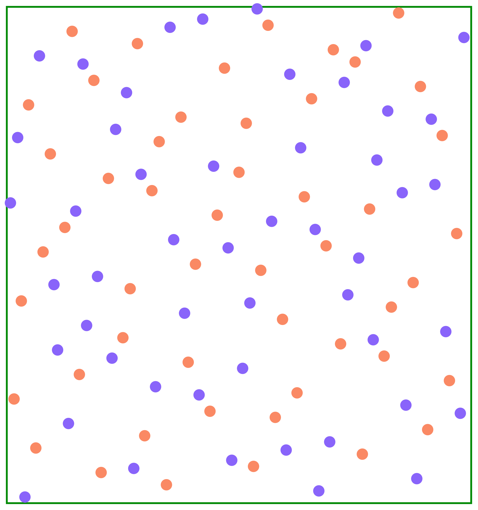
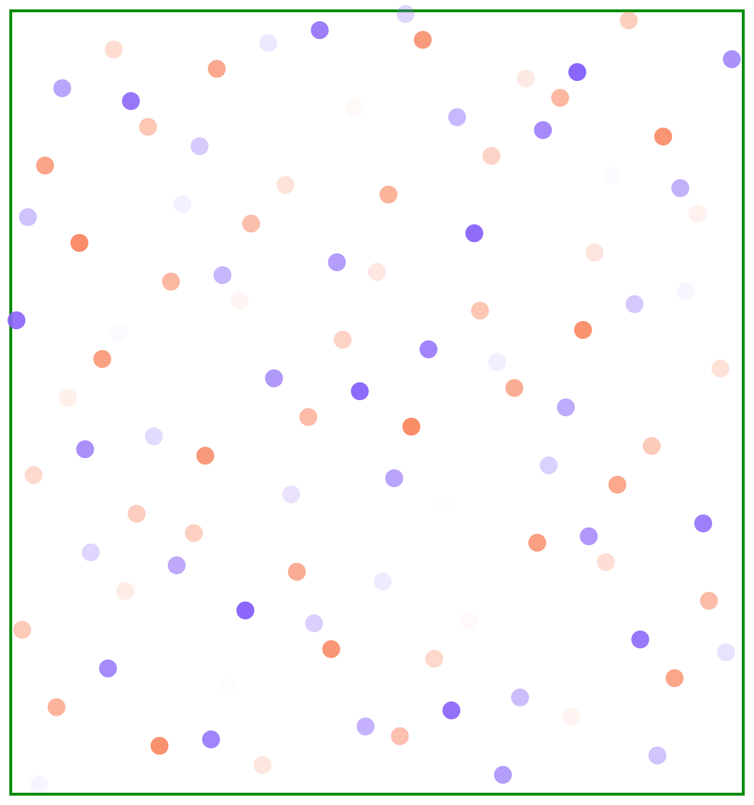
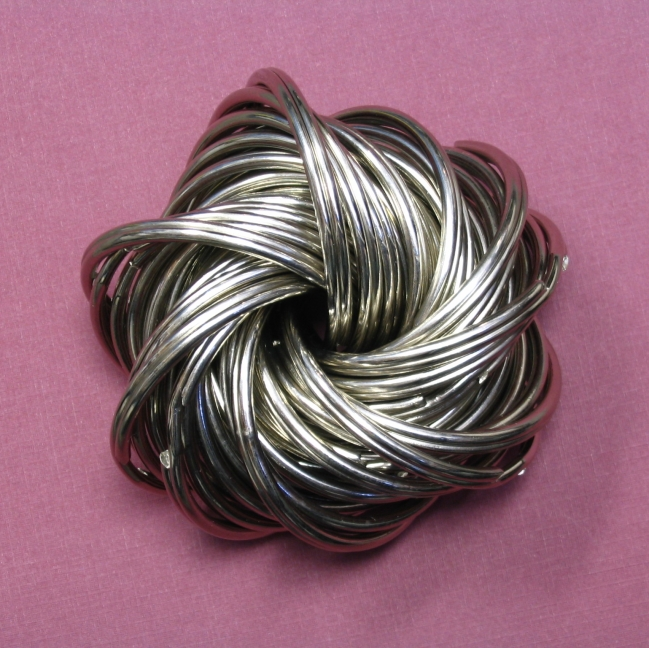
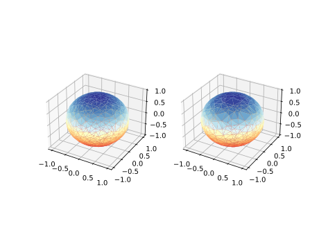
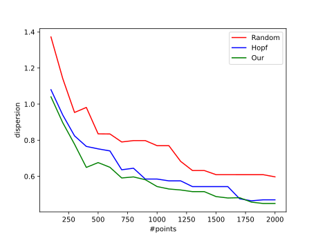
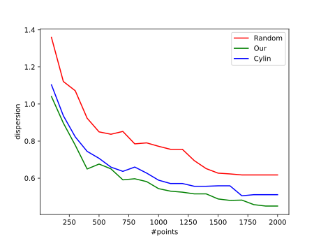
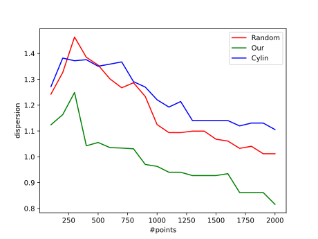

# Low Discrepancy Sampling Method on Hyperspheres ⚽

@luk036 👨‍💻

[](https://codecov.io/gh/luk036/sphere-n)
[](https://sphere-n.readthedocs.io/en/latest/?badge=latest)

---

## Abstract 📝

This note presents a discussion of the generation of low discrepancy sampling methods for n-dimensional spheres. Low discrepancy sequences are important and have been used in a variety of applications, including numerical integration, optimization, and simulation. This note addresses the desirable properties of samples over an n-sphere, including uniformity, determinism, and incrementality. Subsequently, the proposed method for generating low discrepancy sequences over higher dimensional sphere is presented, which is based on the van der Corput sequence. We provide a comprehensive account of the algorithm and its implementation. Furthermore, the note presents the results of numerical experiments conducted to evaluate the performance of the proposed method, including a comparison with randomly generated sequences and other proposed methods such as the Hopf coordinate method and the cylindrical coordinate method.

---

## Agenda 📋

- Introduction and Motivation 🎯

- Theoretical Background and Related Work 📚

- Potential Applications 💡

- Methodology 🧪

- Nummerical Experiments and Results 🔢

- Conclusion and Future Work 🏁

---

count: false
class: nord-light, middle, center

## Introduction and Motivation 🎯

---

## Motivation 💡

- Low discrepancy sequences (LDS) play a pivotal role in numerous fields of mathematics, computer science, and engineering.

- While low discrepancy sampling methods have been extensively studied in lower dimensions, there is an increasing need for efficient sampling techniques in higher dimensions.

---

## Importance of Low Discrepancy Sequences (LDS) 🔑

- Uniform distribution 👔

  LDS's provide a more uniform distribution of points than random sampling, reducing computational errors and improving the accuracy for all types of applications.

- Determinism 📌

  They provide a deterministic sequence of points, which is essential for reproducibility and consistency in simulations and experiments.

- Incrementality 📶

  More importantly, they allow for the efficient addition of new points to an existing sequence, which is useful in applications where the number of points required to solve a problem is not known in advance.

---

## Potential Applications 🚀

- Robotic Motion Planning [@yershova2010generating] 🤖

  In $S^3$ and SO(3), LDS provide uniformly distributed point sets, which are suitable for robot path planning.

- Wireless Communication Coding [@utkovski2006construction] 🛜

  Spherical coding in MIMO systems employs the dots generated by LDS as codewords, which are used to construct a codebook for the MIMO system.

- Filter Bank Design [@mandic2011filter] ♒︎

  Filter bank design for multivariate empirical mode decomposition (MEMD) [@rehman2010multivariate] is based on the van der Corput sequence.

- Statistical and machine learning (training normalized parameters) 🧠

---

count: false
class: nord-light, middle, center

# Theoretical Background and Related Work 📚

---

## van der Corput sequence 🔢

- The van der Corput sequence is a low-discrepancy sequence used to generate uniformly distributed points in the interval [0,1].

- The sequence is constructed by reversing the base-b (usually prime) representation of the sequence of natural numbers.

  

- The sequence is the basis for constructing higher dimensional low-discrepancy sequences.

- The van der Corput sequence is named after the Dutch mathematician Johannes van der Corput, who first introduced it in 1935.

---

## Python Implementation 🐍

```python
def vdc(k: int, base: int = 2) -> float:
    res = 0.0
    denom = 1.0
    while k != 0:
        denom *= base
        k, remainder = divmod(k, base)
        res += remainder / denom
    return res
```

---

## VdCorput class 🏗️

```python
class VdCorput:
    def __init__(self, base: int = 2) -> None:
        self.count: int = 0
        self.base: int = base
        self.rev_lst: List[float] = []
        reverse: float = 1.0
        for i in range(64):
            reverse /= base
            self.rev_lst.append(reverse)

    def pop(self) -> float:
        self.count += 1  # ignore 0
        k = self.count
        res = 0.0
        i = 0
        while k != 0:
            k, remainder = divmod(k, self.base)
            res += remainder * self.rev_lst[i]
            i += 1
        return res

    def reseed(self, seed: int) -> None:
        self.count = seed
```

---

## Unit Circle $S^1$ ⭕

- Can be generated by mapping the van der Corput sequence to $[0, 2\pi]$:
  - $\varphi = 2\pi\cdot\mathrm{vdc}(k,b_1)$ % map to $[0,2\pi]$
  - $[x, y] = [\cos\varphi, \sin\varphi]$

.pull-left[

]
.pull-right[


]

---

## Python Implementation 🐍

```python
from math import cos, pi, sin, sqrt
TWO_PI = 2.0 * pi

class Circle:
    def __init__(self, base: int) -> None:
        self.vdc = VdCorput(base)

    def pop(self) -> List[float]:
        theta = self.vdc.pop() * TWO_PI  # map to [0, 2π]
        return [cos(theta), sin(theta)]
```

---

## Halton sequence on $[0,1]^2$

- The Halton sequence is constructed by combining two van der Corput sequences, which are generated using different prime numbers as the base.

  $$[x, y] = [\mathrm{vdc}(k,b_1), \mathrm{vdc}(k,b_2)]$$

.pull-left[

- The resulting sequence is a low-discrepancy sequence that is uniformly distributed over the unit square.

- The Halton sequence is named after the mathematicians Halton and Rutishauser, who developed it in the 1960s.

]
.pull-right[



]

---

## Python Implementation 🐍

```python
from typing import List, Sequence

class Halton:
    def __init__(self, base: Sequence[int]) -> None:
        self.vdc0 = VdCorput(base[0])
        self.vdc1 = VdCorput(base[1])

    def pop(self) -> List[float]:
        return [self.vdc0.pop(), self.vdc1.pop()]

    def reseed(self, seed: int) -> None: ...
```

---

## Halton sequence on $[0,1]^n$ 🧊

- The concept of the Halton sequence can be extended to higher dimensions through the combination of multiple one-dimensional sequences, each generated using a distinct prime number as the base.

  $$[x_1, x_2, \dots, x_n] = [\mathrm{vdc}(k,b_1), \mathrm{vdc}(k,b_2), \dots, \mathrm{vdc}(k,b_n)]$$

.pull-left[

- This approach permits the generation of points that are distributed uniformly in a multidimensional space. There are a multitude of potential applications for quasi-Monte Carlo methods (QMC).

]
.pull-right[



]

---

## Python Implementation 🐍

```python
class HaltonN:
    def __init__(self, base: Sequence[int]) -> None:
        self.vdcs = [VdCorput(b) for b in base]

    def pop(self) -> List[float]:
        return [vdc.pop() for vdc in self.vdcs]

    def reseed(self, seed: int) -> None:
        for vdc in self.vdcs:
            vdc.reseed(seed)
```

---

## Unit Sphere $S^2$ 🌐

- Cylindrical mapping formula:
  - $z = 2\cdot\mathrm{vdc}(k,b_2) - 1$ % map to $[-1,1]$
  - $\varphi = 2\pi\cdot\mathrm{vdc}(k,b_1)$ % map to $[0,2\pi]$
  - $r = \sqrt{1 - z^2}$
  - $[x, y, z] = [r\cos\varphi, r\sin\varphi, z]$

.pull-left[

- The Sphere class has been applied in computer graphics applications [@wong1997sampling].

]
.pull-right[


]

---

## Python Implementation 🐍

```python
class Sphere:
    def __init__(self, base: Sequence[int]) -> None:
        self.vdc = VdCorput(base[0])
        self.cirgen = Circle(base[1])

    def pop(self) -> List[float]:
        z = 2.0 * self.vdc.pop() - 1.0  # map to [-1, 1]
        r = sqrt(1.0 - z * z)  # cylindrical mapping
        [costheta, sintheta] = self.cirgen.pop()
        return [r * costheta, r * sintheta, z]
```

---

## $S^3$ and SO(3) 🔮

.pull-left[

- The application of a mathematical technique known as the Hopf fibration [@mitchell2008sampling; @yershova2010generating].

- The objective of the original paper is to generate optimal deterministic grid point sets for $S^3$, SO(3).

- $S^3$ is a principal circle bundle over the $S^2$

]
.pull-right[



]

---

## Hopf Coordinate for $S^3$ and SO(3) 🧮

- Hopf coordinates (cf. [@yershova2010generating])
  - $x_1 = \cos(\theta/2) \cos(\psi/2)$
  - $x_2 = \cos(\theta/2) \sin(\psi/2)$
  - $x_3 = \sin(\theta/2) \cos(\varphi + \psi/2)$
  - $x_4 = \sin(\theta/2) \sin(\varphi + \psi/2)$

---

## How to generate LDS on $S^3$ and SO(3) 🔧

Similar to the LDS generation on $S^2$, we perform the mapping:

- $\varphi = 2\pi\cdot\mathrm{vdc}(k,b_1)$ % map to $[0,2\pi]$
- $\psi = 2\pi\cdot\mathrm{vdc}(k,b_2)$ % map to $[0,2\pi]$ for SO(3), or
- $\psi = 4\pi\cdot\mathrm{vdc}(k,b_2)$ % map to $[0,4\pi]$ for $S^3$
- $z = 2\cdot\mathrm{vdc}(k,b_3) - 1$ % map to $[-1,1]$
- $\theta = \cos^{-1}z$

---

## Python Implementation 🐍

```python
class Sphere3Hopf:
    def __init__(self, base: Sequence[int]) -> None:
        self.vdc0 = VdCorput(base[0])
        self.vdc1 = VdCorput(base[1])
        self.vdc2 = VdCorput(base[2])

    def pop(self) -> List[float]:
        phi = self.vdc0.pop() * TWO_PI  # map to [0, 2π]
        psy = self.vdc1.pop() * TWO_PI  # map to [0, 2π]
        vdc = self.vdc2.pop()
        cos_eta = sqrt(vdc)
        sin_eta = sqrt(1.0 - vdc)
        return [
            cos_eta * cos(psy),
            cos_eta * sin(psy),
            sin_eta * cos(phi + psy),
            sin_eta * sin(phi + psy),
        ]
```

---

count: false
class: nord-light, middle, center

# Our approach 🏗️

---

## Unit Disk 🔘

- Polar coordinates:
  - $x = r \cdot \cos\theta$
  - $y = r \cdot \sin\theta$

- Surface element:
  $$dA  = r \cdot d r \cdot d\theta $$

---

## How to generate the point set

- $\theta = 2\pi\cdot\mathrm{vdc}(k,b_1)$ % map to $[0,2\pi]$
- $r = \sqrt{\mathrm{vdc}(k,b_2)}$
- $[x, y] = [r\cos\theta, r\sin\theta]$

.pull-left[
]
.pull-right[


]

---

## Python Implementation 🐍

```python
class Disk:
    def __init__(self, base: Sequence[int]) -> None:
        self.vdc0 = VdCorput(base[0])
        self.vdc1 = VdCorput(base[1])

    def pop(self) -> List[float]:
        theta = self.vdc0.pop() * TWO_PI  # map to [0, 2π]
        radius = sqrt(self.vdc1.pop())  # map to [0, 1]
        return [radius * cos(theta), radius * sin(theta)]

```

---

## Unit Sphere $S^3$ 🌌

- Polar coordinates:
  - $x_0 = \cos\theta_3$
  - $x_1 = \sin\theta_3 \cos\theta_2$
  - $x_2 = \sin\theta_3 \sin\theta_2 \cos\theta_1$
  - $x_3 = \sin\theta_3 \sin\theta_2 \sin\theta_1$

- Spherical surface element:
  $$dA  = \sin^{2}(\theta_3)\sin(\theta_2)\,d\theta_1 \, d\theta_2 d\theta_3$$

---

## Unit N-Sphere $S^n$ 🪐

- Polar coordinates:
  - $x_0 = \cos\theta_n$
  - $x_1 = \sin\theta_n \cos\theta_{n-1}$
  - $x_2 = \sin\theta_n \sin\theta_{n-1} \cos\theta_{n-2}$
  - $x_3 = \sin\theta_n \sin\theta_{n-1} \sin\theta_{n-2} \cos\theta_{n-3}$
  - $\cdots$
  - $x_{n-1} = \sin\theta_n \sin\theta_{n-1} \sin\theta_{n-2} \cdots \cos\theta_1$
  - $x_n = \sin\theta_n \sin\theta_{n-1} \sin\theta_{n-2} \cdots \sin\theta_1$

- Spherical surface element:
  $$d^nA  = \sin^{n-2}(\theta_{n-1})\sin^{n-1}(\theta_{n-2})\cdots \sin(\theta_{2})\,d\theta_1 \, d\theta_2\cdots d\theta_{n-1}$$

---

## How to Generate the Point Set 🔄

- $p_0 = [\cos\theta_0, \sin\theta_0]$ where $\theta_0 = 2\pi\cdot\mathrm{vdc}(k,b_0)$
- Let $f_j(\theta)$ = $\int\sin^j\theta \mathrm{d}\theta$, where $\theta\in (0,\pi)$.
  - Note 1: The function can be defined recursively as:
    $$f_j(\theta) =
    \begin{cases}
      \theta          & \text{if } j = 0 , \\
      -\cos\theta     & \text{if } j = 1 , \\
      (1/n)( -\cos\theta \sin^{j-1}\theta + (n-1) f_{j - 2}(\theta)) & \text{otherwise}.
    \end{cases}
    $$
  - Note 2: $f_j(\theta)$ is a monotonic increasing function in
    $(0,\pi)$
- Map $\mathrm{vdc}(k,b_j)$ to $f_j(\theta)$: $t_j = f_j(0) + (f_j(\pi) - f_j(0)) \mathrm{vdc}(k,b_j)$
- Let $\theta_j = f_j^{-1}(t_j)$
- $p_n = [\sin\theta_n \cdot p_{n-1}, \cos\theta_n]$

---

## Python Implementation of 3-Sphere 🐍

```python
X: np.ndarray = np.linspace(0.0, PI, 300)
NEG_COSINE: np.ndarray = -np.cos(X)
SINE: np.ndarray = np.sin(X)
F2: np.ndarray = (X + NEG_COSINE * SINE) / 2.0
HALF_PI: float = PI / 2.0

class Sphere3(SphereGen):
    def __init__(self, base: List[int]) -> None:
        self.vdc = VdCorput(base[0])
        self.sphere2 = Sphere(base[1:3])

    def pop(self) -> List[float]:
        ti = HALF_PI * self.vdc.pop()  # map to [0, π/2]
        xi = np.interp(ti, F2, X)
        cosxi = math.cos(xi)
        sinxi = math.sin(xi)
        return [sinxi * s for s in self.sphere2.pop()] + [cosxi]
```

---

count: false
class: nord-light, middle, center

# Numerical Experiments 🔢

---

## Test of Correctness 🧪

- The primary objective of this experiment is to evaluate and contrast the quality of point distributions on a sphere, employing both random generation and low-discrepancy sequences (LDS).

- The convex hull is constructed using the scipy.spatial.ConvexHull function.
- finally calculating a dispersion measure based on the triangles formed by the hull
  $$
  \max_{a \in \mathcal{N}(b)} \{D(a,b)\} -
              \min_{a \in \mathcal{N}(b)} \{ D(a, b) \}
  $$
  where $D(a,b) = \sin^{-1} \sqrt{1 - a^\mathsf{T} b}$

---

## Random sequences 🎲

- To generate random points on $S^n$, the spherical symmetry of the multidimensional Gaussian density function can be exploited.

- This results in a normalized vector ($x_i/\|x_i\|$) that is uniformly distributed over the hypersphere $S^n$. (Fishman, G. F. (1996))

---

## Convex Hull with 600 points



: Left: our, right: random

---

## Result for $S^3$ 📈



: Result for $S^3$. Compared with Hopf coordinate method

---

## Result for $S^3$ (II)



: Result for $S^3$. Compared with cylindrical mapping method.

---

## Result for $S^4$


: Result for $S^4$. Compared with cylindrical mapping method.

---

## Result for $S^5$ 📈



: Result for $S^5$. Compared with cylindrical mapping method.

---

## Conclusions 🏁

This note provides a comprehensive discussion of low discrepancy sampling methods for n-dimensional spheres. It introduces a proposed methodology for generating low-discrepancy sequences on n-dimensional spheres based on the van der Corput sequence, addressing challenges associated with high-dimensional sampling while maintaining desirable properties. This note outlines key concepts such as the van der Corput sequence, Halton sequence, and their applications to unit circles, unit spheres, and higher-dimensional spaces. The document provides detailed explanations and implementations of algorithms for generating points on various dimensional spheres, including the use of Hopf fibration for four-dimensional spheres.

---

## Future Work 🔮

The proposed method represents a valuable contribution to the field of low-discrepancy sequences and has the potential to be applied in a variety of applications. The method is both efficient and capable of generating point sets with a high degree of uniformity. The method can be employed in the generation of point sets for a variety of applications, including Monte Carlo simulations, optimization, and machine learning. Moreover, the method is uncomplicated to implement and can be employed by researchers and practitioners alike.
