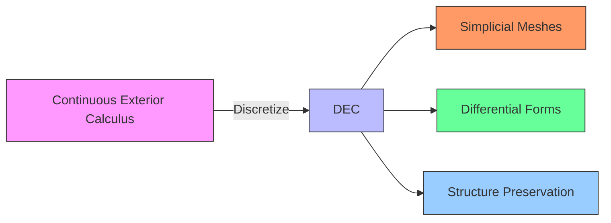
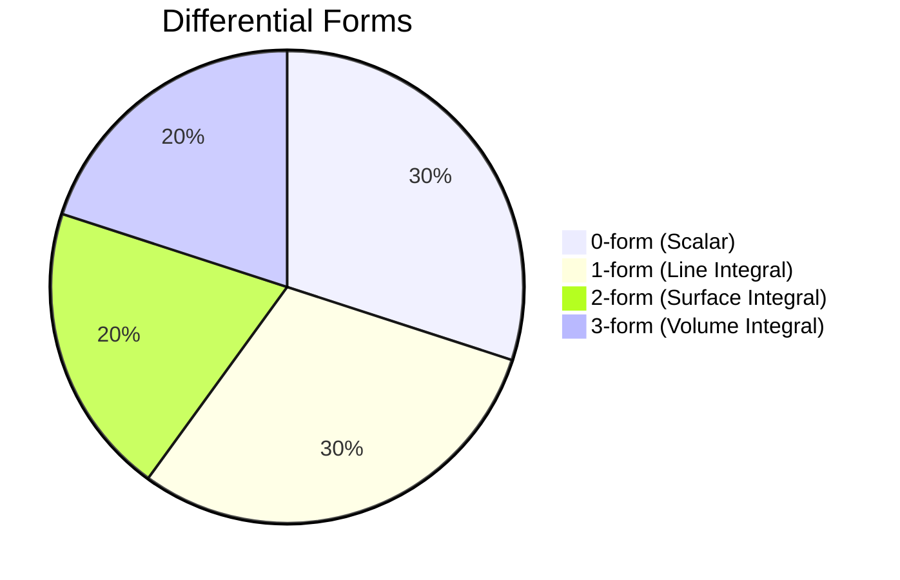
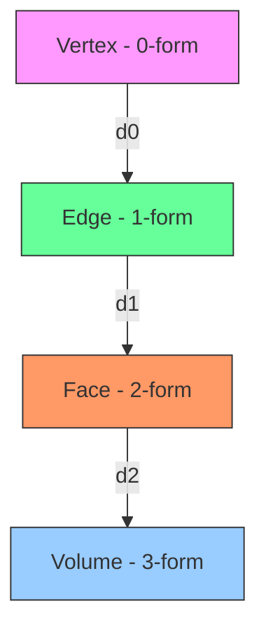
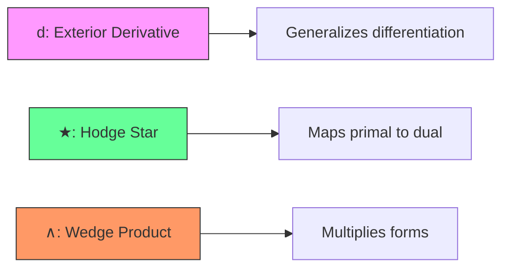
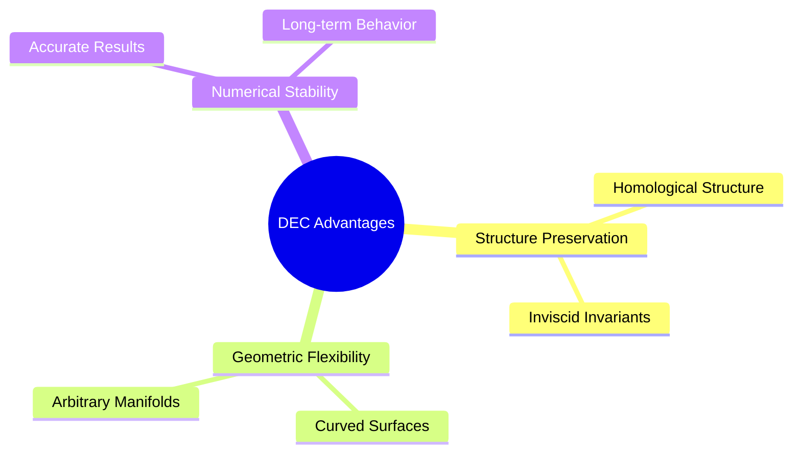
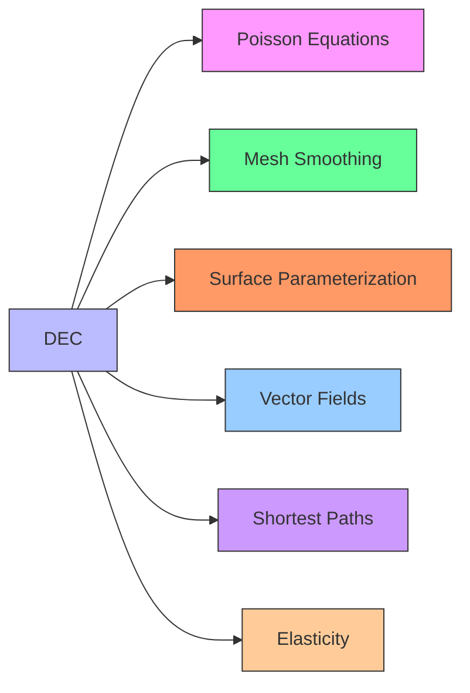
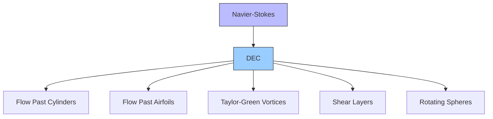
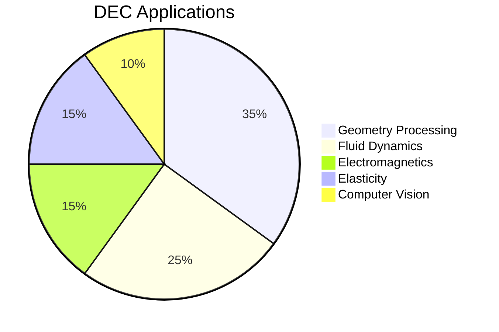
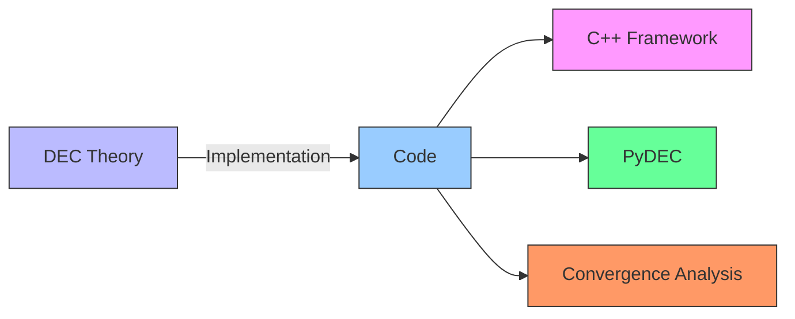

layout: true
class: typo, typo-selection

---

count: false
class: nord-dark, middle, center

Here's your enhanced presentation with colorful Mermaid diagrams added while keeping all other content unchanged:

# **Discrete Exterior Calculus**

@luk036 👨‍💻

2025-06-01 📅

---

## 📐 Discrete Exterior Calculus (DEC) �✨

*   **What is DEC?** 🤔💡
*   A framework for computational modeling. ⚙️
*   Based on differential forms and simplicial meshes. 📊
*   Extends continuous exterior calculus to a discrete setting. 🔄
*   Goal: Preserve geometric and physical structure in numerical simulations. 🎯

---

## 🌌 Exterior Calculus Basics 🔍

*   Exterior calculus deals with **differential forms (k-forms)**. 📜
*   They are related to quantities integrated over geometric objects. 📏
    *   **0-form:** Like a scalar function (e.g., elevation at a point). 📍
    *   **1-form:** Like a quantity integrated along a curve (e.g., elevation *gain* along a path). 🛤️
*   Closely related to vector calculus operations. 🔄
    *   Exterior derivative of a 1-form looks like the curl of a vector field. 🌪️

---

## 🤖 DEC on Simplicial Complexes 🏗️

*   DEC operates on **simplicial complexes** (meshes) and their associated **dual meshes**. 🔲
*   A **discrete k-form** represents the integral of a continuous k-form over a k-dimensional mesh object (primal or dual). 📊
    *   Discrete **0-form**: Scalar value at a **vertex**. ⚫
    *   Discrete **1-form**: Value associated with an **edge** (integral along an edge). ➖
    *   Discrete **2-form** (in 2D): Value associated with a **triangle**. 🔺
    *   Discrete variables require specifying an **orientation** for each mesh element, just like elevation gain needs direction (+151m vs -151m). 🔄
*   Discrete differential forms are stored with both a number and the specified orientation. 🔢

---

## ✨ The Core Trio: d, ★, ∧

*   **Exterior Derivative (d)**: Generalizes differentiation. Maps k-forms to (k+1)-forms. 🔄
    *   `d0` maps values on vertices (0-forms) to values on edges (1-forms). ↗️
    *   Requires taking orientation into account. 🔄
    *   In continuous calculus, `d` on 1-forms looks like curl. 🌪️
    *   A defining property: `d` applied twice is zero (`dp+1dp = 0`). ❌
*   **Hodge Star Operator (★)**: 💫🌟 Relates k-forms to (N-k)-forms in N dimensions. Incorporates metric information. Often transfers forms between primal and dual complexes. A Delaunay Hodge star exists. ⭐
*   **Wedge Product (∧)**: 🌱✖️ Multiplies forms. The discrete definition involves integration. For instance, a 1-form wedge a 0-form results in a 1-form. ➗

---

## 👍 Advantages for Computation 🚀

*   **Structure Preservation** 🏛️🔒: DEC discretizations aim to preserve the physical and mathematical properties (structure) of continuous systems.
    *   Proven successful at preserving the **homological structure** of a surface. 🧬
    *   Can lead to "structure-preserving algorithms". ✅
    *   Helps preserve **inviscid invariants** over extended periods. ⏳
*   **Geometric Flexibility** 🌐🌀: Works over **surface simplicial meshes** and on **arbitrary curved surfaces/manifolds**. Tested on flows past cylinders on spherical surfaces, double periodic shear layers on a plane, and harmonic waves on rotating spheres. 🌍
*   Leads to numerically stable and accurate results for various problems. 📊

---

## 🖼️ Shaping the Digital World �💻

*   A flexible and efficient framework for digital geometry processing. 🛠️
*   Applications include:
    *   Solving the **scalar Poisson equation** (`∆u = f`) on meshes. Involves building a sparse matrix for the Laplacian. 🔢
    *   Implicit **mean curvature flow** for mesh smoothing. 🌀
    *   Surface **parameterization** (e.g., conformal mapping). Can compute via the first non-trivial eigenvector of conformal energy. 🗺️
    *   **Vector field** decomposition (Helmholtz-Hodge) and design (using discrete connections and parallel transport). 🌪️
    *   Computing **shortest paths** or geodesic distance (by solving Poisson or integrating heat flow). 🛣️
    *   Improving **mesh quality**. 🔧
    *   Simulating mechanical phenomena like **elastic bodies**. 🏋️

---

## 🌊 Simulating Flows 💧🌀

*   Used for discretizing the **incompressible Navier–Stokes equations** over surface simplicial meshes. 📜
*   Uses a **primitive variable DEC formulation** with velocity as a one-form (often dual) and pressure as a zero-form (often dual). This choice means velocity integrals along dual edges correspond to mass flux across primal edges. ⚡
*   Tested on various benchmarks:
    *   Flow past stationary and rotating **circular cylinders** (flat and on spherical surfaces). Results like drag/lift coefficients and Strouhal number show good agreement with literature. 🌀
    *   Flow past **airfoils**. ✈️
    *   **Taylor–Green vortices**. Used for error convergence studies. 🔄
    *   Double periodic **shear layer**. Used to show kinetic energy conservation and convergence. ⚡
    *   Motion of harmonic waves and flows on **rotating spheres**. Can preserve stationary states and inviscid invariants. 🌍

---

## 🔬 Beyond Geometry & Fluids 🧪🌐

*   Applicable to **variational problems** in computer vision and graphics. 👁️🎨
*   Connections to **geometric mechanics** and discrete connections. ⚙️
*   Mentions of related use in:
    *   Computer Vision (e.g., template matching). 👁️
    *   Computational Modeling. 🧮
    *   Darcy flow. 💧
    *   Elasticity. 🏋️
    *   Electromagnetic problems. ⚡
*   **Active Research Area** 🤔🔍: Developing a complete discrete calculus where *all* continuous operators (d, ∧, ★, Lie derivative (ℒ_X), interior product (iα), etc.) work well together in the discrete setting. 🏗️

---

## 💻 Putting it into Practice 🖥️🔧

*   Discrete operators (like the discrete Laplacian or exterior derivative matrices) are often implemented as **sparse matrices**. 🔢
*   Implementation examples and libraries exist:
    *   A supplementary C++ framework is available. 📦
    *   **PyDEC** is a Python library for DEC on simplicial and cubical complexes of any dimension, implementing discrete exterior derivative (as coboundary), Delaunay Hodge star, and Whitney forms. 🐍
*   **Convergence**:
    *   Rigorous convergence analysis for the scalar Poisson problem on arbitrary domains has been established. ✅
    *   Numerical tests show convergence. For Taylor-Green vortices, the velocity *flux* error shows second-order convergence on structured meshes and better than first-order on unstructured meshes. Interpolated velocity error is slightly better than first-order. 📈
    *   The kinetic energy relative error converges in a second-order fashion with mesh size for the double periodic shear layer case. ⚡
---

count: false
class: nord-dark, middle, center

# Q & A 🎤
