# Network Optimization: Quick Start

@luk036 👨🏻‍🏫

2022-11-09 📅

## 🎬 Introduction

### Why and why not

- 👍 Algorithms are available for common network problems (Python: networkx, C++: Boost Graph Library (BGL)):
  - Explore the locality of network.
  - Explore associativity (things can be added up in any order)
- 👍 Be able to solve discrete problems optimally (e.g. matching/assignment problems)
- 👍 Bonus: gives you insight into the most critical parts of the network (critical cut/cycle)

- 👎 The theory is hard to understand.
- 👎 Algorithms are hard to understand (some algorithms do not allow
  users to have an input flow in reverse directions,
  but create edges internally for the reverse flows).
- 👎 There are too many algorithms available.
  You have to choose them wisely.

### Flow and Potential

- Cut
- Current
- Flow ${\color{green}x}$
- Sum of ${\color{green}x}_{ij}$ around a node = 0

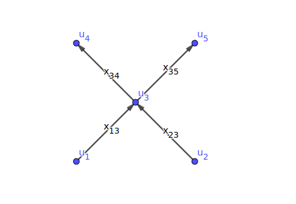

- Cycle/Path
- Voltage
- Tension ${\color{blue}y}$
- Sum of ${\color{blue}y}_{ij}$ around a cycle = 0

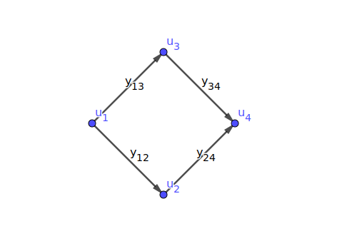

### If you don't know more...

- For the min-cost linear flow problem, the best guess is to use the "network simplex algorithm".

- For the min-cost linear potential problem: formulate it as a dual (flow) problem.

- For the parametric potential problem (single parameter), the best guess is to use Howard's algorithm.

- All these algorithms are based on the idea of finding "negative cycle".

- You can apply the same principle to the nonlinear problems.

### For dual problems...

- Dual problems can be solved by applying the same principle.

- Finding negative cycles is replaced by finding a negative "cuts", which is more difficult...

- ...unless your network is a planar graph.

### Guidelines for the average users

- Look for specialized algorithms for specialized problems.
  For example, for bipartite maximum cardinality matching,
  use the Hopcroft-Karp matching algorithm.

- Avoid creating edges with infinite costs. Delete them or reformulate your problem.

### Guidelines for algorithm developers

- Make "negative cycles" as orthogonal to each other as possible.

- Reuse previous solutions as a new starting point for finding negative cycles.

## 💡 Essential Concepts

### Basic elements of a network

#### Definition (network)

A _network_ is a collection of finite-dimensional vector spaces, which includes _nodes_ and _edges_/_arcs_:

- $V = \{v_1, v_2, \cdots, v_N \}$, where $|V| = N$
- $E = \{e_1, e_2, e_3, \cdots, e_M \}$ where $|E| = M$

which satisfies 2 requirements:

1.  The boundary of each edge is comprised of the union of nodes
2.  The intersection of any edges is either empty or the boundary node of both edges.

### Network

- By this definition, a network can contain self-loops and multi-edges.

- A _graph_ structure encodes the neighborhood information of nodes and edges.

- Note that Python's NetworkX requires special handling of multi-edges.

- The most efficient graph representation is an adjacency list.

- The concept of a graph can be generalized to _complex_: node, edge, face...

#### Types of graphs

Bipartite graphs, trees, planar graphs, st-graphs, complete graphs.

### Orientation

#### Definition (Orientation)

An _orientation_ of an edge is an ordering of its boundary node $(s, t)$, where

- $s$ is called a source/initial node
- $t$ is called a target/terminal node

👉 Note: orientation != direction

#### Definition (Coherent)

Two orientations to be the same is called _coherent_

### Node-edge Incidence Matrix (connect to algebra!)

#### Definition (Incidence Matrix)

An $N \times M$ matrix $A^\mathsf{T}$ is a node-edge incidence matrix with entries:

$$
A(i,j) =
  \begin{cases}
   +1 & \text{if $e_i$ is coherent with the orientation of node $v_j$,} \\
   -1 & \text{if $e_i$ is not coherent with the orientation of node $v_j$,} \\
    0 & \text{otherwise.}
  \end{cases}
$$

#### 📚 Example

$$
A^\mathsf{T} =
  \begin{bmatrix}
  0 & -1 & 1 & 1 & 0 \\
  1 & 1 & 0 & -1 & -1 \\
  -1 & 0 & -1 & 0 & 1
  \end{bmatrix}
$$

### Chain

#### Definition (Chain $\tau$)

An edge/node _chain_ $\tau$ is an $M$/$N$-tuple of scalar
that assigns a coefficient to each edge/node,
where $M$/$N$ is the number of distinct edges/nodes in the network.

#### 📌 Remark (II)

A chain may be viewed as an (oriented) indicator vector representing a set of edges/nodes.

#### 📚 Example (II)

$[0, 0, 1, 1, 1]$, $[0, 0, 1, -1, 1]$

### Discrete Boundary Operator

#### Definition (Boundary operator)

The _boundary_ operator $\partial = A^\mathsf{T}$.

#### Definition (Cycle)

A chain is said to be a _cycle_ if it is in the null-space of the boundary operator, i.e. $A^\mathsf{T} \tau = 0$.

#### Definition (Boundary)

A chain $\beta$ is said to be a _boundary_ of $\tau$ if it is in the range of the boundary operator.

### Co-boundary Operator $\mathrm{d}$

#### Definition (Co-boundary operator)

The _co-boundary_ (or _differential_) operator
$\mathrm{d} = \partial^* = (A^\mathsf{T})^* = A$

#### 👉 Note

Null-space of $A$ is \#components of a graph

### Discrete Stokes' Theorem

- Let $$\tau_i = \begin{cases}
        1 & \mathrm{if}\ e_i \in S, \\
        0 & \mathrm{otherwise.}
      \end{cases}$$
- Conventional (integration):
  $${\color{purple}\int}_{\color{red}S} {\color{green}\mathrm d} \tilde{\omega} = {\color{purple}\oint}_{\color{blue}\partial \color{red}S} \tilde{\omega}$$
- Discrete (pairing):
  $${\color{purple}{[} \color{red}\tau}, {\color{green}A}\omega{\color{purple}]} = {\color{purple}[ \color{blue}A^\mathsf{T} \color{red} \tau}, \omega{\color{purple}]}$$

### Fundamental Theorem of Calculus

- Conventional (integration): $\int_a^b f(t) dt = F(b) - F(a)$

- Discrete (pairing): $[\tau_1, A c^0] = [A^\mathsf{T}\tau_1, c^0]$

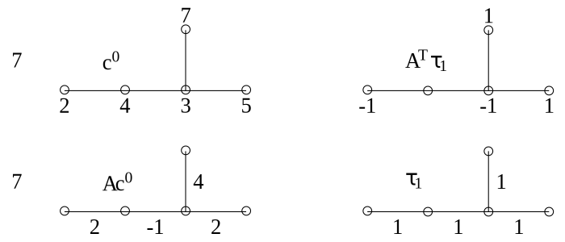

### Divergence and Flow

#### Definition (Divergence)

$\text{div}\, {\color{green}x} = A^\mathsf{T} {\color{green}x}$

#### Definition (Flow)

${\color{green}x}$ is called a _flow_ if
$\sum \text{div}\, {\color{green}x} = 0$, where all negative entries of
(div ${\color{green}x}$) are called _sources_ and positive entries are
called _sinks_.

#### Definition (Circulation)

A network is called a _circulation_ if there is no source or sink. In
other words, $\text{div}\, {\color{green}x} = 0$

### Tension and Potential

#### Definition (Tension)

A tension (in co-domain) ${\color{blue}y}$ is a _differential_ of a
_potential_ ${\color{red}u}$, i.e. ${\color{blue}y}= A {\color{red}u}$.

#### Theorem (Tellgen's)

Flow and tension are bi-orthogonal (isomorphic).

#### Proof

$0 = [A^\mathsf{T} {\color{green}x}, {\color{red}u}] = (A^\mathsf{T} {\color{green}x})^\mathsf{T} {\color{red}u} = {\color{green}x}^\mathsf{T} (A {\color{red}u}) = {\color{green}x}^\mathsf{T} {\color{blue}y}$

### Path

A path indicator vector $\tau$ of $P$ that $$\tau_i =
    \begin{cases}
       1 & \mathrm{if}\ e_i \in P, \\
       0 & \mathrm{otherwise.}
    \end{cases}$$

#### Theorem

[total tension ${\color{blue}y}$ on $P$] = [total potential on the
boundary of $P$].

#### Proof

${\color{blue}y}^\mathsf{T} \tau = (A {\color{red}u})^\mathsf{T} \tau = {\color{red}u}^\mathsf{T}(A^\mathsf{T} \tau) = {\color{red}u}^\mathsf{T}(\partial P)$.

### Cut

Two node sets $S$ and $S'$ (the complement of $S$, i.e. $V - S$).
A cut $Q$ is an edge set, denoted by $[S, S']^-$.
A cut indicator vector $q$ (oriented) of $Q$ is defined as $A c$ where $$c_i =
\begin{cases}
1 & \text{if } v_i \in S \,, \\
0 & \text{otherwise}\,.
\end{cases}

$$

#### Theorem (Stokes' theorem!)

[Total divergence of ${\color{green}x}$ on $S$] = [total ${\color{green}x}$ across $Q$].

#### Proof

$(\text{div}\,{\color{green}x})^\mathsf{T} c = (A^\mathsf{T} {\color{green}x})^\mathsf{T} c = {\color{green}x}^\mathsf{T} (A c) = {\color{green}x}^\mathsf{T} q$.


### 📚 Examples

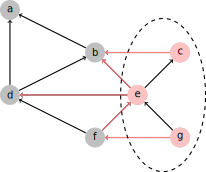


Feasibility Problems
--------------------


### Feasible Flow/Potential Problem

Feasible Flow Problem

-   Find a flow ${\color{green}x}$ such that: $$\begin{array}{ll}
      c^- \leq {\color{green}x} \leq c^+, \\
      A^\mathsf{T} {\color{green}x} = b, b(V) = 0.
      \end{array}
$$

- Can be solved using:

  - Painted network algorithm

  - If no feasible solution, return a "negative cut".

Feasible Potential Problem:

- Find a potential ${\color{red}u}$ such that: $$\begin{array}{ll}
      d^- \leq {\color{blue}y} \leq d^+ \\
      A \cdot {\color{red}u} = {\color{blue}y}.
      \end{array}$$

- Can be solved using:

  - Bellman-Ford algorithm

  - If no feasible solution, return a "negative cycle".

### 📚 Examples

Genome-scale reaction network (primal)

- $A$: Stoichiometric matrix $S$

- ${\color{green}x}$: reactions between metabolites/proteins

- $c^- \leq {\color{green}x} \leq c^+$: constraints on reaction rates

Timing constraints (co-domain)

- $A^\mathsf{T}$: incidence matrix of timing constraint graph

- ${\color{red}u}$: arrival time of clock

- ${\color{blue}y}$: clock skew

- $d^- \leq {\color{blue}y} \leq d^+$: setup- and hold-time
  constraints

### Feasibility Flow Problem

#### Theorem (feasibility flow)

The problem has a feasible solution if and only if $b(S) \leq c^+(Q)$ for all cuts $Q = [S,S']$ where $c^+(Q)$ = upper capacity [1, p. 56].

### Proof (if-part)

Let $q = A \cdot k$ be a cut vector (oriented) of $Q$. Then

- $c^- \leq {\color{green}x} \leq c^+$
- $q^\mathsf{T} {\color{green}x} \leq c^+(Q)$
- $(A \cdot k)^\mathsf{T} {\color{green}x} \leq c^+(Q)$
- $k^\mathsf{T} A^\mathsf{T} {\color{green}x} \leq c^+(Q)$
- $k^\mathsf{T} b \leq c^+(Q)$
- $b(S) \leq c^+(Q)$

### Feasibility Potential Problem

#### Theorem (feasibility potential)

The problem has a feasible solution if and only if $d^+(P) \geq 0$ for all cycles $P$ where $d^+(P)$ = upper span [1, p. ??].

### Proof (if-part)

Let $\tau$ be a path indicator vector (oriented) of $P$. Then

- $d^- \leq {\color{blue}y} \leq d^+$
- $\tau^\mathsf{T} {\color{blue}y} \leq d^+(P)$
- $\tau^\mathsf{T} (A \cdot {\color{red}u}) \leq d^+(P)$
- $(A^\mathsf{T} \tau)^\mathsf{T} {\color{red}u} \leq d^+(P)$
- $(\partial P)^\mathsf{T} {\color{red}u} \leq d^+(P)$
- $0 \leq d^+(P)$

### 📌 Remarks

- The only-if part of the proof is constructive.
  It can be done by constructing an algorithm to obtain the feasible solution.

- $d^+$ could be $\infty$ or zero, etc.

- $d^-$ could be $-\infty$ or zero, etc.

- $c^+$ could be $\infty$ or zero, etc.

- $c^-$ could be $-\infty$ or zero, etc.

**Note**: most tools require that $c^-$ must be zero such that the solution flow ${\color{green}x}$ is always positive.

### Convert to the elementary problem

- By splitting every edge into two, the feasibility flow problem can reduce to an elementary one:

  - Find a flow ${\color{green}x}$ such that

    $$
    \begin{array}{ll}
      c \leq {\color{green}x}, \\
      A_1^\mathsf{T} {\color{green}x} = b_1, \\
      b_1(V_1) = 0.
    \end{array}
    $$

    where $A_1$ is the incident matrix of the modified network.

Original:


Modified:


### Convert to the elementary problem

- By adding a reverse edge for every edge, the feasibility potential problem can reduce to an elementary one:

  - Find a potential ${\color{red}u}$ such that

    $$
    \begin{array}{ll}
      {\color{blue}y}_2 \leq d, \\
      A_2 {\color{red}u} = {\color{blue}y}_2
    \end{array}
    $$

    where $A_2$ is the incident matrix of the modified network.

Original:

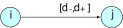

Modified:

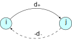

]

### Basic Bellman-Ford Algorithm

```matlab
function BellmanFord(list vertices, list edges, vertex source)
   // Step 1: initialize graph
   for each vertex i in vertices:
       if i is source then u[i] := 0
       else u[i] := inf
       predecessor[i] := null

   // Step 2: relax edges repeatedly
   for i from 1 to size(vertices)-1:
       for each edge (i, j) with weight d in edges:
           if u[j] > u[i] + d[i,j]:
               u[j] := u[i] + d[i,j]
               predecessor[j] := i

   // Step 3: check for negative-weight cycles
   for each edge (i, j) with weight d in edges:
       if u[j] > u[i] + d[i,j]:
           error "Graph contains a negative-weight cycle"
   return u[], predecessor[]
```

### 📚 Example 1 : Clock skew scheduling ⏰

- Goal: intentionally assign an arrival time $u_i$ to each register
  so that the setup and hold time constraints are satisfied.
- Note: the clock skew $s_{ij} = {\color{red}u}_i - {\color{red}u}_j$
  is more important than the arrival time ${\color{red}u}$ itself,
  because the clock runs periodically.
- In the early stages, fixing the timing violation could be done as soon as a negative cycle is detected.
  A complete timing analysis is unnecessary at this stage.

### 📚 Example 2 : Delay padding + clock skew scheduling ⏰

- Goal: intentionally "insert" a delay $p$ so that the setup and hold time constraints are satisfied.
- Note that a delay can be "inserted" by swapping a fast transistor into a slower transistor.
- Traditional problem formulation: Find $p$ and ${\color{red}u}$ such that

  $$
  \begin{array}{ll}
    {\color{blue}y} \leq d + p, \\
    A {\color{red}u} = {\color{blue}y}, p \geq 0
  \end{array}
  $$

- Note 1: Inserting delays into some local paths may not be allowed.
- Note 2: The problem can be reduced to the standard form by modifying the network (timing constraint graph)

### Four possible ways to insert delay

- No delay:

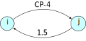

- $p_s = p_h$:

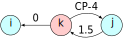

- Independent:

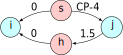

- $p_s \geq p_h$:

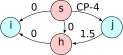

### 📌 Remarks (III)

- If there exists a negative cycle, it means that timing cannot be fixed using simply this technique.

- Additional constraints, such as $p_s \leq p_{\max}$, can be imposed.

## Parametric Problems

### Parametric Potential Problem (PPP)

- Consider a parameter potential problem: $$\begin{array}{ll}
      \text{maximize} & \beta \\
      \text{subject to} & {\color{blue}y} \leq d(\beta), \\
      & A \cdot {\color{red}u} = {\color{blue}y}
    \end{array}$$ where $d(\beta)$ is a _monotonic decreasing_
  function.

- If $d(\beta)$ is a linear function $(m - s \beta)$ where $s$ is non-negative,
  the problem reduces to the well-known _minimum cost-to-time ratio problem_.

- If $s$ = constant, it further reduces to the _minimum mean cycle problem_.

**Note:** Parametric flow problem can be defined similarly.

### 📚 Examples (III)

- $d(\beta)$ is linear $(m - s \beta)$:

  - Optimal clock period scheduling problem

  - Slack maximization problem

  - Yield-driven clock skew scheduling ⏰ (Gaussian)

- $d(\beta)$ is non-linear:

  - Yield-driven clock skew scheduling ⏰ (non-Gaussian)

  - Multi-domain clock skew scheduling ⏰

### 📚 Examples (IV)

- Lawler's algorithm (binary search based)

- Howard's algorithm (cycle cancellation)

- Young's algorithm (path based)

- Burns' algorithm (path based)

  - for clock period optimization problem (all elements of $s$ are either 0 or 1)

- Several hybrid methods have also been proposed

### 📌 Remarks (IV)

- Need to solve feasibility problems many times.

- Data structures, such as Fibonacci heap or spanning tree/forest, can be used to improve efficiency

- For multi-parameter problems, the _ellipsoid method_ can be used.

- 📚 Example 1: yield-driven clock skew scheduling ⏰ (c.f. lecture 5)

### 📚 Example 2: yield-driven delay padding

- The problem can be reduced to the standard form by modifying the underlying constraint graph.

### Four possible way to insert delay

- No delay:


- $p_s = p_h$:

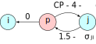

- Independent:

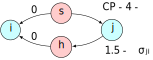

- $p_s \geq p_h$:


## Min-cost Flow/Potenial Problem

### Elementary Optimal Problems

- Elementary Flow Problem:

  $$
  \begin{array}{ll}
    \text{min} & d^\mathsf{T} {\color{green}x} + p \\
    \text{s. t.} & c \leq {\color{green}x}, \\
    & A^\mathsf{T} {\color{green}x} = b, \; b(V)=0
  \end{array}
  $$

- Elementary Potential Problem:
  $$
  \begin{array}{ll}
    \text{max} & b^\mathsf{T} {\color{red}u} - (c^\mathsf{T} {\color{blue}y} + q) \\
    \text{s. t.} & {\color{blue}y} \leq d, \\
    & A {\color{red}u} = {\color{blue}y}
  \end{array}
  $$

### Elementary Optimal Problems (Cont'd)

- The problems are dual to each other if
  $p + q = -c^\mathsf{T} d, ({\color{green}x} - c)^\mathsf{T}(d - {\color{blue}y}) = 0, c \leq {\color{green}x}, {\color{blue}y} \leq d$

- Since
  $b^\mathsf{T} {\color{red}u}$ =
  $(A^\mathsf{T} {\color{green}x})^\mathsf{T} {\color{red}u} = {\color{green}x}^\mathsf{T} A {\color{red}u} = {\color{green}x}^\mathsf{T} {\color{blue}y},$
  $[\min]-[\max] = (d^\mathsf{T} {\color{green}x} + p) - (b^\mathsf{T} {\color{red}u} - [c^\mathsf{T} {\color{blue}y} + q])$
  =
  $d^\mathsf{T} {\color{green}x} + c^\mathsf{T} {\color{blue}y} - {\color{green}x}^\mathsf{T} {\color{blue}y} + p + q = ({\color{green}x} - c)^\mathsf{T} (d - {\color{blue}y}) \geq 0$

- $[\min] - [\max]$ when equality holds.

### 📌 Remark (V)

- We can formulate a linear problem in primal or dual form, depending on which solution method is more appropriate:

  - Incremental improvement of feasible solutions

  - Design variables are in the integral domain:

    - The max-flow problem (i.e. $d^\mathsf{T} = [-1, -1, \cdots, -1]^\mathsf{T}$) may be better solved by the dual method.

### Linear Optimal Problems

- Optimal Flow Problem: $$\begin{array}{ll}
      \text{min} & d^\mathsf{T} {\color{green}x} + p \\
      \text{s. t.} & c^- \leq {\color{green}x} \leq c^+, \\
      & A^\mathsf{T} {\color{green}x} = b, \; b(V)=0
    \end{array}$$

- Optimal Potential Problem: $$\begin{array}{ll}
      \text{max} & b^\mathsf{T} {\color{red}u} - (c^\mathsf{T} {\color{blue}y} + q) \\
      \text{s. t.} & d^- \leq {\color{blue}y} \leq d^+, \\
      & A {\color{red}u} = {\color{blue}y}
    \end{array}$$

### Linear Optimal Problems (II)

By modifying the network:

- The problem can be reduced to the elementary case [pp.275-276]

piece of cake

- Piece-wise linear convex cost can be reduced to this linear problem [p.239,p.260]

The problem has been extensively studied and has numerous applications.

### 📌 Remark (VI)

- We can transform the cost function to be non-negative by reversing the orientation of the negative cost edges.

- Then reduce the problem to the elementary case (or should we???)

### Algorithms for Optimal Flow Problems

- Successive shortest path algorithm

- Cycle cancellation method

  - Iteratively insert additional minimal flows according to a negative cycle of the residual network until no negative cycles are found.

- Scaling method

### For Special Cases

- Max-flow problem ($d = -[1, \cdots, 1]$)

  - Ford-Fulkerson algorithm: iteratively insert additional minimal flows
    according to an augmented path of the residual network, until no augmented paths of the residual network are found.

  - Pre-flow Push-Relabel algorithm (dual method???)

- Matching problems ($[c^-, c^+] = [0, 1]$)

  - Edmond's blossom algorithm

### Min-Cost Flow Problem (MCFP)

- Problem Formulation: $$\begin{array}{ll}
      \text{min} & d^\mathsf{T} {\color{green}x} \\
      \text{s. t.} & 0 \leq {\color{green}x} \leq c, \\
      & A^\mathsf{T} {\color{green}x} = b, \; b(V)=0
    \end{array}$$

- Algorithm idea: descent method: given a feasible
  ${\color{green}x}_0$, find a better solution
  ${\color{green}x}_1 = {\color{green}x}_0 + \alpha p$, where $\alpha$
  is positive.

### General Descent Method

- **Input**: $f(x)$, initial $x$
- **Output**: optimal opt $x^*$
- **while** not converged,
  1.  Choose descent direction $p$;
  2.  Choose the step size $\alpha$;
  3.  $x := x + \alpha p$;

### Some Common Descent Directions

- Gradient descent: $p = -\nabla f(x)^\mathsf{T}$
- Steepest descent:
  - $\triangle x_{nsd} = \argmin\{\nabla f(x)^\mathsf{T} v \mid \|v\|=1 \}$
  - $\triangle x_{sd}$ = $\|\nabla f(x)\| \triangle x_{nsd}$ (un-normalized)
- Newton's method: $p = -\nabla^2 f(x)^{-1} \nabla f(x)$
- For convex problems, must satisfy $\nabla f(x)^\mathsf{T} p < 0$.

**Note:** Here, there is a natural way to choose $p$!

### Min-Cost Flow Problem (II)

- Let ${\color{green}x}_1 = {\color{green}x}_0 + \alpha p$, then we
  have: $$\begin{array}{lll}
      \text{min} & d^\mathsf{T} {\color{green}x}_0 + \alpha d^\mathsf{T} p  & \Rightarrow d^\mathsf{T} p < 0 \\
      \text{s. t.} & -{\color{green}x}_0 \leq \alpha p \leq c-{\color{green}x}_0 & \Rightarrow \text{residual graph} \\
      & A^\mathsf{T} p = 0 & \Rightarrow p \text{ is a cycle!}
    \end{array}$$

- In other words, choose $p$ to be a negative cycle!

  - Simple negative cycle, or

  - Minimum mean cycle

### Primal Method for MCFP

- **Input**: $G(V,E), [c^-, c^+], d$
- **Output**: optimal opt ${\color{green}x}^*$
- Initialize a feasible ${\color{green}x}$ and certain data structure
- **while** a negative cycle $p$ found in $G({\color{green}x})$,
  1.  Choose a step size $\alpha$;
  2.  **If** $\alpha$ is unbounded, **return** UNBOUNDED;
  3.  **If** $\alpha = 0$, **break**;
  4.  ${\color{green}x} := {\color{green}x} + \alpha p$;
  5.  Update corresponding data structures
- **return** OPTIMAL

### 📌 Remarks (VI)

- In Step 4, negative cycle can be found using Bellman-Ford algorithm.

- In the cycle cancelling algorithm, $p$ is:

  - a simple negative cycle, or

  - a minimum mean cycle

- A heap or other data structures are used for finding negative cycles efficiently.

- Usually $\alpha$ is chosen such that one constraint is tight.

### Min-Cost Potential Problem (MCPP)

- Problem Formulation: $$\begin{array}{ll}
      \text{min}   & c^\mathsf{T} {\color{blue}y} \\
      \text{s. t.} & {\color{blue}y} \leq d, \\
      & A {\color{red}u} = {\color{blue}y}
    \end{array}$$ where $c$ is assumed to be non-negative.

- Algorithm: given an initial feasible $u_0$, find a better solution $u_1 = {\color{red}u}_0 + \beta q$, where $\beta$ is positive:
  $$
  \begin{array}{lll}
    \text{min} & c^\mathsf{T} {\color{blue}y}_0 + c^\mathsf{T} {\color{blue}y}  & \Rightarrow c^\mathsf{T} {\color{blue}y} < 0 \\
    \text{s. t.} & {\color{blue}y} \leq d - A {\color{red}u}_0 & \Rightarrow \text{residual graph} \\
    & \beta A q = {\color{blue}y}    & \Rightarrow q \; \text{is a ``cut''!}
  \end{array}
  $$

### Method for MCPP

- **Input**: $G(V,E), c, d$
- **Output**: optimal opt ${\color{red}u}^*$
- Initialize a feasible ${\color{red}u}$ and certain data structure
- **while** a negative cut $q$ found in $G({\color{red}u})$,
  1.  Choose a step size $\beta$;
  2.  **If** $\beta$ is unbounded, **return** UNBOUNDED;
  3.  **If** $\beta = 0$, **break**;
  4.  ${\color{red}u} := {\color{red}u} + \beta q$;
  5.  Update corresponding data structures
- **return** OPTIMAL

### 📌 Remarks (VII)

- Usually $\beta$ is chosen such that one constraint is tight.

- The min-cost potential problem is the dual of the min-cost flow problem, so algorithms can solve both problems.

- In the network simplex method, $q$ is chosen from a spanning tree data structure (for linear problems only)
