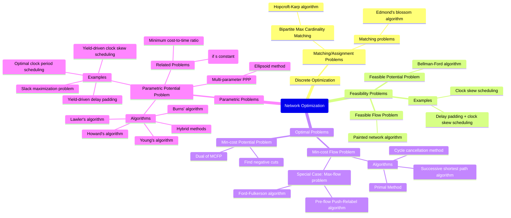

Okay, I can provide a colorful mindmap in Mermaid format that outlines the key areas of network optimization, the types of problems discussed in the sources, the associated algorithms, and core concepts.

The sources present Network Optimization as a lecture covering algorithms and techniques for solving network optimization problems. It delves into fundamental concepts like the structure of a network, including nodes, edges, orientation, and the node-edge incidence matrix, as well as abstract notions like flow and potential, cuts and cycles, and the boundary operator. Various problems are discussed, categorized broadly into feasibility and optimal problems, with parametric problems also explored. A recurring theme for many algorithms is finding **negative cycles** or **negative cuts**. Duality between flow and potential problems is also highlighted.

Here is a colorful mindmap based on these sources:

This mindmap organizes the information from the sources, showing the relationships between different types of network problems and the algorithms or methods suggested for solving them. It also includes key concepts that underpin these problems and solutions. The coloring is applied automatically by the Mermaid renderer based on the theme and the depth of the nodes in the hierarchy.

For the **Feasible Flow Problem**, the **Painted network algorithm** is mentioned as a solution method, and the problem's feasibility is tied to the upper capacity of cuts. If no feasible solution exists, a "negative cut" is returned. Similarly, for the **Feasible Potential Problem**, the **Bellman-Ford algorithm** is used, and feasibility depends on the upper span of cycles. A "negative cycle" is returned if no solution is found.

Optimal problems include the **Min-cost Flow Problem (MCFP)** and the **Min-cost Potential Problem (MCPP)**. Algorithms for MCFP include the **Successive shortest path** and **Cycle cancellation** methods, where cycle cancellation iteratively uses negative cycles of the residual network. MCPP is noted as the dual of MCFP, and a method based on finding negative cuts is suggested. **Special cases** like the max-flow problem (solvable by **Ford-Fulkerson** or **Pre-flow Push-Relabel**) and matching problems (**Edmond's blossom algorithm**) are also mentioned with specific algorithm recommendations.

**Parametric Potential Problems (PPP)** involve optimizing a parameter subject to potential constraints. Various algorithms like **Howard's**, **Lawler's**, **Young's**, and **Burns'** algorithms are applicable. These problems are related to minimum cost-to-time ratio and minimum mean cycle problems. For multi-parameter problems, the **ellipsoid method** can be used. Examples like clock period scheduling and yield-driven problems fall into this category.

Core concepts include the definition of a network and its elements, the incidence matrix, operators like the boundary and co-boundary, and the fundamental relationship between flow and potential via theorems like Tellegen's theorem and discrete versions of Stokes' theorem and the Fundamental Theorem of Calculus. The **importance of negative cycles and cuts** as a basis for many algorithms is a recurring theme.

General tools and libraries like **Python's networkx** and **C++'s Boost Graph Library** are available for common network problems. Guidelines for users and developers are also provided.