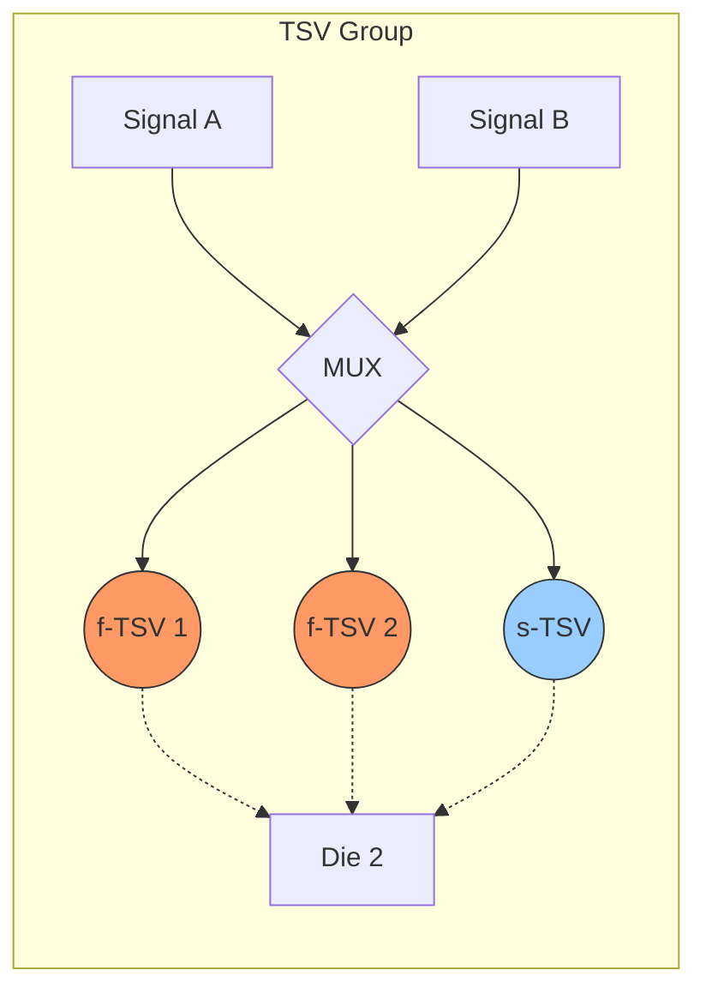
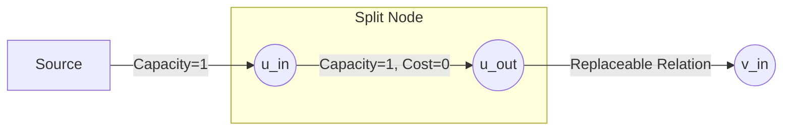

# 🏗️ TSV Fault-Tolerance and Repair Architectures in 3D-ICs

---

## 🔬 Slide 1: Introduction to 3D-ICs
*   **Definition:** Vertically stacking multiple silicon dies connected by **Through-Silicon Vias (TSVs)**.
*   **Key Advantages:**
    *   ⚡ **Reduced Interconnect Delay:** Average wire-length varies with layers:
        $$\color{cyan} L_{avg} \propto \sqrt{N_{layers}}$$.
    *   🔋 **Lower Power Dissipation:** Shorter vertical paths replace long horizontal wires.
    *   🚀 **High Bandwidth:** Massive parallel vertical connections.
    *   🤝 **Heterogeneous Integration:** Stacking logic, memory, analog, and sensors.

---

## 🛠️ Slide 2: The TSV Fabrication Challenge
TSV manufacturing is a complex physical process highly susceptible to failures:
*   **Stages:** Via etching, filling, thinning, and thermal bonding.
*   **Defect Modes:**
    *   ❌ **Open Defects:** Insufficient filling, voids, or micro-cracks.
    *   🔌 **Short Defects:** Substrate shorting or leakage.
    *   📏 **Geometric Defects:** Misalignment between dies or uneven TSV heights.
*   **Observation:** Even a single post-bond TSV failure can render an entire multi-die stack defective.

---

## 📊 Slide 3: Impact on Yield and Reliability
*   **Stacking Yield:** Cumulative product of die, bonding, and TSV yields:
    $$\color{cyan} Y_{chip} = Y_{stack} \cdot \prod Y_{bonding(i)} \cdot \prod Y_{TSV(i)}$$
*   **Reliability Concerns:** Latent defects can emerge post-manufacturing due to thermal and physical stress during operation.
*   **The Solution:** Fault-tolerance architectures using **redundant (spare) TSVs** are essential to improve yield and lifespan.

---

## 🧩 Slide 4: Foundational Repair: Redundant TSV Grouping
The basic strategy partitions functional TSVs (f-TSVs) and redundant TSVs (s-TSVs) into independent groups.

*   **Grouping Ratio:** Defined as $\color{cyan} gr = N_{gr} : N_{gs}$ (Regular:Redundant).
*   **Logic:** A group is repairable if the number of defective TSVs ($x$) is $\le$ the number of spare TSVs ($k$).

---

## 📈 Slide 5: Yield Analysis: Independent Defects
Assuming each TSV fails independently with a uniform failure rate ($p$):
*   **Binomial Distribution:** Probability of having exactly $x$ defective TSVs in a group of size $n$:
    $$\color{cyan} P(X = x) = \binom{n}{x} p^x (1-p)^{n-x}$$.
*   **Group Yield:**
    $$\color{cyan} Y_{group} = \sum_{x=0}^{k} \left[ \binom{n}{x} p^x (1-p)^{n-x} \right]$$.
*   **Total Yield:** $\color{cyan} Y_{total} = (Y_{group})^t$, where $t$ is the number of groups.

---

## 📍 Slide 6: The Reality of Clustered Defects
In practice, TSV defects are spatially correlated due to bonding pressure variations or wafer roughness.
*   **Cluster Centers:** A single defect increases the likelihood of failures in its immediate vicinity.
*   **Defect Probability ($P_i$):** Inversely proportional to the distance ($d_{ic}$) from a cluster center:
    $$\color{cyan} P_i = p \cdot \left( 1 + \left( \frac{1}{d_{ic}} \right)^\alpha \right)$$
    where $\color{cyan} \alpha$ is the clustering coefficient.
*   **Insight:** Larger $\color{cyan} \alpha$ values cause higher yield drops, especially in designs with high TSV density.

---

## 🔍 Slide 7: Built-In Self-Test (BIST) Architecture
BIST enables chips to autonomously detect and record TSV failures.
*   **Grouping Concept:** TSVs are divided into **Read Groups** (Slave to Master) and **Write Groups** (Master to Slave).
*   **Test Methodology:**
    1.  Apply test patterns (vectors) via the BIST controller.
    2.  Compare results on the master die using loopback paths for write groups.
    3.  Store "Repair Signatures" in **Fuse Registers**.
*   **Gain:** BIST grouping can reduce test time by approximately **17.5%**.

---

## 🕒 Slide 8: TDMA-Based Fault Tolerance
A cost-effective technique using Time Division Multiple Access to detect and bypass faulty links.
*   **Three Modules:** TDMA, Testing, and Routing.
*   **Sequential Testing:** Signals utilize specific time slots; the testing module identifies defects via delay tests (detecting voids/delamination) or short-to-substrate tests.
*   **Control Flow:**
    *   If **Testresult = 1**, the NMOS path of the defective TSV is cut off.
    *   Signal is re-routed through a defect-free TSV in a subsequent clock cycle.
*   **Overhead:** Minimal area cost, though it introduces serialized delay.

---

## 🔄 Slide 9: Rerouting: Switching vs. Shifting
Different hardware structures balance repair rate and area overhead.

| Architecture | Mechanism | Repair Rate | Area Cost |
| :--- | :--- | :---: | :--- |
| **Signal-Shifting** | 2:1 MUX chains shift signals to the next neighbor | 📉 Low | ✨ Extremely Low |
| **Signal-Switching** | Row-end spares with 3:1 MUXs | 📊 Med | 📉 Low |
| **Router-Based** | 3-port or 5-port routers bypass distant faults | 📈 High | 💹 High |
| **LCTRA** | Switch-based matrix specialized for clusters | 📈 High | 📊 Moderate |

---

## 🛡️ Slide 10: Adaptive Fault Tolerance (AFTS)
AFTS adaptively determines the number of tolerant faults ($K$) based on f-TSV and s-TSV distributions.
*   **Constraint Violation:** Previous works assumed fixed $K$ and that any s-TSV could replace any f-TSV.
*   **AFTS Advantage:** Handles non-uniform layouts where f-TSVs have limited candidate s-TSVs.
*   **Optimization:** Uses **Integer Linear Programming (ILP)** to minimize MUX delay and the number of s-TSVs used.
*   **Result:** Reduces spare TSV count by up to **48%** compared to fixed-ratio methods.

---

## 🔀 Slide 11: Solving Repair via Max Flow
Repair problems are modeled using graph theory, specifically vertex-disjoint paths.
*   **Theorem (Menger):** The max number of vertex-disjoint paths equals the minimum disconnecting vertex set.
*   **Node Splitting Transformation:** To solve using standard edge-flow algorithms, each node $u$ is split into $u$ (input) and $u'$ (output) connected by a zero-cost edge.

---

## ⚖️ Slide 12: Integer Linear Programming (ILP) Formulation
ILP is used to find the optimal repair structure with minimum delay overhead.
*   **Objective:** Minimize the maximum indegree ($\color{cyan} \lambda$) of all vertices to limit MUX input port counts:
    $$\color{cyan} \min \max_{u \in V} \{ indegree(u) \}$$.
*   **Binary Variables:** $\color{cyan} x_{vu}^{(s,t)} = 1$ if a path from f-TSV $s$ to s-TSV $t$ passes through edge $(u, v)$.
*   **Constraint:** Ensures paths are edge-disjoint (vertex-disjoint in original graph).

---

## 🏎️ Slide 13: MCMF Heuristic for Large Groups
For massive TSV arrays, ILP becomes computationally expensive; **Min-Cost Max-Flow (MCMF)** heuristics provide a faster alternative.
*   **Process:** Solve edge-disjoint paths for f-TSVs one by one.
*   **Cost Function:**
    *   $\color{cyan} Cost = 0$ for already used edges.
    *   $\color{cyan} Cost = C$ for introducing a new spare TSV to the repair chain.
*   **Goal:** Re-use existing TSV connections to minimize total MUX ports and wirelength.

---

## ⏱️ Slide 14: Delay and Area Overhead Trade-offs
Repairing a TSV is not "free"—it introduces signal degradation.
*   **Wire Delay:** Signals must travel longer distances to reach redundant TSVs.
    *   Example: A 400µm reroute adds ~200ps delay.
*   **Gate Delay:** Larger MUXs required for high repair rates increase path latency.
    *   Example: A 14:1 MUX adds ~340ps.
*   **Critical Timing:** Timing-aware placement ensures the most critical signals are least affected by rerouting.

---

## 🧪 Slide 15: Experimental Case Study: HBM Yield
High-Bandwidth Memory (HBM) stacking is particularly sensitive to TSV defects.
*   **Observation:** Standard repair schemes fail under the heavy clustering typical of HBM.
*   **LCTRA Performance:** Research indicates BIST repair can improve HBM yield by **12.5%**.
*   **Lifespan Enhancement:** Built-in self-repair (BISR) can monitor and bypass interconnects that degrade during the chip's operating life.

---

## 🏁 Slide 16: Conclusion
*   🏗️ **TSVs are critical but fragile** components of 3D integration.
*   📉 **Yield loss** is the primary barrier to commercial 3D IC adoption.
*   🛡️ **Modern repair architectures** combine BIST, redundant grouping, and advanced graph-based optimization to reach **~100% yield**.
*   🔮 **Future Work:** Development of temperature-aware recovery methods and accurate aging models to further enhance reliability.
