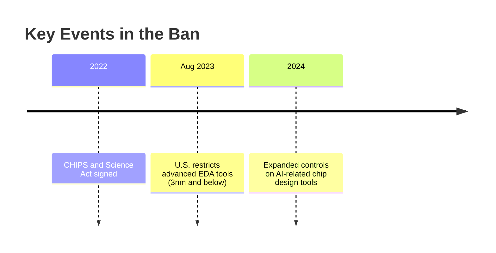
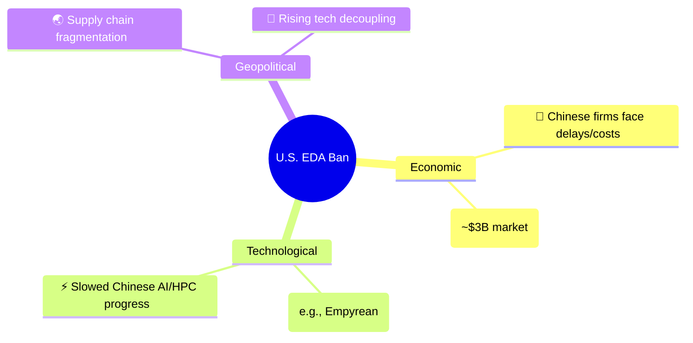

# **🚫 U.S. Ban on EDA Tools to China: Impacts & Implications**  

### **🔍 Background**  

---

### **⚡ Affected EDA Tools**  

| **🛠️ Banned Tools** (Synopsys, Cadence, Siemens EDA) | **📉 Impact** |  
|------------------------------------------------|--------------------------------|  
| High-end semiconductor design (3nm/5nm nodes)  | Blocks China’s cutting-edge chip development |  
| GPU/AI accelerator design tools               | Limits AI/military advancements |  
| Foundry/IP collaboration tools                | Disrupts supply chain partnerships |  

---

### **💥 Consequences**  

---

### **🚀 China’s Response**  
- **🇨🇳 "EDA Self-Sufficiency"** initiatives (e.g., Huawei’s HiSilicon, Empyrean).  
- **🔄 Reverse engineering** & open-source alternatives (e.g., **OpenROAD**).  
- **🌍 Partnerships** with non-U.S. tool vendors (e.g., EU/Japan).  

---

### **🤔 Key Question**  
*"Will this ban accelerate China’s tech independence or deepen global divisions?"*  

---

## **EDA Tools & Operating Systems: The Impact of Monopoly** 🖥️⚖️  

---

### **🔧 Key Players in the Industry**  

| **🛠️ EDA Tools**       | **💻 Operating Systems**  |  
|----------------------|------------------------|  
| Synopsys, Cadence    | Microsoft, Apple       |  
| Design Compiler      | Windows 7 (Legacy)     |  
| IP & Foundry         | Hard Disk, Drivers     |  

---

### **⚠️ The Problem of Monopoly**  

🔴 **Without Linux**, we’d still be stuck with **Windows 7**! 😱  
- 🐌 **Slow progress** due to lack of competition.  
- 💸 **Higher costs** from vendor lock-in.  
- 🚀 **Open-source (Linux) broke the cycle!**  

---

### **🤔 Food for Thought**  
*"Should regulations encourage open-source alternatives to prevent monopolies?"*  
