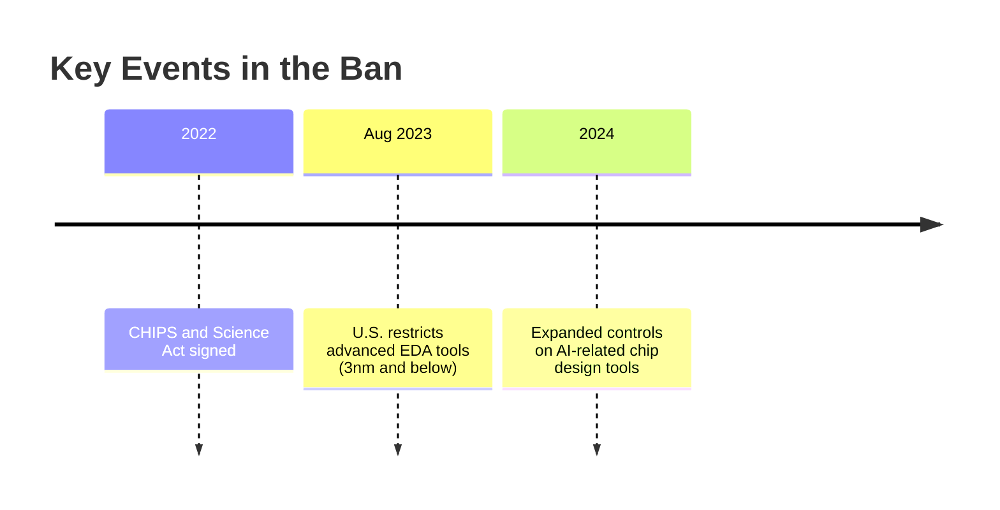

# 🚫 美国对华 EDA 工具禁令：影响与启示

@luk036 👨‍💻

2025-06-12 📅

---

### **🔍 背景**

---

### **⚡ 受影响的 EDA 工具**

| **🛠️ 禁用工具**（Synopsys、Cadence、Siemens EDA）| **📉 影响** |
|------------------------------------------------|--------------------------------|
| 高端半导体设计（3nm/5nm 节点）|阻碍中国尖端芯片研发 |
| GPU/AI 加速器设计工具 | 限制 AI/军事发展 |
| 晶圆代工/IP 协作工具 | 破坏供应链合作伙伴关系 |

---

### **💥 后果**

---

### **🚀 中国的应对**
- **🇨🇳 “EDA 自给自足”** 计划（例如华为海思、Empyrean）。
- **🔄 逆向工程** 和开源替代方案（例如 **OpenROAD**）。
- **🌍 与非美国工具供应商（例如欧盟/日本）建立合作伙伴关系**。

---

### **🤔 关键问题**
*“这项禁令会加速中国的技术独立性还是加深全球分歧？”*

---

## **EDA 工具和操作系统：垄断的影响** 🖥️⚖️

---

### **🔧 行业关键参与者**

| **🛠️ EDA 工具** | **💻 操作系统** |
|----------------------|------------------------|
| Synopsys、Cadence | Microsoft、Apple |
| Design Compiler | Windows 7（旧版）|
| IP 和代工厂 | 硬盘、驱动程序 |

---

### **⚠️ 垄断问题**

🔴 **如果没有 Linux 🐧**，我们现在还得用**Windows 7**！😱
- 🐌 由于缺乏竞争，**进展缓慢**。
- 💸 供应商锁定导致**成本上升**。
- 🚀 **开源（Linux）打破了这个循环！**

---

### **🤔 思考题**
*“监管是否应该鼓励开源替代方案以防止垄断？”*
