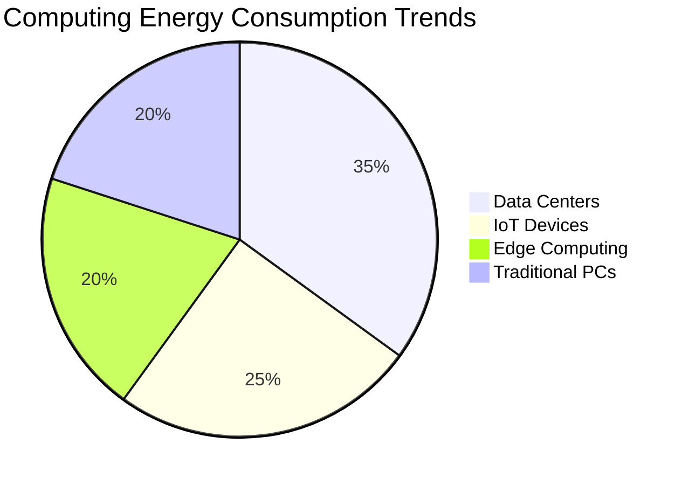
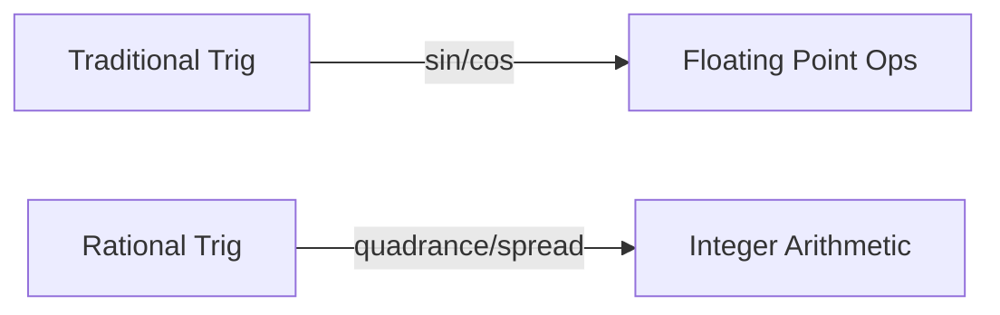
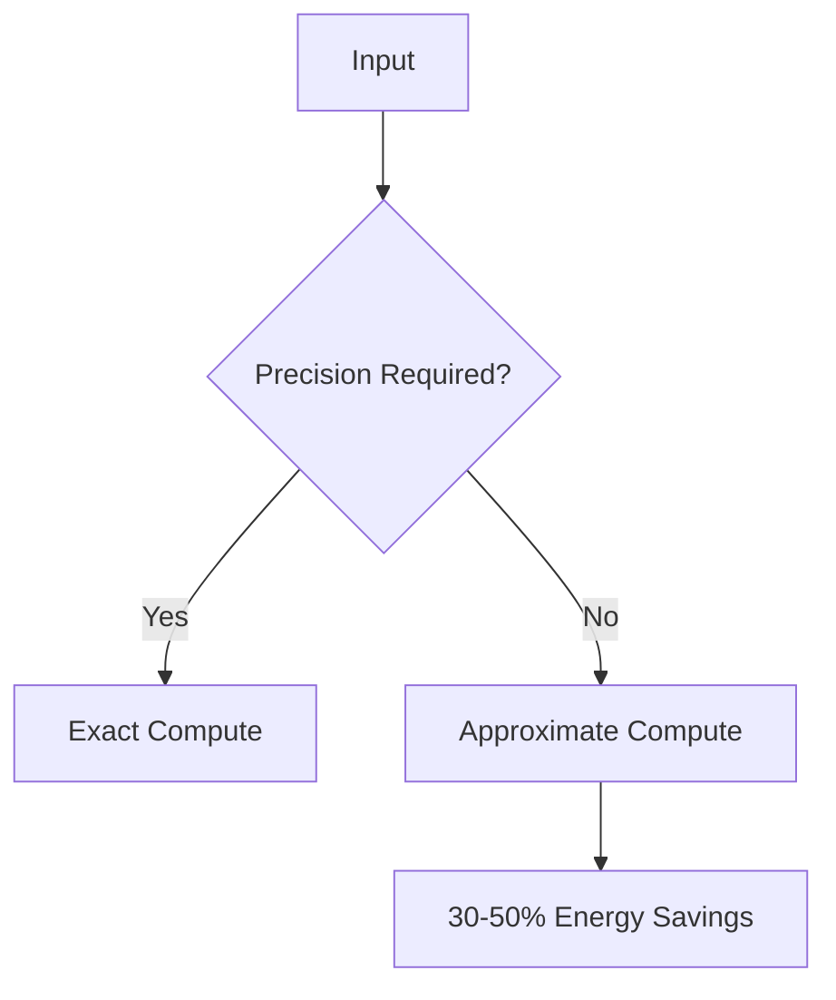
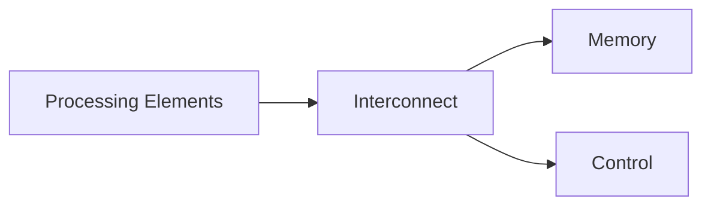
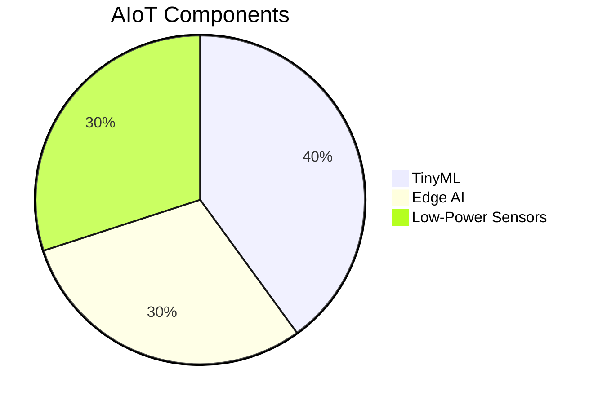

# Low Energy Computing: The Future of Efficient Systems 🔋

**Presented by:** [Your Name]  
**Date:** [Presentation Date]

---

## Today's Agenda

1. 🌍 Introduction to Low Energy Computing
2. 🧮 Rational Trigonometry vs Traditional Methods
3. ≈ Approximate Computing
4. ⚙️ Hardware Architectures for Efficiency
5. 🚀 Future Outlook

---

## 1. 🌍 Why Low Energy Computing?

**Key Challenges:**
- Conventional architectures prioritize performance over efficiency 💨
- Algorithms optimized for speed, not energy savings ⚡
- Growing demand for sustainable computing ♻️

> "By 2030, computing could consume 8% of global electricity" - IEEE Study

---

## 2. 🧮 Rational Trigonometry: Math Meets Efficiency

### Traditional vs Rational Approach

**Advantages:**
- ✖️ No complex floating-point operations
- 🔢 Pure algebraic calculations
- 🧭 Direction/ordering independent
- 2-3x energy savings in geometric computations

**Use Case:** Computer vision, robotics, GPS systems

---

## 3. ≈ The Power of Approximation

### When "Good Enough" is Perfect

**Applications:**
- 🖼️ Image/audio processing
- 📈 Machine learning inference
- 🌡️ Sensor data analysis

**Requirements:**
- ✅ Error tolerance
- ✅ Good simulation models
- ✅ Quality-of-Service metrics

---

## 4. ⚙️ Hardware Architectures for Low Energy

### Two Promising Approaches

**1. CGRA (Coarse-Grained Reconfigurable Array)**  

- ♻️ Reconfigurable for different tasks
- 5-10x more efficient than FPGAs

**2. AIoT (AI + IoT)**  

- 🦾 On-device intelligence
- 📶 Reduced data transmission

---

## 5. 🚀 The Road Ahead

**2025-2030 Predictions:**
- 📉 50% reduction in ML inference energy
- 🏙️ Proliferation of city-scale IoT networks
- 🔋 Self-powered edge devices

**Research Opportunities:**
- Hybrid exact-approximate systems
- Quantum-inspired classical algorithms
- Biologically-inspired architectures

---

## 🎯 Key Takeaways

1. 💡 Energy efficiency is the new performance metric
2. ➗ Rational mathematics enables integer-based computing
3. ≈ Approximation unlocks massive savings
4. ⚡ Specialized hardware (CGRA/AIoT) is crucial
5. 🌱 Sustainable computing = Better future

---

## ❓ Questions & Discussion 🗣️

[Your Contact Information]  
[Optional QR Code to Resources]

