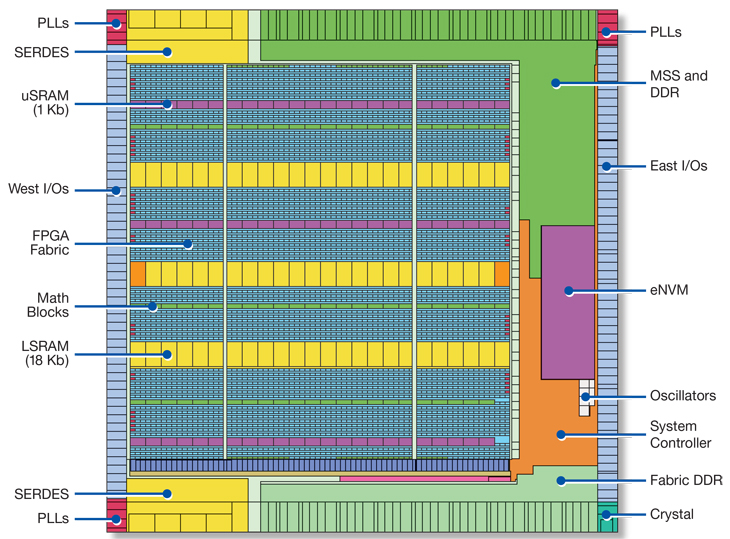
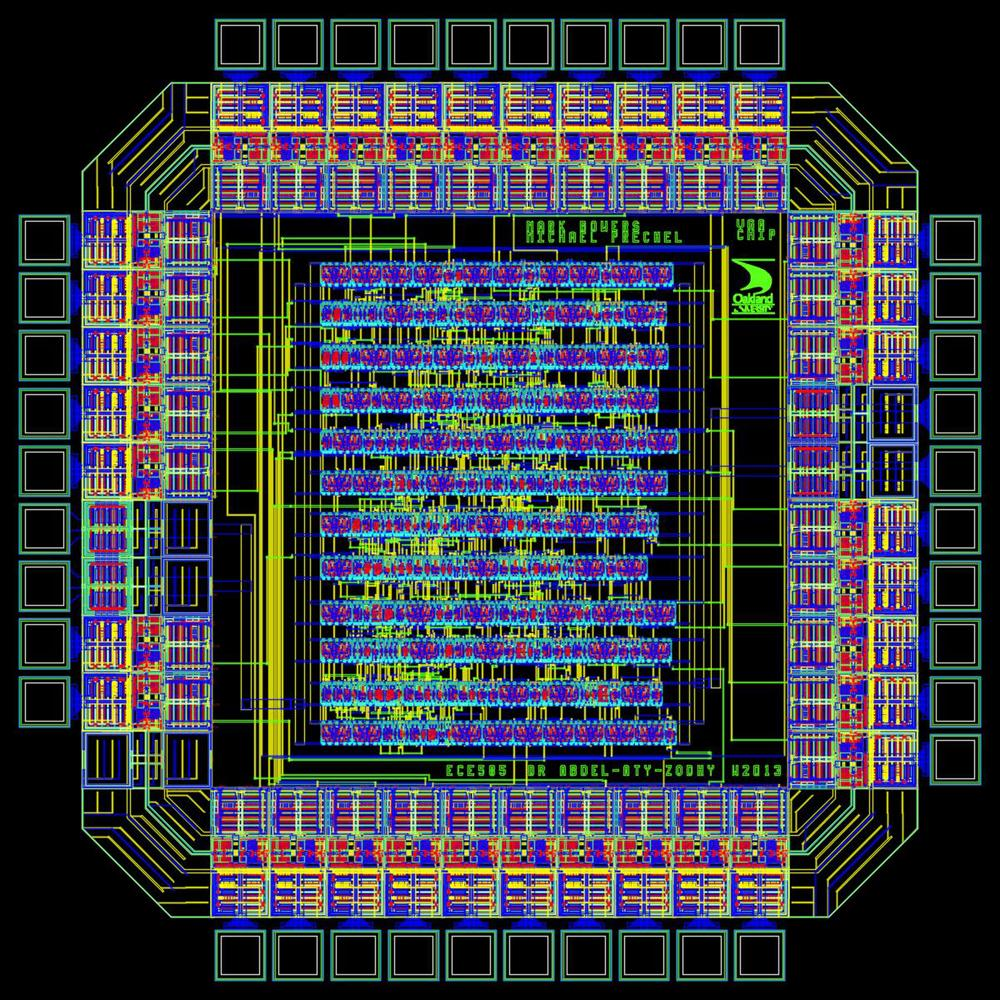

layout: true
class: typo, typo-selection

---

count: false
class: nord-dark, middle, center

# Some thoughts on global placement 💡

@luk036

2021-10-26

---

## Who is to blame for the congestion problem?

--

A1. The smooth approximated HPWL of the analytical placer should be blamed.

- Convex → analytical placement (gradient can be computed analytically)
  - Note 1: Quadratic approximation: can be efficiently solved by the conjugate gradient method.
  - Note 2: Non-quadratic approximation: e.g. log-sum-exp technique.
  - Fixed position constraints
  - Density constraints
- Non-convex → simulated annealing
- Legalization → detailed placement

---

## Who is to blame for the congestion problem?

A2. HPWL wire-length model should be blamed.

- Underestimated when $n>3$, where $n$=the number of pins of a net.
- Thereafter, some compensate factor (e.g. Rent's rule) are used.

--

A simple fact that has been ignored for 50 years? 🤔

---

## What have I learned from timing optimization?

- "不患寡而患不均"
- "不均" means "unfair", not "uneven"
- Cantonese: "均真"
- **As long as the objective is to minimize the total wire-length, the problem will not go away.**

---

## How to achieve fairness while reducing wire-length

- Min-max fairness: minimize the worst wire length (still convex)
- Min-max is usually (but not always) easier to solve than Min-sum.
- Imposing proportional fairness through weighted costs
- Related paper:
  A. Kahng, S. Mantik and I. L. Markov, Min-Max Placement For Large-Scale Timing Optimization, ISPD'03. (minimize the worst delay path, non-convex?)

---

## Optimize x-direction and y-direction separately. Why?

---

## ASIC

---

## Flow-based Optimization

- 1D Placement can be formulated as a network flow (dual) problem
  - Min-sum objective: min-cost flow problem
  - Min-Max objective: parametric network flow problem
  - Advantage:
    - Faster than LP 👍
    - Allow discrete solution 👍👍👍
  - Disadvantage:
    - Difficult to impose additional constraints 👎
- 2D, 3D: alternating directions

---

class: nord-dark, middle, center

# Q & A 🙋️
