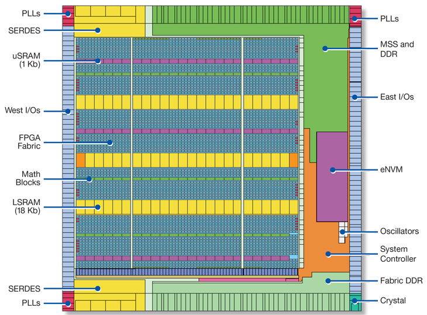
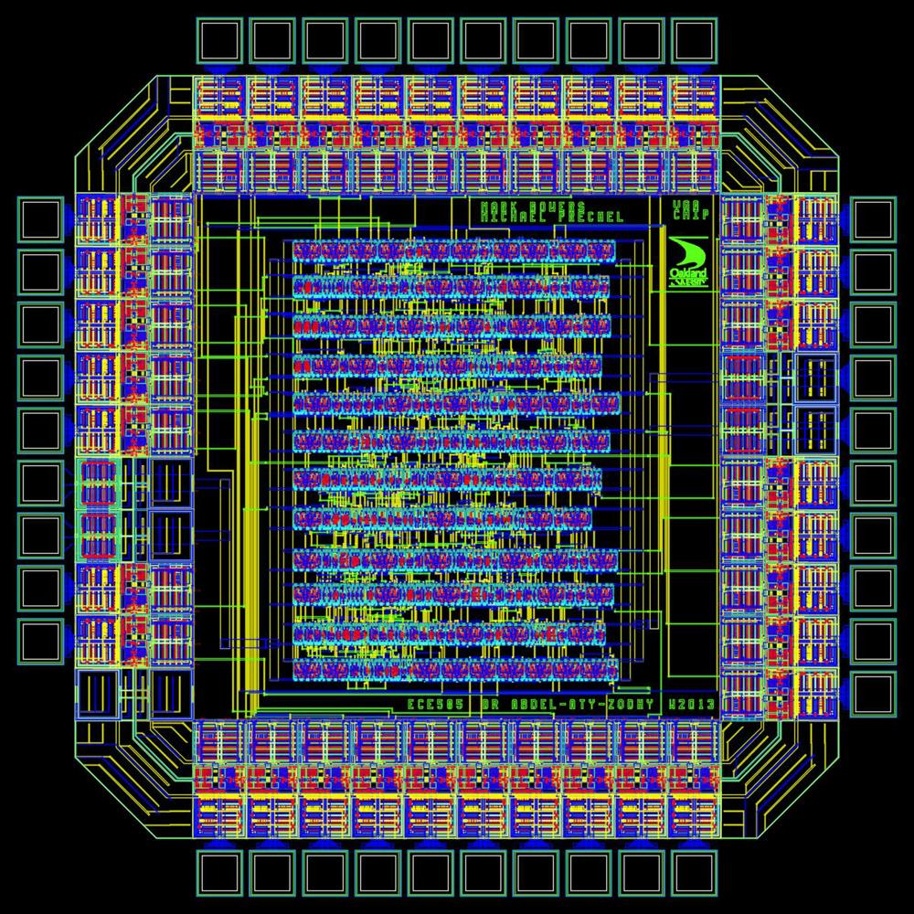

layout: true
class: typo, typo-selection

---

count: false
class: nord-dark, middle, center

# Some thoughts on global placement 💡

@luk036 👨‍💻

2021-10-26 📅

---

### Who is to blame for the congestion problem?

--

A1. The smooth approximated HPWL of the analytical placer should be blamed.

-   Convex → analytical placement (gradient can be computed analytically)
  -   Note 1: Quadratic approximation: can be efficiently solved by the conjugate gradient method.
  -   Note 2: Non-quadratic approximation: e.g. log-sum-exp technique.
  -   Fixed position constraints
  -   Density constraints
-   Non-convex → simulated annealing
-   Legalization → detailed placement

.mermaid[

<pre>
graph LR
    A["Netlist with\n Fixed Pins"] --> B{Objective}
    B -->|Quadratic| CG["Conjugate\n Gradient"]
    B -->|Log-Sum-Exp| LSE["Smooth\n Approximation"]
    CG --> P["Global\n Placement"]
    LSE --> P
    P --> L[Legalization]
    L --> D["Detailed\n Placement"]
    style A fill:#ff9800
    style B fill:#f44336
    style CG fill:#2196f3
    style LSE fill:#2196f3
    style P fill:#4caf50
    style L fill:#9c27b0
    style D fill:#9c27b0
</pre>

]

---

### Who is to blame for the congestion problem?

A2. HPWL wire-length model should be blamed.

-   Underestimated when $n>3$, where $n$=the number of pins of a net.
-   Thereafter, some compensate factor (e.g. Rent's rule) are used.

--

A simple fact that has been ignored for 50 years? 🤔

---

.mermaid[

<pre>
graph LR
    subgraph "2-pin Net"
        P1[Pin A] --- P2[Pin B]
        EQ[HPWL = Actual ✅]
    end
    subgraph "Multi-pin Net (n>3)"
        P3[Pin C] --- P4[Pin D]
        P3 --- P5[Pin E]
        P3 --- P6[Pin F]
        NEQ[HPWL &lt; Actual ❌]
    end
    style EQ fill:#4caf50
    style NEQ fill:#f44336
</pre>

]

---

### What have I learned from timing optimization?

-   "不患寡而患不均"
-   "不均" means "unfair", not "uneven"
-   Cantonese: "均真"
-   **As long as the objective is to minimize the total wire-length, the problem will not go away.**

---

### How to achieve fairness while reducing wire-length

-   Min-max fairness: minimize the worst wire length (still convex)
-   Min-max is usually (but not always) easier to solve than Min-sum.
-   Imposing proportional fairness through weighted costs
-   Related paper:
  A. Kahng, S. Mantik and I. L. Markov, Min-Max Placement For Large-Scale Timing Optimization, ISPD'03. (minimize the worst delay path, non-convex?)

---

.mermaid[

<pre>
graph LR
    subgraph "Min-Sum"
        MS["Minimize\n ∑ wirelength"]
        R1["Some nets very long\n Congestion ❌"]
    end
    subgraph "Min-Max"
        MM["Minimize\n max wirelength"]
        R2["Balanced distribution\n Fairness ✅"]
    end
    style MS fill:#f44336
    style R1 fill:#f44336
    style MM fill:#4caf50
    style R2 fill:#4caf50
</pre>

]

---

### Optimize x-direction and y-direction separately. Why?

---

### ASIC

---

### Flow-based Optimization

-   1D Placement can be formulated as a network flow (dual) problem
  -   Min-sum objective: min-cost flow problem
  -   Min-Max objective: parametric network flow problem
  -   Advantage:
    -   Faster than LP 👍
    -   Allow discrete solution 👍👍👍
  -   Disadvantage:
    -   Difficult to impose additional constraints 👎
-   2D, 3D: alternating directions

---

.mermaid[

<pre>
graph TD
    subgraph "1D Placement"
        Prob[Placement] --> Dual[Dual Network Flow]
        Dual --> MCF{Objective}
        MCF -->|Min-Sum| MCS[Min-Cost Flow]
        MCF -->|Min-Max| PAR[Parametric Flow]
        MCS --> SOL[Discrete Solution]
        PAR --> SOL
    end
    Prob --> Alt[Alternating Directions]
    Alt --> X[X-axis]
    Alt --> Y[Y-axis]
    style Prob fill:#ff9800
    style Dual fill:#2196f3
    style MCF fill:#f44336
    style MCS fill:#4caf50
    style PAR fill:#4caf50
    style SOL fill:#9c27b0
    style Alt fill:#ff9800
    style X fill:#2196f3
    style Y fill:#2196f3
</pre>

]

---

class: nord-dark, middle, center

# Q&A️ 🎤
