# Slide 1: Title Slide 🏭💡

## Course: Introduction to VLSI Physical Design Automation

## From Netlist to Chip: The Art & Science of Physical Design

📅 Duration: 60 Minutes
🎓 Instructor: [Your Name]

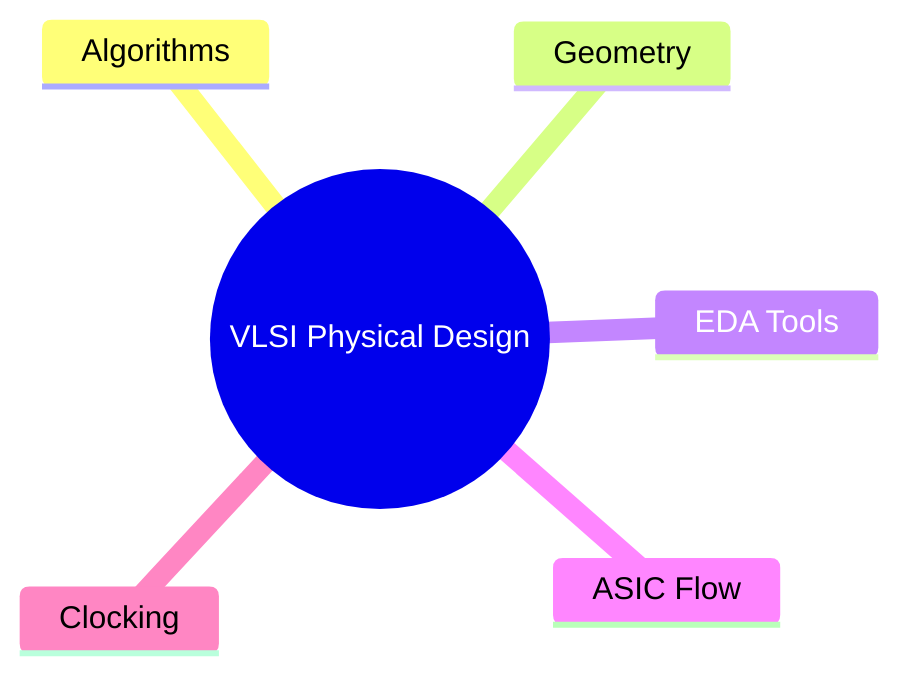

---

## Slide 2: What is Electronic Design Automation (EDA)? 🤖⚡

## EDA = CS + EE + Magic ✨

-   **Computer Science** → Algorithms, Data Structures, Software Engineering
-   **Electrical Engineering** → Modeling, Simulation, Signal Integrity
-   **The Big Challenge**: *"Chicken and Egg"* Design Flow Issues 🥚🐔

> *"Without EDA, a modern chip would take centuries to design manually."*

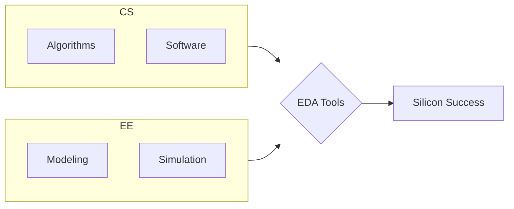

---

## Slide 3: EDA vs. Logic Synthesis 🧠👁️

| Aspect | Logic Synthesis | Physical Design |
|--------|----------------|------------------|
| **Human Strength** | Weak at logic | Strong at vision 👀 |
| **Output** | Gates & netlist | Shapes & coordinates 📐 |
| **Appreciation** | High (Synthesis is sexy) | Low (Layout is grunt work?) 😢 |

> **Key Insight**: Humans are **not** good at logic, but human eyes are **amazing** at pictures.
> *Physical design respects your visual brain!*

---

## Slide 4: Computer Languages for Physical Design 💻🐍➡️⚙️

**The Hard Truth**: C++ is powerful but *hard*.

**Our Strategy** (Works with AI 🤝):

1. **Prototype in Python** 🐍 → Fast, flexible, forgiving
2. **Translate to C++** → Performance, control
3. **Use AI copilots** to assist translation

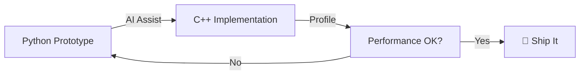

---

## Slide 5: Domain-Specific Rule #1 – Coordinates 📏

**🚫 NEVER use floating point for coordinates.**

-   Use **big integers** (e.g., `int64_t`, Python `int`)
-   Watch for **overflow** in add/subtract/multiply

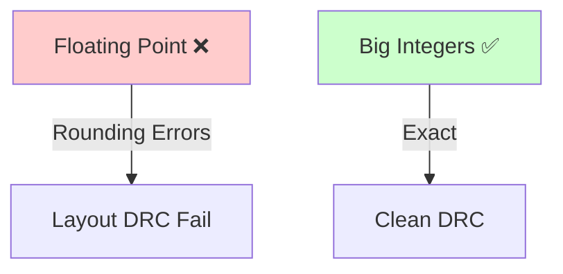

> *Physical design grids can be 1,000,000 x 1,000,000 units. Floats lie, integers don't.*

---

## Slide 6: Domain-Specific Rule #2 – Geometry 🧩

**Default assumption: Rectilinear shapes** (Manhattan geometry)

-   Vertical + Horizontal lines (90°)
-   *Sometimes* + 45° lines (abstract routing)
-   No arbitrary angles unless specified

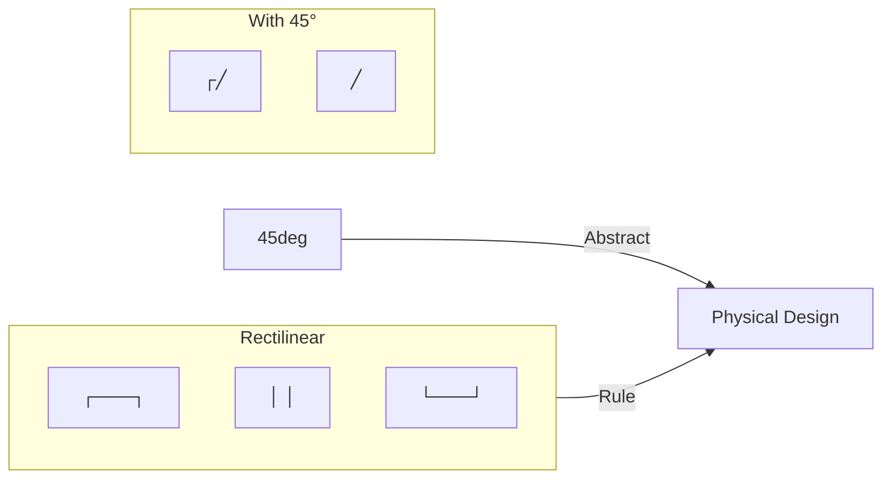

**Why?** Simpler DRC, faster algorithms, predictable parasitics.

---

## Slide 7: Domain-Specific Rule #3 – Scale 📊

## Number of physical objects: Billions (10⁹)

| Except... | Typical size |
|-----------|--------------|
| Polygon vertices | Few (≤ 10) |
| Pins per net | Few (except high fan-out) |
| Metal layers | ≤ 20 |
| Keepouts | ≤ 10 |

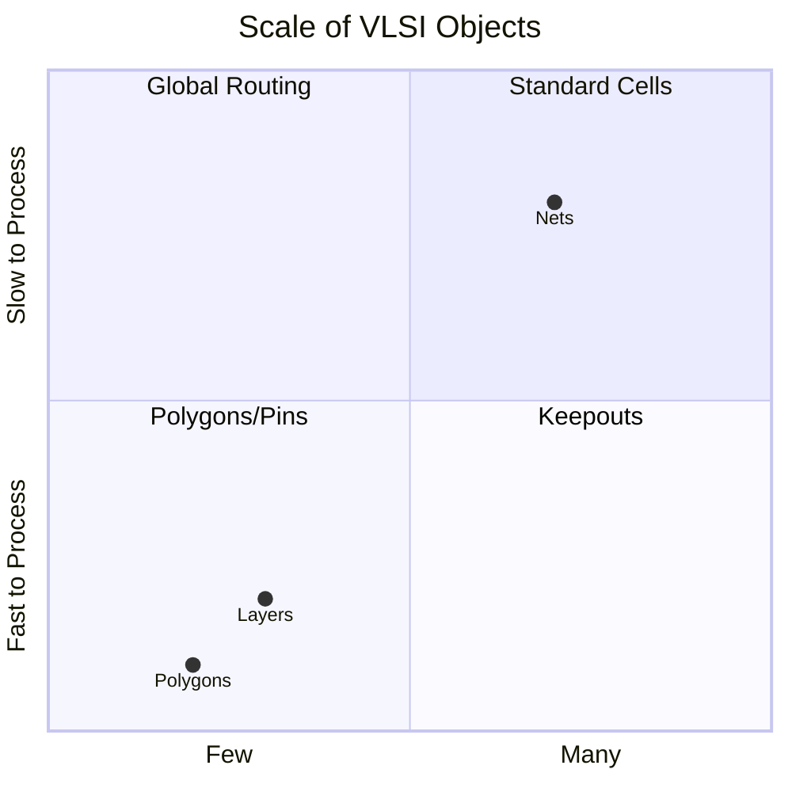

---

## Slide 8: Keep Algorithms Simple 🙏

> **Simple ≠ Easy**
> *Simple means few moving parts, easy to verify, hard to break.*

**Golden Rule**: Start with the simplest possible solution, then optimize.

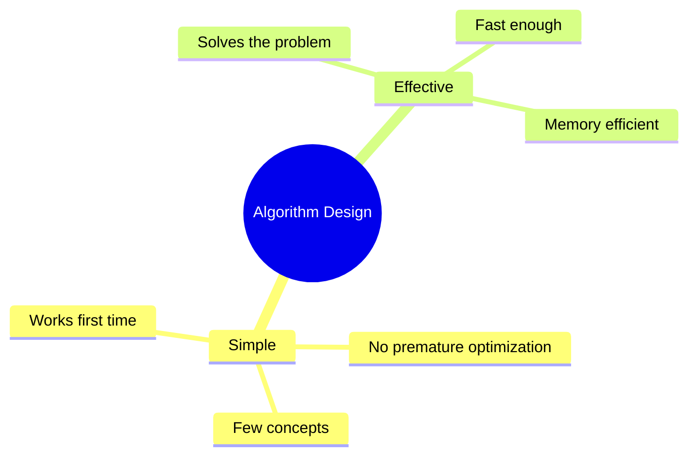

---

## Slide 9: C++ Rules of Thumb (For This Course) ⚙️

-   **🚫 Avoid virtual functions** (unless explicitly allowed)
  -   Virtual = vtable = indirection = cache miss
-   **✅ Prefer `unique_ptr`** over `shared_ptr`
  -   `shared_ptr` hides ownership cycles

```cpp
// Good 👍
auto cell = std::make_unique<Cell>("AND2");

// Less good (unless truly shared) 👎
auto shared_cell = std::make_shared<Cell>("OR2");
```

```mermaid
flowLR
    A[unique_ptr] -->|Single Owner| B[No Overhead]
    C[shared_ptr] -->|Multiple Owners| D[Atomic Refcount + Overhead]
```

---

## Slide 10: Advanced Topics Overview 🚀

## Focus: ASIC Physical Design

| Topic | Emoji |
|-------|-------|
| Multilevel Hypergraph Partitioning | 🧩 |
| Rectilinear Shapes & Manhattan Metric | 📐 |
| Rectilinear Voronoi Diagram | 🔮 |
| Global Routing with Keepouts + 3D | 🌐 |
| Steiner Forest (Union-Find + Primal-Dual) | 🌲 |
| Prescribed-Skew DME Clock Tree | ⏰ |
| Useful Skew Design Flow | ⚡ |
| Global Placement | 🗺️ |

---

## Slide 11: Topic 1 – Multilevel Hypergraph Partitioning 🧩

**Goal**: Divide netlist into balanced blocks, minimize cut nets.

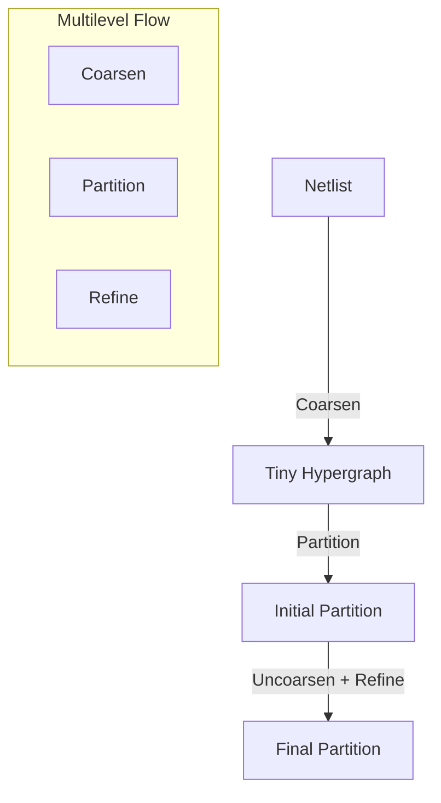

**Key Algorithms**:

-   Clustering
-   Fiduccia-Mattheyses (FM) refinement
-   hMETIS / KaHyPar

---

## Slide 12: Topic 2 – Rectilinear Shapes & Manhattan Metric 🧮

**Manhattan Distance**: `|x1-x2| + |y1-y2|`

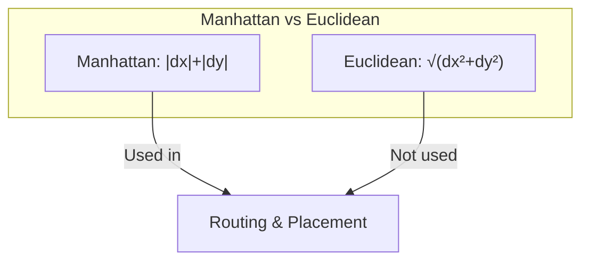

**Rectilinear Polygons**:

-   All edges horizontal or vertical
-   Easy to compute area, overlap, DRC
-   No holes in simple version

---

## Slide 13: Topic 3 – Rectilinear Voronoi Diagram 🔮

**Regular Voronoi** (Euclidean) → **Rectilinear Voronoi** (Manhattan)

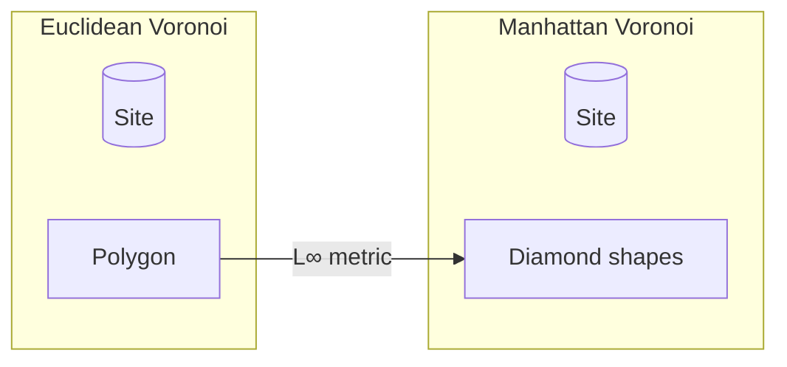

**Use**:

-   Find nearest obstacle
-   Wire width estimation
-   Buffer insertion

---

## Slide 14: Topic 4 – Global Routing with Keepouts & 3D 🌐

**Global routing**: Assign wires to routing regions (not exact tracks)

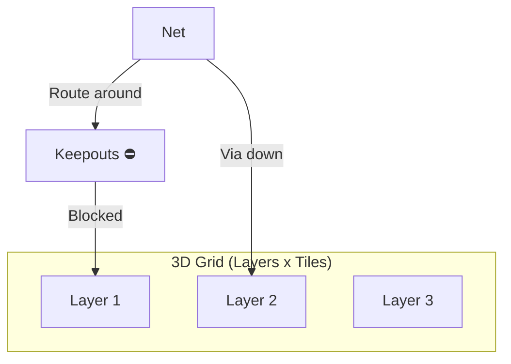

**Constraints**:

-   Keepouts (placement blockages, macros)
-   Layer direction alternating (M1 horiz, M2 vert, etc.)
-   Via capacity limits

---

## Slide 15: Topic 5 – Steiner Forest via Union-Find & Primal-Dual 🌲

**Problem**: Connect multiple nets sharing resources → Minimum cost forest.

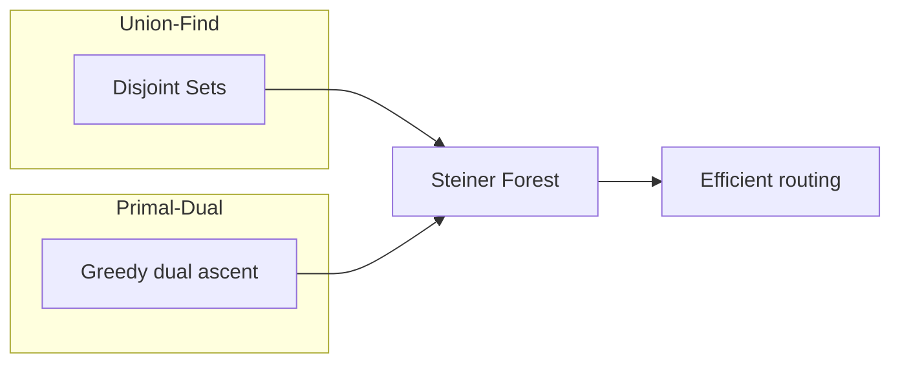

**Why clever**: Avoids explicit Steiner tree enumeration → fast, near-optimal.

---

## Slide 16: Topic 6 – Prescribed-Skew DME Clock Tree ⏰

## DME = Deferred Merge Embedding

-   Build clock tree for **exact arrival times** at sinks
-   Not zero-skew, but *prescribed skew*

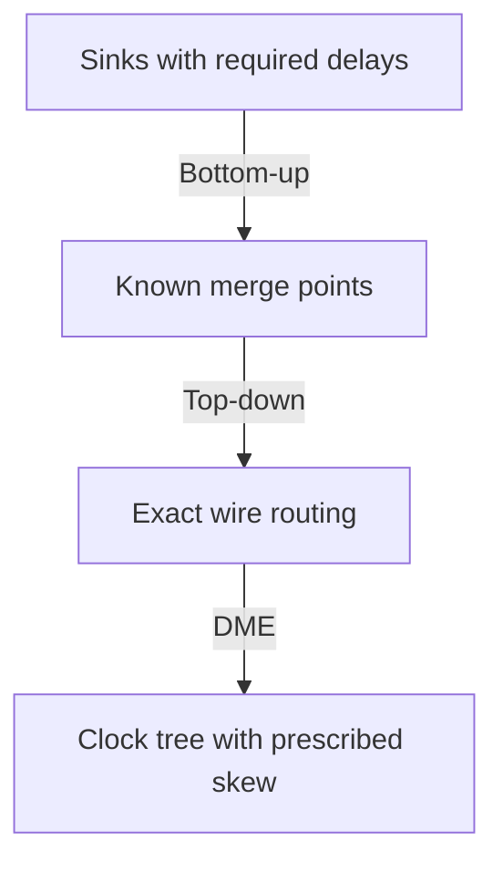

**Use**: Useful skew, timing closure, clock gating.

---

## Slide 17: Topic 7 – Useful Skew Design Flow ⚡

Traditional: Zero skew → **Useful skew**: intentional clock delays to fix setup/hold

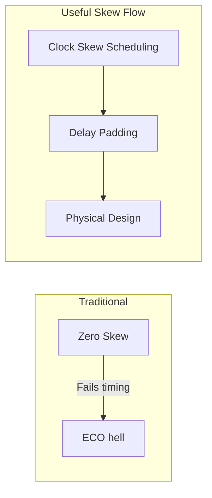

**Benefits**:

-   Fix setup violations without moving cells
-   Fix hold violations with padding
-   **Reclaim timing slack**

---

## Slide 18: Topic 8 – Global Placement 🗺️

**Goal**: Place standard cells to minimize wirelength + congestion.

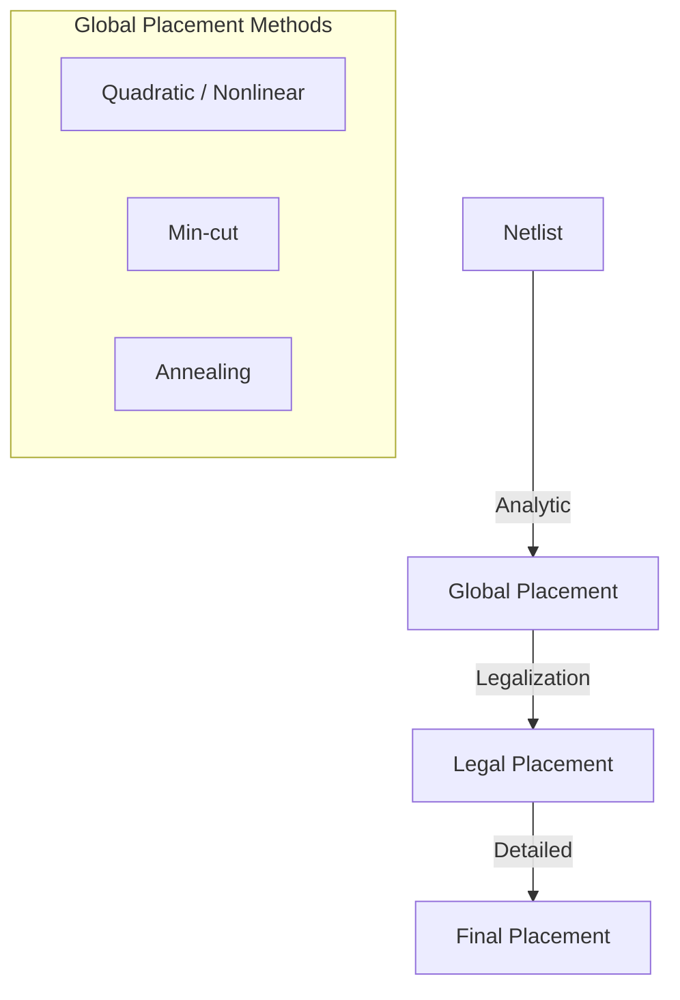

**Modern approach**: Analytic placement + non-linear optimization (e.g., ePlace, DREAMPlace).

---

## Slide 19: Recap – The Big Picture 🖼️

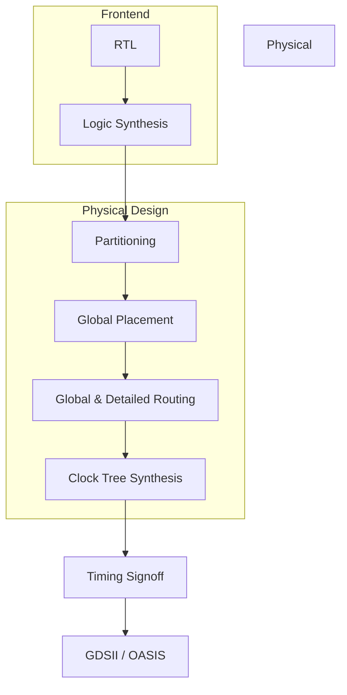

**You now understand the main pillars** 🎯

---

## Slide 20: Key Takeaways & Next Steps 🎓✅

**Golden Rules to Remember**:

1. 🚫 No floating point coordinates
2. 📐 Rectilinear unless specified
3. 🔢 Billions of objects, but small exceptions
4. 🧠 Keep algorithms simple
5. 🔗 Prefer `unique_ptr` over `shared_ptr`
6. 🤖 Python → C++ with AI help

**Next Steps**:

-   Implement a simple FM partitioner
-   Build a Manhattan distance router
-   Explore open-source tools: OpenROAD, TritonRoute

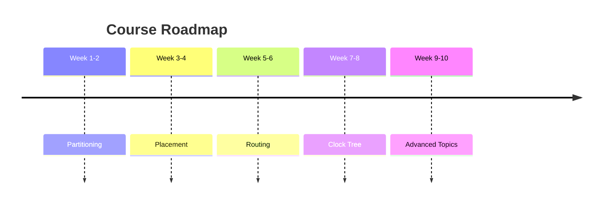

---

## Thank you! Questions? 🙋‍♂️🙋‍♀️

*"Chips don't lie, but they do get hot."* 🔥
