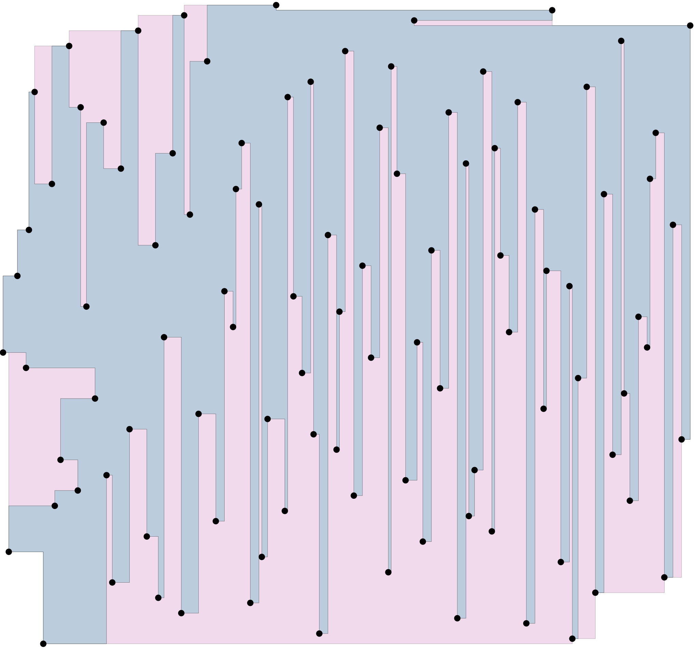
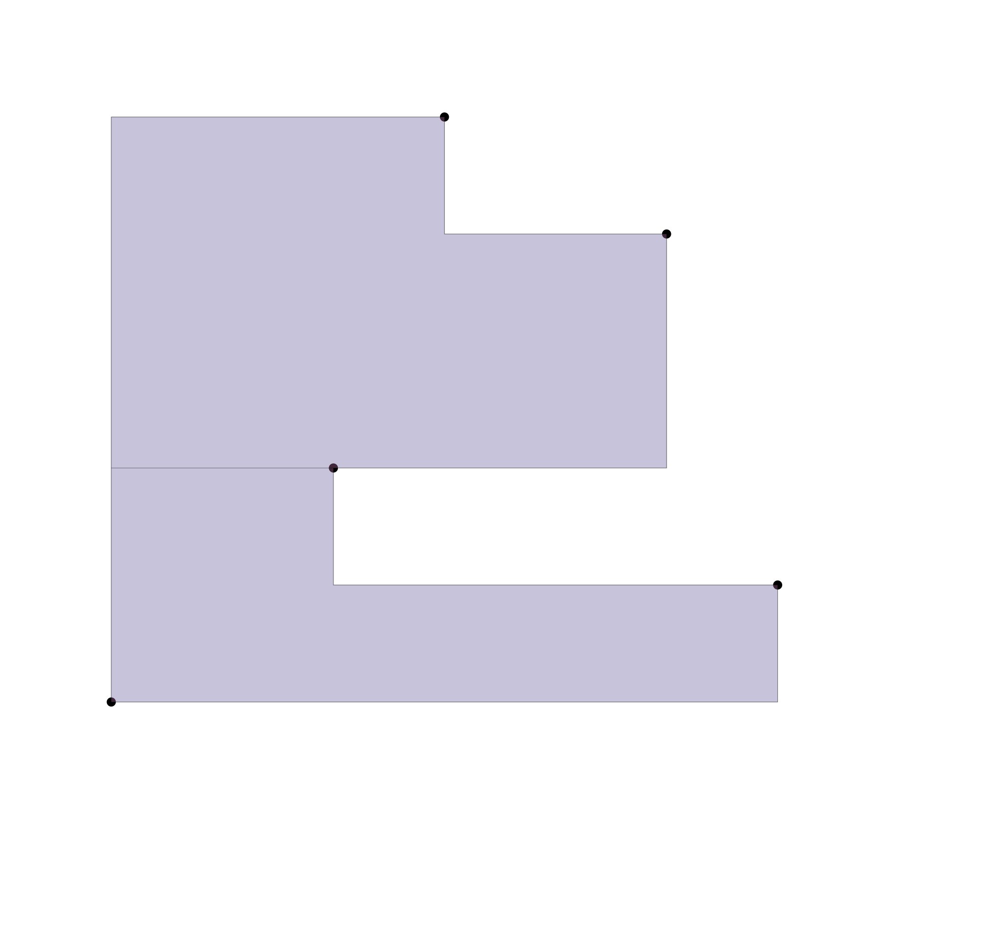
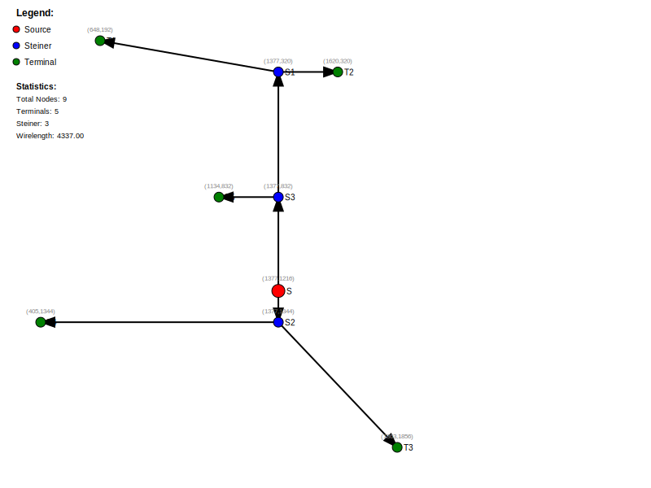

layout: true
class: typo, typo-selection

---

count: false
class: nord-dark, middle, center

# The `physdes` Package
## A Toolkit for Geometric Operations

@luk036 👨‍💻

2025-05-17 📅

---

## What is physdes?

*   `physdes` is a Python package 🐍🔧
*   It provides **tools for performing geometric operations** and calculations in a 2D space, particularly in **rectilinear space**. 📏➗
*   Designed for physical design calculations 🏗️
*   Useful in areas like computational geometry, computer graphics, and layout manipulation 🖥️🎨

---

## Core Concepts & Modules

*   The package is organized into several **modules** 🧩
*   Each module focuses on different types of geometric objects or operations 🔍
*   It often uses **object-oriented programming** principles 🏗️👨‍💻
*   Supports **generic types** (`T1`, `T2`, etc.) for flexibility with different data types (integers, floats) 🔄🔢

---

## Generic Operations (`physdes.generic`)

*   Provides **general-purpose operations** applicable to different object types 🛠️🔧
*   Handles simple objects like numbers (scalars) and more complex objects like intervals 🔢➡️🔣
*   Key functions:
    *   `overlap(lhs, rhs)`: Checks if two objects overlap ↔️❓
    *   `contain(lhs, rhs)`: Checks if one object contains another 📦✔️
    *   `intersection(lhs, rhs)`: Finds the common part between two objects ✖️🔍
    *   `min_dist(lhs, rhs)`: Calculates the minimum distance between two objects (often Manhattan distance) 📏➗

---

## Working with Intervals (`physdes.interval`)

*   Defines the **Interval Class** 📏📊
*   Represents a **range of numbers** with a lower bound (`lb`) and an upper bound (`ub`) 🔽🔼
*   Purpose: Work with intervals, perform operations and comparisons ↔️⚖️
*   Supports both integers and floating-point numbers 🔢🔣
*   Examples of methods:
    *   `contains(obj)`: Check if an object is within the interval ✔️📦
    *   `length()`: Calculate the length of the interval 📏➗
    *   `intersect_with(obj)`: Find the intersection with another object ✖️🔍
    *   `min_dist_with(obj)`: Calculate minimum distance to another object 📏➗
    *   `overlaps(other)`: Check if it overlaps with another interval ↔️❓

---

## Points in 2D (`physdes.point`)

*   Defines the **Point Class** 📍🎯
*   Represents a point in a 2D Cartesian coordinate system 📊➕
*   Stores `xcoord` and `ycoord` attributes 🔢
*   Can be used for points, segments, or other geometric shapes 🔷📐
*   Key capabilities:
    *   Adding and subtracting vectors ➕➖
    *   Checking if points overlap or contain each other ↔️📦
    *   Finding the minimum distance between points 📏➗
    *   Finding the intersection of points or shapes ✖️🔍
    *   Enlarging a point to create a rectangle around it 🔲➕
*   Examples of methods/properties:
    *   `xcoord`, `ycoord`: Access coordinates 🔍🔢
    *   `displace(rhs)`: Returns a new object displaced by a vector or point ➡️↗️
    *   `flip()`: Returns a new Point with coordinates swapped 🔄

---

## Vectors in 2D (`physdes.vector2`)

*   Defines the **Vector2 Class** ↔️↕️➡️
*   Represents a **two-dimensional vector** 📐🔢
*   Has magnitude and direction 📏🧭
*   Stores `x` and `y` coordinates 🔢
*   Useful for applications in game development, physics, etc. 🎮🌍
*   Supports standard arithmetic operations (addition, subtraction, multiplication by scalar) ➕➖✖️
*   Key method:
    *   `cross(rhs)`: Calculates the cross product of two vectors ✖️🔀
*   Properties:
    *   `x`: Returns the x-coordinate ↔️
    *   `y`: Returns the y-coordinate ↕️

---

## Axis-Parallel Rectangles & Segments (`physdes.recti`)

*   Defines classes for working with **rectangles and line segments** in 2D 🔲📏
*   Includes **HSegment** (horizontal) and **VSegment** (vertical) classes ↔️↕️
*   Also includes the **Rectangle** class 🏢🔳
*   Built on top of Point and Interval classes 🔼🔽
*   Provides methods for checking containment, flipping coordinates, and basic properties 🔍🔄📊
*   Examples for Rectangle:
    *   `area()`: Calculates the area 📏✖️
    *   `contains(other)`: Checks if a point or segment is inside 📦✔️
    *   `height()`, `width()`: Get dimensions 📏
    *   `ll`, `ur`: Get lower-left and upper-right points ↙️↗️

---

## 45° Rotated Objects (`physdes.merge_obj`)

*   Defines the **MergeObj Class** 🔶🔄
*   Represents a geometric object (point, segment, region, etc.) rotated **45 degrees** 📐↩️
*   Works with different types of inputs (integers, floats, intervals) 🔢🔣📊
*   Coordinates are represented as `xcoord` and `ycoord` 🔢
*   Provides methods for manipulating and interacting with these rotated objects 🛠️🔧
*   Key methods:
    *   `construct(xcoord, ycoord)`: Static method to create a MergeObj from x,y coordinates 🏗️🔨
    *   `enlarge_with(alpha)`: Returns a new object with enlarged coordinates 🔲➕
    *   `intersect_with(other)`: Finds the intersection point ✖️🔍
    *   `merge_with(other)`: Combines objects based on minimum Manhattan distance and intersection 🤝📏
    *   `min_dist_with(other)`: Calculates the minimum rectilinear distance 📏➗

---

## Polygons (`physdes.polygon`)

*   Defines the **Polygon Module** 🔶📦
*   Tools for creating, manipulating, and analyzing **polygons** in 2D 🛠️🔍
*   Focuses on **arbitrary polygons** 🪨
*   Polygons are represented by a set of points (vertices) 📍
*   Achieves efficient manipulation and analysis ⚡📊
*   Key concepts/functions:
    *   **Monotone Polygons**
    *   **Point-in-Polygon Test**: Determines if a given point is inside a polygon (Uses the ray-casting algorithm) 📍❓
    *   **Signed Area**: Calculated using the Shoelace formula 👟📏

---

## Polygon Functionalities

*   Functions for creating specific polygon types:
    *   `create_mono_polygon(pointset, dir)`: Creates a monotone polygon 📈🔶
    *   `create_xmono_polygon(list)`: Creates an x-monotone polygon ↔️🔶
    *   `create_ymono_polygon(list)`: Creates a y-monotone polygon ↕️🔶
    *   `create_test_polygon(list)`: Creates a test polygon for testing purposes 🧪🔶
*   `point_in_polygon(pointset, ptq)`: Checks if a point is inside a polygon represented by a pointset 📍❓
*   `signed_area_x2`: Property to get twice the signed area of a polygon 📏✖️

---

## RPolygons (`physdes.rpolygon`)

*   Defines the **RPolygon Module** 🔶📦
*   Tools for creating, manipulating, and analyzing **rpolygons** in 2D 🛠️🔍
*   Focuses on **rectilinear polygons** (sides are horizontal or vertical) ↔️↕️
*   RPolygons are represented by a set of points (vertices) 📍
*   Achieves efficient manipulation and analysis ⚡📊
*   Key concepts/functions:
    *   **Monotone RPolygons**
    *   **Point-in-RPolygon Test**: Determines if a given point is inside a polygon (Uses the ray-casting algorithm) 📍❓
    *   **Signed Area**: Calculated using the Shoelace formula 👟📏

---

## RPolygon Functionalities

*   Functions for creating specific rpolygon types:
    *   `create_mono_rpolygon(pointset, dir)`: Creates a monotone polygon 📈🔶
    *   `create_xmono_rpolygon(list)`: Creates an x-monotone polygon ↔️🔶
    *   `create_ymono_rpolygon(list)`: Creates a y-monotone polygon ↕️🔶
    *   `create_test_rpolygon(list)`: Creates a test polygon for testing purposes 🧪🔶
*   `point_in_rpolygon(pointset, ptq)`: Checks if a point is inside a polygon represented by a pointset 📍❓
*   `signed_area`: Property to get the signed area of a polygon 📏✖️

---

## Rectilinear Polygon Convex Hull

*   Extends the concept of convex hulls to rectilinear polygons 🧱🔶
*   The **rectilinear convex hull** is the smallest rectilinear convex polygon that contains the given polygon 📦
*   Key for simplification and approximation of complex shapes 📉
*   Implemented in `physdes.rpolygon` 🛠️
*   Functions like `rpolygon_convex_hull` are provided to compute it efficiently ⚡

---

class: nord-dark, middle, center

## Rectilinear Polygon Convex Hull Example

---

## Convex Decomposition

*   Breaks down a non-convex rectilinear polygon into a set of non-overlapping convex rectilinear polygons that cover the original polygon 🧩🔶
*   Essential for many algorithms that work only on convex shapes, like area calculation or intersection testing ➕✖️
*   The module `physdes.rpolygon_cut` handles this decomposition 🔪
*   `rpolygon_cut_convex` function performs the decomposition ⚡

---

class: nord-dark, middle, center

## Convex Decomposition Example

---

## Global Routing

*   A key step in VLSI physical design 칩 🗺️
*   The `physdes.router` module provides tools for global routing  ROUTER
*   It aims to find paths for connecting different components on a chip 🔌
*   Uses concepts like Steiner trees to minimize wire length and congestion 🌳
*   The `GlobalRouter` class and `dme_algorithm` are key components for this task 🛠️

---

class: nord-dark, middle, center

## Global Routing Example

---

## Summary

*   `physdes` is a comprehensive library for **2D geometric operations** 🗺️📐
*   Includes modules for:
    *   Generic operations 🛠️
    *   Intervals
    *   Points 📍
    *   Vectors ➡️
    *   Rectangles and Segments 🔲📏
    *   45-degree Rotated Objects 🔶
    *   Polygons (especially rectilinear) 🔶↔️
*   Provides classes and functions for common tasks like checking containment, overlap, intersection, distance, and polygon analysis 🔍📏✖️
*   Flexible and reusable due to use of generic types and object-oriented design 🔄🏗️

---

## Conclusion

*   `physdes` offers a robust set of tools for physical design and geometric tasks. 🛠️📐
*   Its modular structure makes it adaptable for various applications. 🧩🔄
*   Explore the specific module documentations for detailed usage! 📚🔍

**GitHub** 🐙: [physdes-py](https://github.com/luk036/physdes-py) 🔗

---

count: false
class: nord-dark, middle, center

# Q&A 🎤
