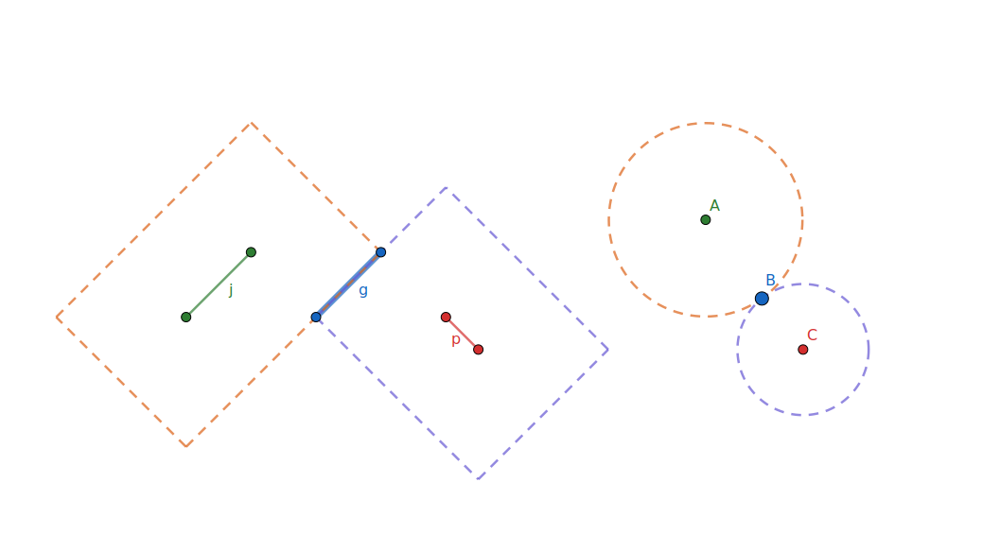

layout: true
class: typo, typo-selection

---

count: false
class: nord-dark, center, middle

# Rectilinear shape 𓊍

@luk036
<https://github.com/luk036/physdes-{py,rs,cpp}>

---

  

---

## 📖 Introduction

- Also known as L-shape, orthogonal shape

Applications: VLSI Physical Design

- Billions of objects
- Restrict integer coordinate ✨🚀
  - In C++/Rust, faster than floating Point. No round-off error.
  - In Python, arbitrary precision.
- Usually simpler than general shapes
- `Rectangle` = `Point<Interval, Interval>`

Different story for additional metric consideration

- L1 metric vs. L2 metric

---

## Rectilinear Polygon

- Use canonical form to simplify algorithms ✨🚀
  - x first, then y
- x-monotone, y-monotone
- Orthogonal convex hull 🔲
  - (Steiner points only exists inside the convex hull of given points)

---

## Computational Geometry

- Art Gallery problem
- Rectilinear Minimum Spanning Tree (RMST)
- Rectilinear Traveling Salesman Problem 🧳🕴(RTSP)
- Rectilinear Steiner Tree Minimization (RSTM)
- Rectilinear Voronoi diagram (with integer coordinates)

---

## Merging segment (45° line segment)

- Tap point in Clock tree synthesis (with integer coordinates)
- Analog to "Circle" in L2-metric (unit-ball in 2D)

---

## 3D Extension

- Path (x -- z -- y)

---

## Possible contribution 🤏

- c.f. python: shapely
- Testing
- Porting to C++
- Documentation

---

class: nord-dark, center, middle

# Q & A 🙋
