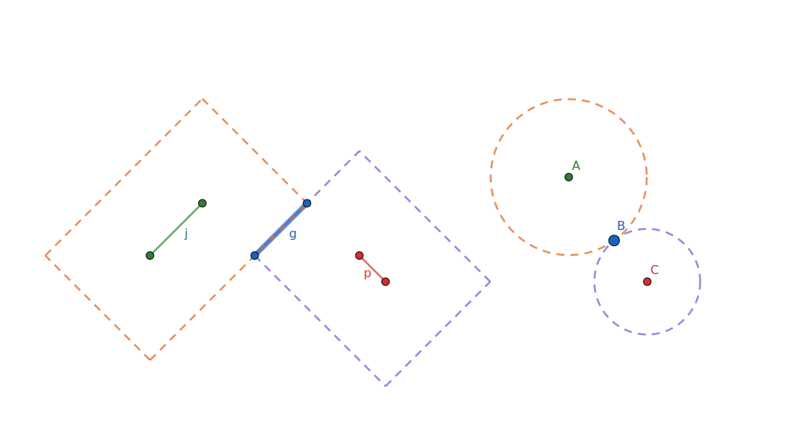

layout: true
class: typo, typo-selection

---

count: false
class: nord-dark, center, middle

# Rectilinear shape 🧱

@luk036 👨‍💻

[](https://codecov.io/gh/luk036/physdes-py)
[](https://physdes-py.readthedocs.io/en/latest/?badge=latest)

<https://github.com/luk036/physdes-{py,rs,cpp}>

---

## 📊 Visual Representation

<p align="center">
  
</p>

---

### 🎬 Introduction

-   Applications: VLSI Physical Design 💾🔌
-   Also known as L-shape, orthogonal shape
-   Billions of objects 🌍🔢
-   Restrict integer coordinate ✨🚀
  -   In C++/Rust, faster than floating Point. No round-off error. ⚡
  -   In Python, arbitrary precision. ∞
-   Usually simpler than general shapes
  -   Point: `Point<int, int>`📍
  -   Rectangle: `Point<Interval, Interval>`🟦
  -   Vertical Segment: `Point<int, Interval>`↕️
  -   Horizontal Segment: `Point<Interval, int>`↔️
  -   Point3D: `Point<Point<int, int>, int>`🧊

.mermaid[

<pre>
graph TD
    A[Rectilinear Shapes] --> B[Point 📍]
    A --> C[Rectangle 🟦]
    A --> D[Segment]
    D --> E[Horizontal ↔️]
    D --> F[Vertical ↕️]
    A --> G[Polygon 🔶]
    B --> H[Point&lt;int, int&gt;]
    C --> I[Point&lt;Interval, Interval&gt;]

    style A fill:#ff9800
    style B fill:#4caf50
    style C fill:#2196f3
    style D fill:#9c27b0
    style G fill:#4caf50
</pre>

]

---

### Why Generic Programming? 🤔

- 🤸 Increased Flexibility

  Adapt code to various data types without modification

- ♻️ Reduced Duplication

  Write once, use for multiple types

- 🛡️ Enhanced Type Safety

  Catch errors at compile-time rather than runtime

- 🚀 Improved Performance

  Optimize code for specific types at compile-time

---

### Set-like Operations (1) 🔍

- The 'overlap' function checks if two objects overlap or are equal. ↔️
  This function is useful for determining if two physical entities share some common space or value.

- The 'contain' function checks if one object contains another. 🎁
  This can be used to determine if one physical entity is completely within another.

- The 'intersection' function finds the common part between two objects. ✖️
  This is useful for finding where two physical entities meet or share space.

- The 'min_dist' function calculates the minimum Manhattan distance between two objects. 📏
  For numbers, it simply calculates the absolute difference.

---

### Set-like Operations (2) 🔍

- The 'nearest' function returns the nearest point on `lhs` to `rhs`. 🎯
  If `lhs` has a `nearest_to` member function, it is used. Otherwise, it assumes `lhs` is a scalar and returns it directly.

- The 'blocks' function checks if one object blocks another (touches without containing). 🚧
  This is useful in VLSI routing to check if one wire blocks another's path.

- The 'measure_of' function calculates the measure (length, area, volume, etc.) of an object. 📐
  If the object has a `measure` member function, it is used. Otherwise, it returns 1 (scalar).

- The 'center' function calculates the center of an object. ⚖️
  If the object has a `get_center` member function, it is used. Otherwise, it assumes `obj` is a scalar and returns it directly.

.mermaid[

<pre>
graph LR
    A[Object A] --> B{overlap}
    A --> C{contain}
    A --> D{intersection}
    A --> E{min_dist}
    A --> F{nearest}
    B --> G[Boolean]
    C --> G
    D --> H[Common Region]
    E --> I[Distance Value]
    F --> J[Nearest Point]

    style A fill:#ff9800
    style B fill:#f44336
    style C fill:#2196f3
    style D fill:#4caf50
    style E fill:#9c27b0
    style F fill:#4caf50
</pre>

]

---

### Overlap in Python 🐍

```python
def overlap(lhs, rhs) -> bool:
    if hasattr(lhs, "overlaps"):
        return lhs.overlaps(rhs)
    elif hasattr(rhs, "overlaps"):
        return rhs.overlaps(lhs)
    else:  # assume scalar
        return lhs == rhs
```

The `overlap` function checks if two objects have an overlapping property or are equal. ↔️

```text
           |
    +------|--------------+
    |      |              |
    |      |     +--------+-------+
    |            |        |       |
    +------------+--------'       |
                 |                |
                 +----------------+
```

---

### Overlap in C++20

```cpp
template <typename U1, typename U2>  //
constexpr auto overlap(const U1 &lhs, const U2 &rhs) -> bool {
    if constexpr (requires { lhs.overlaps(rhs); }) {
        return lhs.overlaps(rhs);
    } else if constexpr (requires { rhs.overlaps(lhs); }) {
        return rhs.overlaps(lhs);
    } else /* constexpr */ {
        return lhs == rhs;
    }
}
```

This function checks if the two input objects `lhs` and `rhs` overlap with each other. ↔️

---

### Overlap in Rust 🦀

```rust
pub trait Overlap<T> {
    fn overlaps(&self, other: &T) -> bool;
}
```

The `trait Overlap<T>` defines a method `overlaps` that checks if two objects of type `T` overlap
with each other. ↔️

```rust
impl Overlap<i32> for i32 {
    #[inline]
    fn overlaps(&self, other: &i32) -> bool {
        self == other
    }
}
```

This implementation of the `Overlap` trait for `i32` simply checks if the two values are equal. 🔢

---

### Overlap of Points 🐍

```python
class Point(Generic[T1, T2]):
    ...
    def overlaps(self, other) -> bool:
        return overlap(self.xcoord, other.xcoord) \
            and overlap(self.ycoord, other.ycoord)

    def contains(self, other) -> bool:
        return contain(self.xcoord, other.xcoord) \
            and contain(self.ycoord, other.ycoord)

    def blocks(self, other) -> bool:
        return (contain(self.xcoord, other.xcoord)
                and contain(other.ycoord, self.ycoord)) \
            or (contain(self.ycoord, other.ycoord)
                and contain(other.xcoord, self.xcoord))
```

---

### Overlap of Interval 🐍

```python
class Interval(Generic[T]):
    ...
    def __lt__(self, other) -> bool:
        return self.ub < other

    def overlaps(self, other) -> bool:
        return not (self < other or other < self)

    def contains(self, other) -> bool:
        if hasattr(other, 'lb'):
            return self.lb <= other.lb and other.ub <= self.ub
        else:  # assume scalar
            return self.lb <= other <= self.ub
```

---

### Overlap of Points (C++20)

```cpp
template <typename T1 = int, typename T2 = T1>
class Point {
  private:
    T1 _xcoord;  //!< x coordinate
    T2 _ycoord;  //!< y coordinate
    ...
  public:
    template <typename U1, typename U2>  //
    constexpr bool overlaps(const Point<U1, U2> &other) const {
        return overlap(this->xcoord(), other.xcoord())
               && overlap(this->ycoord(), other.ycoord());
    }
    ...
};
```

The `Point` class is a template class that represents a point in a 2D coordinate system. 📍

- Supports `T1`, `T2` = `int`, `Interval`, or `Point` 🧱
- Provides comparison, arithmetic, geometric operations 🔢
- `blocks` checks if the point blocks another (touches without containing). 🚧

---

### Overlap of Intervals (C++20)

```cpp
template <typename T = int>
class Interval {
  private:
    T _lb;  //> lower bound 🔽
    T _ub;  //> upper bound 🔼
  public:
    template <typename U>  // spaceship operator
    constexpr std::weak_ordering operator<=>(const U &rhs) const {
        if (this->ub() < rhs) return std::weak_ordering::less;
        if (this->lb() > rhs) return std::weak_ordering::greater;
        return std::weak_ordering::equivalent;
    }
    ...
    template <typename U>
    constexpr bool overlaps(const U &other) const {
        return !(*this < other || other < *this);
    }    ...
};
```

- Uses spaceship operator `<=>` for three-way comparison ⚖️
- Supports comparison with both Intervals and scalars 📊

---

### Overlap of Points 🦀

```rust
#[derive(PartialEq, Eq, Copy, PartialOrd, Ord, Clone, Debug)]
pub struct Point<T1, T2> {
    pub xcoord: T1,
    pub ycoord: T2,
}

impl<T1, T2, U1, U2> Overlap<Point<U1, U2>> for Point<T1, T2>
where
    T1: Overlap<U1>,
    T2: Overlap<U2>,
{
    #[inline]
    fn overlaps(&self, other: &Point<U1, U2>) -> bool {
        self.xcoord.overlaps(&other.xcoord) &&
            self.ycoord.overlaps(&other.ycoord)
    }
}
```

- Uses trait bounds for generic operations 🧱
- Supports `T1`, `T2` = `i32`, `Interval`, or `Point` 📍

---

### Overlap of Intervals 🦀 (1)

```rust
#[derive(Debug, Clone, Copy, PartialEq, Eq)]
pub struct Interval<T> {
    pub lb: T,
    pub ub: T,
}

impl<T: PartialOrd> PartialOrd for Interval<T> {
    #[inline]
    fn partial_cmp(&self, rhs: &Self) -> Option<std::cmp::Ordering> {
        if self.ub < rhs.lb {
            Some(std::cmp::Ordering::Less)
        } else if rhs.ub < self.lb {
            Some(std::cmp::Ordering::Greater)
        } else {
            Some(std::cmp::Ordering::Equal)
        }
    }
}
```

---

### Overlap of Intervals 🦀 (2)

```rust
impl<T: PartialOrd> Overlap<Interval<T>> for Interval<T> {
    fn overlaps(&self, other: &Interval<T>) -> bool {
        self.ub >= other.lb && other.ub >= self.lb
    }
}
impl<T: PartialOrd> Overlap<T> for Interval<T> {
    fn overlaps(&self, other: &T) -> bool {
        self.ub >= *other && *other >= self.lb
    }
}
impl<T: PartialOrd> Overlap<Interval<T>> for T {
    fn overlaps(&self, other: &Interval<T>) -> bool {
        *self >= other.lb && other.ub >= *self
    }
}
```

---

### Set-like Operations (3) 🔧

- The `hull` function calculates the bounding box of two objects. 📦
- The `enlarge` function takes two arguments, `lhs` and `rhs`, and returns the result of enlarging
  `lhs` by `rhs`. 🔍➕
- The `min_dist_change` function calculates the minimum distance with the ability to update one object. 📏
- The `intersect_with` function computes the intersection of two objects. ✖️

---

### Hull and Enlarge in Python 🐍

```python
def hull(lhs, rhs):
    if hasattr(lhs, "hull_with"):
        return lhs.hull_with(rhs)
    elif hasattr(rhs, "hull_with"):
        return rhs.hull_with(lhs)
    else:  # assume scalar
        return Interval(lhs, rhs) if lhs < rhs \
            else Interval(rhs, lhs)

def enlarge(lhs, rhs):
    if hasattr(lhs, "enlarge_with"):
        return lhs.enlarge_with(rhs)
    elif isinstance(lhs, (int, float)):  # assume scalar
        return Interval(lhs - rhs, lhs + rhs)
    else:
        raise TypeError("Cannot enlarge non-scalar type")
```

- `hull` returns the bounding box containing both objects 📦
- `enlarge` expands an object by a given value 🔍➕

---

### Hull and Enlarge in C++20

```cpp
template <typename U1, typename U2>
constexpr auto hull(const U1 &lhs, const U2 &rhs) {
    if constexpr (requires { lhs.hull_with(rhs); }) {
        return lhs.hull_with(rhs);
    } else if constexpr (requires { rhs.hull_with(lhs); }) {
        return rhs.hull_with(lhs);
    } else /* constexpr */ {
        return lhs < rhs ? Interval(lhs, rhs) : Interval(rhs, lhs);
    }
}
template <typename U1, typename U2>
constexpr auto enlarge(const U1 &lhs, const U2 &rhs) {
    if constexpr (requires { lhs.enlarge_with(rhs); }) {
        return lhs.enlarge_with(rhs);
    } else if constexpr (std::is_arithmetic_v<U1>) {
        return Interval<U1>{lhs - rhs, lhs + rhs};
    } else {
        // No default behavior for non-arithmetic types
        return lhs;
    }
}
```

- Uses C++20 `requires` expressions for compile-time dispatch 📦🔍➕

---

### Hull of Points and Intervals 🐍

```python
class Point(Generic[T1, T2]):
    ...
    def hull_with(self, other):
        T = type(self)
        return T(hull(self.xcoord, other.xcoord),
                 hull(self.ycoord, other.ycoord))

    def enlarge_with(self, value):
        xb = enlarge(self.xcoord, value)
        yb = enlarge(self.ycoord, value)
        return Point(xb, yb)

class Interval(Generic[T]):
    ...
    def hull_with(self, obj):
        if isinstance(obj, Interval):
            return Interval(min(self.lb, obj.lb),
                            max(self.ub, obj.ub))
        else:  # assume scalar
            return Interval(min(self.lb, obj),
                            max(self.ub, obj))

    def enlarge_with(self, value):
        return Interval(self.lb - value, self.ub + value)
```

---

### Hull of Points (C++20)

```cpp
template <typename T1 = int, typename T2 = T1>
class Point {
    ...
    template <typename U1, typename U2>  //
    constexpr auto hull_with(const Point<U1, U2> &other) const {
        auto xcoord = hull(this->xcoord(), other.xcoord());
        auto ycoord = hull(this->ycoord(), other.ycoord());
        return Point<decltype(xcoord), decltype(ycoord)>{
            std::move(xcoord), std::move(ycoord)
        };
    }
    ...
};
```

---

### Hull of Intervals (C++20)

```cpp
template <typename T = int>
class Interval {
    ...
    template <typename U>  //
    constexpr auto hull_with(const U &other) const {
        if constexpr (requires { other.lb(); }) {
            return Interval<T>{
                this->lb() < other.lb() ? this->lb() : T(other.lb()),
                this->ub() > other.ub() ? this->ub() : T(other.ub())
            };
        } else /* constexpr */ {  // assume scalar
            return Interval<T>{
                this->lb() < other ? this->lb() : T(other),
                this->ub() > other ? this->ub() : T(other)
            };
        }
    }
};
```

---

### Merging segment (45° line segment) ⚡

- Tap point in Clock tree synthesis (with integer coordinates) ⏰
- Analog to "Circle" in L2-metric (unit-ball in 2D) ⚪

.mermaid[

<pre>
graph TD
    A[Manhattan Metric L1] --> B[Rectilinear Distance]
    A --> C[Rectilinear Shapes]
    A --> D[Voronoi Diagram]
    B --> E[d = |x1-x2| + |y1-y2|]
    C --> F[Orthogonal Polygons]
    D --> G[L-infinity Plane Sweep]

    style A fill:#ff9800
    style B fill:#4caf50
    style C fill:#2196f3
    style D fill:#9c27b0
</pre>

]



---

class: nord-dark, center, middle

## Q&A 🎤
