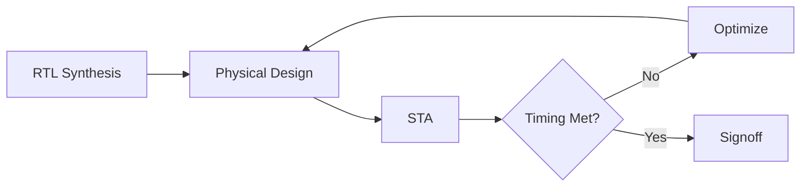

## 📋 Overview

-   **Static Timing Analysis (STA)** 🕐
  -   Setup & Hold Constraints
  -   Critical Path Analysis
-   **Useful Skew Optimization** 🔄
-   **Delay Padding** ⏳
-   **Timing-Driven Placement** 🎯
-   **ECO Flows** 🔧
-   **Advanced Topics** 🚀

---

### What is Timing Closure? 🎯

> **Timing closure** is the process of ensuring that a digital circuit meets all timing constraints after physical design.

**Why it matters:**

-   Chip performance determined by critical path delay
-   Manufacturing variations affect timing
-   Late-stage timing fixes are expensive

---

### Static Timing Analysis (STA) Basics 🕐

**Setup Constraint** (max delay):

$$T_{clk} \geq T_{ck\to q} + T_{logic} + T_{setup} + T_{skew}$$

**Hold Constraint** (min delay):

$$T_{ck\to q} + T_{logic} \geq T_{hold} + T_{skew}$$

| Term          | Meaning                          |
| ------------- | -------------------------------- |
| $T_{clk}$     | Clock period                     |
| $T_{ck\to q}$ | Clock-to-Q delay                 |
| $T_{logic}$   | Combinational logic delay        |
| $T_{setup}$   | Setup time                       |
| $T_{hold}$    | Hold time                        |
| $T_{skew}$    | Clock skew ($T_{ck2} - T_{ck1}$) |

---

### Setup & Hold Timing 🌉

**Setup Violation** → Reduce logic delay:

-   Gate sizing (up-size critical gates)
-   Buffer insertion
-   Logic restructuring
-   Threshold voltage (VT) swapping

**Hold Violation** → Increase delay:

-   Buffer insertion (delay padding)
-   Gate down-sizing
-   Route detour

---

### Slack and Critical Path 📊

**Slack**: The margin by which a timing constraint is met (positive) or violated (negative)

$$ \text{Slack} = \text{Required Time} - \text{Arrival Time} $$

-   **Positive Slack** ✅ — Timing is met
-   **Negative Slack** ❌ — Violation, needs fixing
-   **Worst Negative Slack (WNS)**: Most critical violation
-   **Total Negative Slack (TNS)**: Sum of all violations
-   **Critical Path**: Path with least positive / most negative slack

---

### Clock Skew: Friend or Foe? 🤔

**Traditional view**: Skew is bad — zero-skew trees minimize it.

**Modern view**: Useful skew can improve timing!

**Positive skew** (data and clock flow in same direction):

$$T_{skew} = T_{ck2} - T_{ck1} > 0$$

-   Helps setup (more time for logic)
-   Hurts hold (less time for data stability)

**Negative skew** (opposite direction):

-   Hurts setup
-   Helps hold

---

### Clock Skew Scheduling 🔄

Formulated as a linear programming (LP) problem:

**Variables**: $s_i$ = clock arrival time at flip-flop $i$

**Constraints** (for each path $i \to j$):

Setup: $$s_j - s_i \leq T_{clk} - D_{max}(i,j)$$

Hold: $$s_j - s_i \geq -D_{min}(i,j)$$

**Objective**: Minimize total negative slack or maximize yield

> 📖 See: [Clock Skew Scheduling](../algo4dfm/css_under_pv.html)

---

### Delay Padding ⏳

When hold violations remain after useful skew optimization:

-   **Delay Padding**: Insert buffers or delay cells into short paths
-   **Goal**: Increase path delay to meet hold constraints

**Trade-offs**:

-   Increased power consumption
-   Area overhead
-   Potential setup degradation

**Algorithms**:

-   Greedy padding (fix worst violators first)
-   LP-based optimal padding
-   Sensitivity-guided padding

> 📖 See: [delay_padding.md](../algo4dfm/delay_padding.md)

---

### Timing-Driven Placement 🎯

Traditional placement minimizes wirelength.
Timing-driven placement additionally considers timing criticality.

**Techniques**:

1. **Net Weighting**: Assign higher weights to critical nets
2. **Bound Constraints**: Keep critical cells close
3. **Replication**: Duplicate logic to reduce fanout
4. **Incremental Placement**: Local moves for timing fix

---

### ECO Flows for Timing Closure 🔧

**Engineering Change Order (ECO)** — Late-stage timing fixes with minimal layout changes.

**ECO Types**:

-   **Pre-mask ECO**: Gate-level netlist changes before mask generation
-   **Post-mask ECO**: Metal-only fixes (spin)
-   **Buffer ECO**: Insert/remove buffers only

**ECO Operations**:

-   Gate sizing (VT swap, drive strength)
-   Buffer insertion/removal
-   Layer assignment
-   Spare cell utilization

---

### Statistical Static Timing Analysis (SSTA) 📊

At advanced nodes, deterministic STA is insufficient due to process variations.

**Key Concepts**:

-   **Corner-based STA**: SS, TT, FF corners — pessimistic
-   **SSTA**: Treat delays as random variables
-   **Parametric yield**: Probability circuit meets timing

**Challenges**:

-   Spatial correlation of variations
-   Non-Gaussian distributions (log-normal, GEV)
-   Computational complexity

See also: [GEV.pdf](../algo4dfm/GEV.pdf), [unimodal](../algo4dfm/unimodal.html)

---

### Machine Learning for Timing Prediction 🤖

Modern ML approaches to accelerate timing closure:

**Applications**:

-   **Path delay prediction**: Replace slow SPICE with ML models
-   **Critical path identification**: Rank paths by criticality
-   **Gate sizing guidance**: Predict optimal cell choices
-   **Congestion-aware timing**: Correlate routing with delay

**Popular Models**:

-   Gradient boosting (XGBoost, LightGBM)
-   Graph neural networks (GNNs) for netlist graphs
-   Transfer learning across designs

---

### Summary 📝

**What We Covered:**

1. **STA fundamentals**: Setup, hold, slack
2. **Useful skew**: LP-based scheduling
3. **Delay padding**: Fixing hold violations
4. **Timing-driven placement**: Criticality-aware
5. **ECO flows**: Minimal-change fixes
6. **SSTA**: Statistical variation awareness
7. **ML for timing**: Data-driven prediction

**Key References:**

-   Kahng et al., _VLSI Physical Design: From Graph Partitioning to Timing Closure_
-   Sapatnekar, _Timing_
-   Alpert et al., "What Makes a Design Difficult to Close" (DAC 2010)
-   [Clock Skew Scheduling](../algo4dfm/css_under_pv.html)
-   [Delay Padding](../algo4dfm/delay_padding.md)
