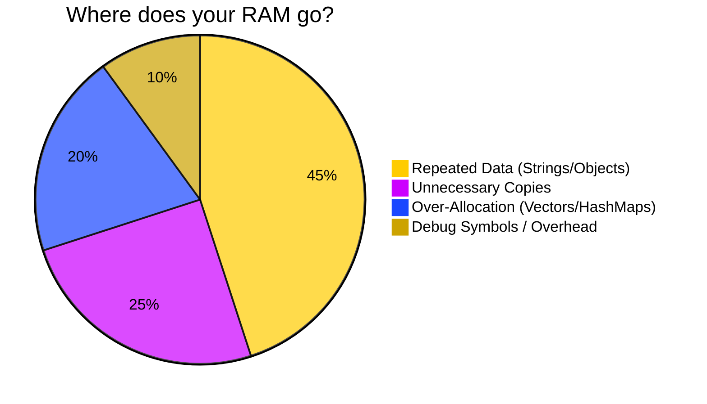
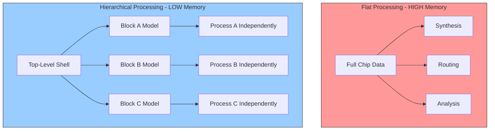
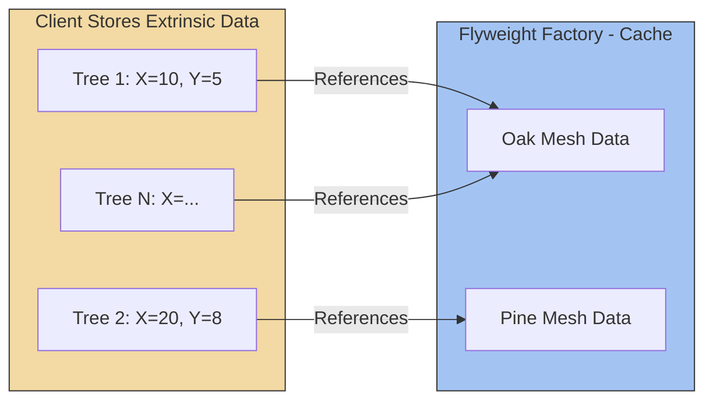
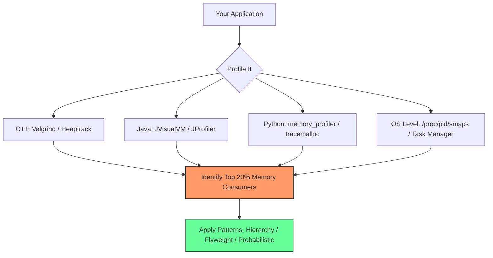

<!-- 
PAGE 1 
Duration: 1 min
-->
# 🧠 How to Reduce Memory Usage
## *From EDA Tools to Code & Probabilistic Data Structures*

**Presented by:** [Your Name]  
**Date:** [Date]  
**Duration:** 30 Minutes

---
<!-- P-Note: Welcome everyone. Today we are tackling the universal challenge of memory bloat. Whether you are running a massive chip simulation or writing a Python script, memory is the ultimate bottleneck. We will cover strategies across three layers: Software/Hardware, Coding Patterns, and Big-Data Math. -->

---

<!-- 
PAGE 2 
Duration: 2 mins
-->
# 📊 The Memory Problem in Numbers



**The Hard Truth:** 
- 45% of memory is wasted on **duplicates**.
- Moving from 8GB to 64GB RAM costs **~$300**. 
- Optimizing your code to save 2GB costs **$0** and makes your app 10x faster (less paging!).

---
<!-- P-Note: Memory is cheap, but not infinite. The real cost isn't the hardware; it is the latency when the CPU waits for data to page from the SSD. A single cache miss can cost 10,000 CPU cycles. Optimizing memory is about optimizing speed. Let's start with the biggest hammer: Hierarchy. -->

---

<!-- 
PAGE 3 
Duration: 3 mins
-->
# 🏗️ Strategy 1: Hierarchical Design (The "Divide & Conquer")

When processing massive datasets (like Chip Layouts or 3D Models), **Flat** = **Memory Crash**.



- **✅ Pro:** Loads ONLY one block at a time. Uses **Abstract Models** (e.g., timing models) for top-level integration.
- **⚠️ Trade-off:** Requires significant upfront planning, complex timing budgeting, and accuracy can suffer at block boundaries. Prolongs overall design cycle.

---
<!-- P-Note: The hierarchy strategy is about replacing a giant monolithic object with references to smaller pieces. But remember, you are trading RAM for planning time. If your block boundaries are wrong, you will have to re-spin the entire chip, which costs millions. Use this when the design is simply too big to fit in memory flatly. -->

---

<!-- 
PAGE 4 
Duration: 4 mins
-->
# 💻 Strategy 2: Code-Level Optimization (The "Big Three")

### 1️⃣ Choose the Right Container
- **Bad:** `std::list` (LinkedList) → 16 bytes per node overhead.
- **Good:** `std::vector` (Array) → Contiguous memory, CPU Cache friendly.
- **Python:** Use `array('i')` or NumPy instead of lists of `int` objects (28 bytes each!).

### 2️⃣ Kill the Copy (Zero-Copy)
```cpp
// BAD: Copies a massive 10MB string
void process(std::string data); 

// GOOD: Zero-copy, just references the original
void process(const std::string& data); 
```

### 3️⃣ Lazy Loading
- **Bad:** Loading a 5GB XML file at startup.
- **Good:** Streaming/Iterators (`yield` in Python) – only keep the current row in memory.

**⚠️ Trade-off:** Optimizing containers (e.g., using bitfields) makes code less readable and harder to debug. Zero-copy with references can lead to **dangling pointers** if the original object is destroyed before the function finishes. Lazy loading increases CPU overhead due to frequent I/O calls.

---
<!-- P-Note: These are the low-hanging fruits. But with great power comes great responsibility. Passing by reference is fast, but if the original object goes out of scope, your reference becomes a ticking time bomb. Always ensure the lifetime of the referenced object exceeds the lifetime of the reference. -->

---

<!-- 
PAGE 5 
Duration: 4 mins
-->
# 🕊️ Strategy 3: The Flyweight Pattern (Shared Intrinsic State)

**The Problem:** A forest rendering 1 million trees, each storing a 5MB 3D mesh. **(1M * 5MB = 5 Terabytes!)**

**The Solution:** Store the mesh **ONCE** and share it among all trees.


**🔑 Key Takeaway:** 
- **Intrinsic (Shared):** The heavy geometry.
- **Extrinsic (Unique):** Position, color, health.
- **Result:** Memory usage drops from **5TB to 10MB**.

**⚠️ Trade-off:** Code complexity skyrockets. You must separate internal state from external state, which makes the code harder to maintain. If the shared intrinsic data is **mutable** (changeable), you will run into severe thread-safety issues and cache invalidation nightmares. Flyweight works best with **immutable** objects.

---
<!-- P-Note: The Flyweight is brilliant when you have thousands of identical heavy objects. However, I have seen teams abandon this pattern because the code became too spaghetti-like. Use it only when the memory savings are massive (at least 10x). For small savings, it's not worth the complexity. -->

---

<!-- 
PAGE 5.5 (NEW SLIDE)
Duration: 3 mins
-->
# ⚖️ The Universal Trade-off Matrix

Every memory-saving technique involves **sacrificing** something. Here is the full picture:

| Strategy | Memory Saved | ⚠️ The Price You Pay |
| :--- | :--- | :--- |
| **Hierarchical Design** | 70% - 90% | **↑ Planning Time, ↑ Integration Complexity, ⬇ Accuracy** at boundaries. |
| **Zero-Copy (Pass by Ref)** | 50% - 80% | **Risk of Dangling Pointers** (lifetime management hell). |
| **Flyweight Pattern** | 80% - 95% | **↑ Code Complexity**, Thread-safety issues if shared state mutates. |
| **Lazy Loading / Streaming** | 90% (peak) | **↑ CPU Overhead** (frequent I/O), **⬇ Responsiveness** (lag spikes). |
| **Bitfields / Packing** | 30% - 60% | **⬇ Readability**, bit-shifting bugs, endianness issues. |
| **Bloom Filter** | 99.9% | **False Positives** (may say "yes" incorrectly). |
| **Count-Min Sketch** | 99.9% | **Overcounting** (frequency is always ≥ actual value). |
| **HyperLogLog** | 99.99% | **~2% Standard Error**, cannot retrieve individual items. |

---
<!-- P-Note: This is the most important slide of the presentation. There is no free lunch. The moment you optimize for memory, you are borrowing from CPU time, developer sanity, or accuracy. The art of engineering is knowing which trade-off is acceptable for your specific use case. If you are building a medical device, never use probabilistic structures. If you are building a social media feed, they are perfect. -->

---

<!-- 
PAGE 6 
Duration: 6 mins
-->
# 📊 Strategy 4: Probabilistic Data Structures (The "Memory Math")

When billions of items hit your server, storing exact data in a HashMap is impossible. These structures use **KB of RAM** for TB of data—but with slight inaccuracies.

| Structure | Answers | Error Type | Memory Usage | Use Case |
| :--- | :--- | :--- | :--- | :--- |
| **Bloom Filter** ❓ | "Have I seen X?" | False Positives only | **~1 MB** for 10M items | Caching, Blacklists |
| **Count-Min Sketch** 📈 | "How many times X?" | Overestimates only | **~1 MB** | Top-K hot items, DDoS |
| **HyperLogLog** 📊 | "How many *unique* X?" | ~2% Error | **~1.5 KB** for Billions | Daily Active Users |

**The Golden Rule:** Use these **ONLY** when an occasional wrong answer doesn't crash the system (e.g., ads, recommendations). **NEVER** use for financial transactions or medical devices.

**⚠️ Shared Trade-off:** All three structures are **non-invertible**—you cannot retrieve the original data back. They are one-way streets. If you need to delete an item, standard Bloom Filters and Count-Min Sketches do not support deletion (use Cuckoo Filters or Counting Bloom Filters for that, but they cost more memory).

---
<!-- P-Note: These data structures are mind-blowing when you first see them. HyperLogLog can count a billion unique users in just 1.5 kilobytes—that is smaller than an old-school floppy disk. Count-Min Sketch lets you track the hottest topics on Twitter without storing the tweets. The trade-off is probability, but for large scale, probability is all you need. Just remember: you can never get the original data back, so don't use these for audit logs. -->

---

<!-- 
PAGE 7 
Duration: 3 mins
-->
# 🔧 The Toolbox: How to Find Memory Hogs

**If you can't measure it, you can't fix it.** Don't guess—profile!



- **Pareto Principle:** 80% of memory is usually consumed by 20% of the code.
- Focus your optimization efforts **only** on the top 5 memory hotspots.

**⚠️ Trade-off:** Profiling tools add overhead (slow down your app by 10x-100x). Never profile in production without a canary deployment. Also, interpreting profiling results requires deep knowledge of your runtime environment (e.g., Python's GIL, JVM's GC pauses).

---
<!-- P-Note: I can't stress this enough. I have seen developers spend days optimizing a function that uses 2MB of RAM, while ignoring a cache that uses 2GB. Always, always, always run a profiler first. It shows you exactly where the crime scene is. Just remember to turn off the profiler when you are done—it is a heavy tool. -->

---

<!-- 
PAGE 8 
Duration: 4 mins
-->
# 🧩 Putting It All Together (Decision Matrix with Trade-offs)

Which strategy do you use? Here is the full picture including the risks.

| Your Problem | The Solution | Complexity | ⚠️ The Trade-off / Risk |
| :--- | :--- | :--- | :--- |
| **Tool is crashing** with a 10GB chip design. | **Hierarchical Design** (Partition & Model). | High | Prolonged design cycle, potential boundary mismatch errors. |
| **Code is passing huge structs** everywhere. | **Zero-Copy** (Pass by Ref / Move). | Low | Dangling pointers / use-after-free bugs. |
| **1 million identical** objects (Trees/Bullets). | **Flyweight Pattern** (Share intrinsic). | Medium | Code becomes harder to maintain; thread-safety risks. |
| **10 billion** unique visitors to count. | **HyperLogLog** (Approx. distinct count). | Medium | ~2% error margin; cannot retrieve individual users. |
| **500 million** malicious IPs to blacklist. | **Bloom Filter** (Fast membership). | Low | False positives (may block safe IPs). |
| **Real-time Twitter** trending topics. | **Count-Min Sketch** (Top-K frequency). | Medium | Overcounting; cannot get exact frequencies. |
| **Reading a 50GB log file.** | **Lazy Loading / Streaming** (Generator). | Low | Slower processing time; frequent disk I/O. |

---
<!-- P-Note: To summarize the decision process: If you are processing massive files, use hierarchy. If you are writing code, check for copies. If you are repeating the same heavy data, use Flyweight. If your data is too big to store, move to probabilistic math. But always, always consider the trade-off column. If the risk of being wrong is catastrophic, choose the exact (but slower) method. -->

---

<!-- 
PAGE 9 
Duration: 2 mins
-->
# ✅ Key Takeaways (What to do on Monday)

1. **Profile First:** Run a memory profiler before writing any optimization code.
2. **Kill Duplicates:** Use Flyweight or String Interning to share heavy objects.
3. **Go Probabilistic:** For Big Data, use Bloom/HLL/CMS instead of HashMaps.
4. **Think in Hierarchy:** Break giant monolithic processes into smaller, cacheable blocks.
5. **Measure the Trade-off:** Memory saved = Complexity added. Balance is key.


**Final Trade-off Reminder:** The fastest code is the code that runs entirely in the CPU cache. The most memory-efficient code is often the hardest to read. Your job as an engineer is to find the **sweet spot** for your specific domain.

---
<!-- P-Note: Optimizing memory is not just about saving money; it's about respecting the user's hardware and making your software feel incredibly snappy. A program that doesn't page to disk is a program that runs in real-time. But never over-engineer. If your app runs fine with 100MB, don't spend a week making it use 90MB. Invest that time in features. -->

---

<!-- 
PAGE 10 
Duration: 1 min
-->
# 🙋 Q&A / Discussion

## Thank You!

**Resources:**
- *C++:* `std::string_view`, `std::move`, `std::vector::reserve`
- *Python:* `__slots__`, `memoryview`, `tracemalloc`
- *Data Structures:* Google's **Guava** Library (BloomFilter), **redisbloom** (Redis Module)
- *Books:* "Design Patterns" (GoF), "High Performance Browser Networking"

**📧 Contact:** [Your Email / LinkedIn]

---
<!-- P-Note: Thank you for your time. I'm happy to dive deeper into any of these algorithms or tools during the Q&A. Does anyone have questions about implementing these strategies in their specific environment? Remember—profile first, optimize second, and always document your trade-offs! -->
