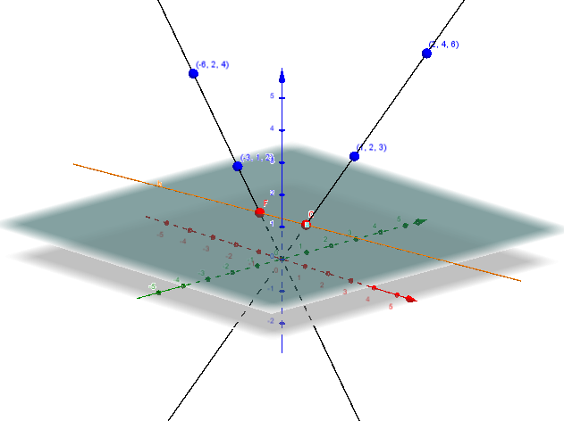
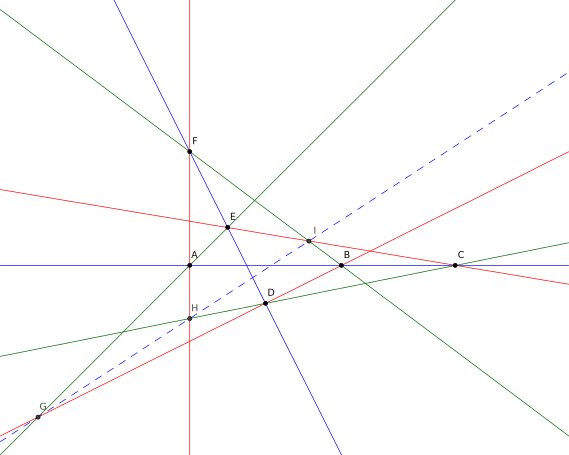
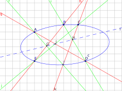

layout: true
class: typo, typo-selection

---

count: false
class: nord-dark, middle, center

# Projective Geometry

@luk036

2023-08-03

---

class: nord-light, middle, center


---

class: middle, center


---

class: nord-light, middle, center

## 👋 Introduction

---

## Geometry and Algebra

- Geometry
  - Points, lines, triangles, circles, conic sections...
  - Collinear, concurrent, parallel, perpendicular...
  - Distances, angles, areas, quadrance, spread, quadrea...
  - Midpoint, bisector, orthocenter, pole/polar, tangent...
- Algebra
  - Addition, multiplication, inverse...
  - Elementary algebra: integer/rational/real/complex... numbers.
  - Abstract Algebra: rings, fields...
  - Linear algebra: vector, matrix, determinant, dot/cross
    product...
- The two subjects are linked by coordinates.

---

## 🔑 Key points

- The earth is not flat and our universe is non-Euclidean.

- Non-Euclidean geometry is much easier to learn than you might think.

- Our curriculum in school is completely wrong.

- Euclidean geometry is asymmetric. Three sides determine a triangle, but three angles do not determine a triangle. This may not the case in general geometries. Euclidean geometry is just a special case.

- Yet Euclidean geometry is computationally more efficient and is still used in our small-scale everyday life.

- Incidenceship facilitates integer arithmetic; non-oriented measurement facilitates rational arithmetic; oriented measurement facilitates floating-point arithmetic. Don't shoot rabbits with machine guns.

---

class: nord-light, middle, center

## The Basic Elements of Projective Plane

---

### The concept of Projective Plane

- Only "points" and "lines" are involved.

- Assume that "points" (or "lines") are distinguishable.

- Denote $A$ = $B$ as $A$ and $B$ refer to the same point.

- E.g., $(1/3, 2/3)$ = $(10/30, 20/30)$

- We have the following rules:

  - $A$ = $A$ (reflective)
  - If $A$ = $B$, then $B$ = $A$ (symmetric)
  - If $A$ = $B$ and $B$ = $C$, then $A = C$ (transitive)

- Unless otherwise mentioned, objects with different names are assumed to be distinct, i.e. $A \neq B$.

- This idea can be generalized to higher dimensions. However, we restrict here to 2D only.

---

### Incidence

- A point either lies on a line or it does not.

- If a point $A$ lies on a line $l$, denote $l \circ A$.

- For convenience, we also denote it as $A \circ l$.

- We have $A \circ l = l \circ A$


---

### Projective Point and Line

- Projective Point

  - Exactly one line passes through two distinct points.
  - Denote join($A$, $B$) or simply $AB$ as a line joined by $A$ and $B$.
  - We have:
    - $AB$ = $BA$
    - $AB \circ A$ and $AB \circ B$ are always true.

- Projective Line

  - Exactly one point met by two distinct lines.
  - Denote meet($l$, $m$) or simply $l m$ as a point met by $l$ and $m$.
  - We have:
    - $lm$ = $ml$
    - $lm \circ l$ and $lm \circ m$ are always true.

- Duality: "Point" and "Line" are interchangable here.

- "Projective geometry is all geometry." (Arthur Cayley)

---

### Example 1: Euclidean Geometry

- Point: projection of a 3D vector $p = [x, y, z]$ onto a 2D plane $z = 1$: $$(x', y') = (x/z, y/z)$$

- $[\alpha x, \alpha y, \alpha z]$ for all $\alpha \neq 0$ represents the same point.

- For instance, $[1, 5, 6]$ and $[-10, -50, -60]$ represent the same point $(1/6, 5/6)$

- $p_\infty = [x, y, 0]$ is a point at _infinity_.

- Line: $a x' + b y' + c = 0$, denoted by a vector $[a, b, c]$.

- $[\alpha a, \alpha b, \alpha c]$ for all $\alpha \neq 0$ represents the same line.

- $l_\infty = [0, 0, 1]$ is the line at _infinity_.

- $[0, 0, 0]$ is not a valid point or line.

---

### Euclidean 2D plane from 3D vector

{#fig:euclidean}

---

### Calculation by Vector Operations

- Let $v_1 = [x_1, y_1, z_1]$ and $v_2 = [x_2, y_2, z_2]$.
  - Dot product $v_1 \cdot v_2$ = $v_1^\mathsf{T} v_2$ = $x_1 x_2 + y_1 y_2 + z_1 z_2$.
  - Cross product $v_1 \times v_2$ = $[y_1 z_2 - z_1 y_2, -x_1 z_2 + z_1 x_2, x_1 y_2 - y_1 x_2]$
- Then, we have:
  - $A \circ a$ precisely when $[A] \cdot [a] = 0$
  - Join of two points: $[AB]$ = $[A] \times [B]$
  - Meet of two lines: $[lm]$ = $[l] \times [m]$
  - $A = B$ precisely when $[A] \times [B] = [0, 0, 0]$

---

### Examples

- The linear equation that joins the point $(1/2, 3/2)$ and $(4/5, 3/5)$ is $[1, 3, 2] \times [4, 3, 5]$ = $[9, 3, -9]$, or $9x + 3y - 9 = 0$, or $3x + y = 3$.

- The point $(1/2, 3/2)$ lies on the line $3x + y = 3$ because $[1, 3, 2]\cdot [3, 1, -3]$ = $0$.

- Exercise: Calculate the line equation that joins the points $(5/8, 7/8)$ and $(-5/6, 1/6)$.

---

### 🐍 Python Code (pg_object)

```python
class pg_object(np.ndarray):
    @abstractmethod
    def dual(self):
        """abstract method"""
        pass

    def __new__(cls, inputarr):
*        obj = np.asarray(inputarr).view(cls)
        return obj

    def __eq__(self, other):
        if type(other) is type(self):
            return (np.cross(self, other) == 0).all()
        return False

    def __ne__(self, other):
        return not self.__eq__(other)

    def incident(self, l):
        return not self.dot(l)

    def __mul__(self, other):
        T = self.dual()
        return T(np.cross(self, other))
```

---

### 🐍 Python Code (pg_point and pg_line)

```python
class pg_point(pg_object):
    def __new__(cls, inputarr):
        obj = pg_object(inputarr).view(cls)
        return obj

    def dual(self):
        return pg_line

class pg_line(pg_object):
    def __new__(cls, inputarr):
        obj = pg_object(inputarr).view(cls)
        return obj

    def dual(self):
        return pg_point

def join(p, q):
    assert isinstance(p, pg_point)
    return p * q

def meet(l, m):
    assert isinstance(l, pg_line)
    return l * m
```

---

### 🐍 Python Code (Example)

```python
from __future__ import print_function
from pprint import pprint
import numpy as np

if __name__ == "__main__":
    p = pg_point([1, 3, 2])
    q = pg_point([4, 3, 5])
    print(join(p, q))

    l = pg_line([5, 7, 8])
    m = pg_line([-5, 1, 6])
    print(meet(l, m))

    p = pg_point([1-2j, 3-1j, 2+1j]) # complex number
    q = pg_point([-2+1j, 1-3j, -1-1j])
    assert p.incident(p*q)
```

---

### Example 2: Perspective View of Euclidean Geometry

- It turns out that we can choose any line in a plane as the line of infinity.

{#fig:euclidean2}

---

### Example 3: Spherical/Elliptic Geometry

- Surprisingly, the vector notations and operators can also represent other geometries, such as spherical/Elliptic geometry.

- "Point": projection of the 3D vector $[x, y, z]$ onto the unit sphere.
  $$(x', y', z') = (x/r, y/r, z/r)$$
  where $r^2 = x^2 + y^2 + z^2$.

- Here, the two points on the opposite poles are considered to be the same point.

- "Line": $[a, b, c]$ represents the _great circle_ intersecting the unit sphere and the plane $a x + b y + c z = 0$.

- The $[x, y, z]$ are called _Homogeneous Coordinates_.

- Here, the coordinates can be integer numbers, rational numbers (the ratio of two integers), real numbers, complex numbers, or finite field numbers, or even polynomial functions.

---

### Spherical Geometry from 3D vector

{#fig:sphere}

---

### Example 4: Hyperbolic Geometry from 3D vector

- A velocity "point": projection of a 3D vector $[p] = [x, y, t]$ onto 2D plane $t = 1$: $$(v_x, v_y) = (x/t, y/t)$$

---

### Counterexamples

- In some quorum systems, two "lines" are allowed to meet at more than one point. Therefore, it is a projective geometry only in very special cases.

- In some systems, the line from $A$ to $B$ is not the same as the line from $B$ to $A$, so they cannot form a projective geometry.

- "Symmetry" is an important keyword in projective geometry.

---

### Number systems

- Integers ($\mathbb{Z}$):
  - e.g. $0, 1, 2, 3, \ldots, -1, -2, -3, \ldots$
  - discrete, more computationally efficient.
- Rational numbers ($\mathbb{Q}[\mathbb{Z}]$):
  - e.g. $0/1, 2/3, -1/3, 1/0$ (i.e. infinity)
  - Multiplication/division is simpler than addition/subtraction
- Real numbers ($\mathbb{R}$):
  - e.g. $0.3$, $2^{1/2}$, $\pi$
  - May induce round-off errors.
- Finite field, $GF(n)$, where $n$ is a prime number (e.g.
  $2, 3, 5, 7, 11, 13$) or prime powers (e.g. $4=2^2, 8=2^3, 9=3^2$).
  - Used in Coding Theory

---

### Number systems (cont'd)

- Complex numbers ($\mathbb{C}$):
  - e.g. $1 + \pi i$, $1 - 3\pi i$
  - Besides the identity (the only automorphism of the real numbers), there is also the automorphism $\tau$ that sends $x + i y$ to $x - iy$ such that $\tau(\tau(x)) = x$.
- Complex numbers over integers ($\mathbb{C}[\mathbb{Z}]$)
  - e.g. $1 + 2 i$, $1 - 2 i$
  - are also known as Gaussian integers.
- Complex numbers over rational numbers ($\mathbb{C}[\mathbb{Q}]$)

- Projective Geometry can work on all these number systems.

- In fact, Projective Geometry can work on any field. Moreover, multiplicative inverse operations are not required.

- No "Continuity" is assumed in Projective Geometry.

---

### Example 4: Poker Card Geometry

- Even "coordinates" is **not** necessary for projective geometry.

- Consider the poker cards in @tbl:poker_card:

  - For example, meet($l_2, l_5$) = `5`, join(`J`, `4`) = $l_8$.

- We call this _Poker Card Geometry_ here.

---

class: middle

### Table

| $l_1$ | $l_2$ | $l_3$ | $l_4$ | $l_5$ | $l_6$ | $l_7$ | $l_8$ | $l_9$ | $l_{10}$ | $l_{11}$ | $l_{12}$ | $l_{13}$ |
| ----- | ----- | ----- | ----- | ----- | ----- | ----- | ----- | ----- | -------- | -------- | -------- | -------- |
| A     | 2     | 3     | 4     | 5     | 6     | 7     | 8     | 9     | 10       | J        | Q        | K        |
| 2     | 3     | 4     | 5     | 6     | 7     | 8     | 9     | 10    | J        | Q        | K        | A        |
| 4     | 5     | 6     | 7     | 8     | 9     | 10    | J     | Q     | K        | A        | 2        | 3        |
| 10    | J     | Q     | K     | A     | 2     | 3     | 4     | 5     | 6        | 7        | 8        | 9        |

: Poker Card Geometry {#tbl:poker_card}

---

### Finite projective plane

- Yet we may assign the homogeneous coordinate to a finite projective plane where the vector operations are in a finite field.

- E.g. the poker card geometry is a finite projective plane of order 3.

- The smallest finite projective plane (order 2) contains only 7 points and 7 lines.

- If the order is prime or prime powers, then we can easily construct the finite projective plane via finite fields and homogeneous coordinates.

- In 1989, the nonexistence of finite projective plane of order 10 was proved . The proof took the equivalent of 2000 hours on a Cray 1 supercomputer.

- The existence of many other higher order finite projective planes remains an open question.

---

### Not covered in this work

- Unless specifically mentioned, we will not discuss finite projective plane further more.

- Although coordinate systems are not a requirement for general projective geometry, practically all examples we deal with have homogeneous coordinates. The proofs of all theorems are based on the assumption of homogeneous coordinates.

---

class: nord-light, middle, center

## Basic Properties

---

### Collinear, Concurrent, and Coincidence

- If all three points lie on the same line, they are said to be _collinear_.

- If all three lines intersect at the same point, they are called _concurrent_.

- Denote the coincidence relationship as coI($A,B,C$).

- coI($A,B,C$) is true precisely when $AB \circ C$ is true.

- Similarly, coI($a,b,c$) is true precisely when $ab \circ c$ is true.

- In general, coI($A_1, A_2, \ldots, A_n$) is true precisely when $A_1 A_2 \circ X$ is true for all $X$ in the remaining points $A_3, A_4, \ldots, A_n$.

- Unless otherwise mentioned, $ABCD\ldots$ is assumed to be coincide, while $\\{ABCD\ldots\\}$ is assumed to coincide with none of the three.

---

### Parameterize a line

- The points on a line $AB$ can be parameterized by $\lambda [A] + \mu [B]$, with $\lambda$ and $\mu$ are not both zero.

- For integer coordinates, to show that $\lambda [A] + \mu [B]$ can span all integer points on the line, we give the exact expression of $\lambda/\mu$ for a point $C$ as follows.

- Let $l = [C] \times ([A] \times [B])$.

- Then
  $$\lambda [A] + \mu [B] = (l^\mathsf{T} [B]) [A] - (l^\mathsf{T} [A]) [B]$$

---

### 🐍 Python Code

```python
def coincident(p, q, r):
    return r.incident(p * q)

def coI_core(l, Lst):
    for p in Lst:
        if not l.incident(p):
            return False
    return True

def coI(p, q, *rest):
    assert p != q
    return coI_core(p*q, rest )

# 👉 Note: `lambda` is a preserved keyword in python
def plucker(lambda1, p, mu1, q):
    T = type(p)
    return T(lambda1 * p + mu1 * q)
```

---

### Pappus' Theorem

- Theorem (Pappus): Given two lines $ABC$ and $DEF$. Let $G$=meet($AE,BD$), $H$=meet($AF,CD$), and $I$=meet($BF,CE$). Then $G,H,I$ are collinear.

- Sketch of the _proof_:
  - Let $[C] = \lambda_1 [A] + \mu_1 [B]$.
  - Let $[F] = \lambda_2 [D] + \mu_2 [E]$.
  - Express $[G], [H], [I]$ in terms of $[A], [B], \lambda_1, \mu_1, \lambda_2, \mu_2$.
  - Simplify the expression $[G] \cdot ([H] \times [I])$ and conclude that it is equal to 0 (we may use the Python's symbolic package for the calculation).
- Exercise: verify that this theorem holds for `3`, `6`, `Q` on $l_3$ and `8`, `9`, `J` on $l_8$ in the poker card geometry.

---

### 🐍 Python Code for the Proof

```python
import sympy
sympy.init_printing()
pv = sympy.symbols("p:3", integer=True)
qv = sympy.symbols("q:3", integer=True)
lambda1, mu1 = sympy.symbols("lambda1 mu1", integer=True)
p = pg_point(pv); q = pg_point(qv)
r = plucker(lambda1, p, mu1, q)
sv = sympy.symbols("s:3", integer=True)
tv = sympy.symbols("t:3", integer=True)
lambda2, mu2 = sympy.symbols("lambda2 mu2", integer=True)
s = pg_point(sv); t = pg_point(tv)
u = plucker(lambda2, s, mu2, t)
G = (p * t) * (q * s)
H = (p * u) * (r * s)
I = (q * u) * (r * t)
ans = np.dot(G, H * I)
ans = sympy.simplify(ans)
print(ans) # get 0
```

---

### An instance of Pappus' theorem

{#fig:pappus}

---

### Another instance of Pappus' theorem

{#fig:pappus2}

---

### Triangles and Trilaterals

- If three points $A$, $B$, and $C$ are not collinear, they form a triangle, denoted as $\\{ABC\\}$.

- If three lines $a$, $b$, and $c$ are not concurrent, they form a trilateral, denoted as $\\{abc\\}$.

- Triangle $\\{ABC\\}$ and trilateral $\\{abc\\}$ are dual if $A = bc$, $B = ac$ and $C = ab$.

---

### 🐍 Python Code (II)

```python
def tri(T):
    a1, a2, a3 = T
    l1 = a2 * a3
    l2 = a1 * a3
    l3 = a1 * a2
    return l1, l2, l3

def tri_func(func, T):
    a1, a2, a3 = T
    m1 = func(a2, a3)
    m2 = func(a1, a3)
    m3 = func(a1, a2)
    return m1, m2, m3
```

---

### An example of triangle and trilateral

{#fig:triangle}

---

class: nord-light, middle, center

## Projectivities and Perspectivities

---

### Projectivities

- An ordered set $(A,B,C)$ (whether collinear or not) is called a projective of a concurrent set $abc$ precisely when $A \circ a$, $B \circ b$ and $C \circ c$.

- Denote this as $(A,B,C)$ $\barwedge$ $abc$.

- An ordered set $(a,b,c)$ (whether concurrent or not) is called a projective of a collinear set $ABC$ precisely when $A \circ a$, $B \circ b$ and $C \circ c$.

- Denote this as $(a,b,c)$ $\barwedge$ $ABC$.

- If each ordered set is coincident, we may write:
  - $ABC$ $\barwedge$ $abc$ $\barwedge$ $A'B'C'$
  - Or simply write $ABC$ $\barwedge$ $A'B'C'$

---

### Perspectivities

- An ordered set $(A,B,C)$ is called a perspectivity of an ordered set $(A', B', C')$ precisely when $(A,B,C)$ $\barwedge$ $abc$ and $(A', B', C')$ $\barwedge$ $abc$ for some concurrent set $abc$.

- Denote this as $(A, B, C)$ $\doublebarwedge$ $(A', B', C')$.

- An ordered set $(a,b,c)$ is called a perspectivity of an ordered set $(a', b', c')$ precisely when $(a,b,c)$ $\barwedge$ $ABC$ and $(a',b',c')$ $\barwedge$ $ABC$ for some collinear set $ABC$.

- Denote this as $(a,b,c)$ $\doublebarwedge$ $(a', b', c')$.

---

### An instance of perspectivity

{#fig:perspec}

---

### Another instance of perspectivity

{#fig:perspec2}

---

### Perspectivity

- Similar definition for more than three points:
  - $(A_1,A_2,A_3,\ldots,A_n)$ $\doublebarwedge$ $(A_1',A_2',A_3',\ldots,A_n')$.
- To check perspectivity:
  - First construct a point $O$ := meet($A_1 A_1', A_2 A_2'$).
  - For the rest of the points, check if $X, X', O$ are collinear.
- Note that $(A,B,C)$ $\doublebarwedge$ $(D,E,F)$ and $(D,E,F)$ $\doublebarwedge$ $(G,H,I)$ does not imply $(A,B,C)$ $\doublebarwedge$ $(G,H,I)$.

---

### 🐍 Python Code (III)

```python
def persp(L, M):
    if len(L) != len(M):
        return False
    if len(L) < 3:
        return True
    [pL, qL] = L[0:2]
    [pM, qM] = M[0:2]
    assert pL != qL
    assert pM != qM
    assert pL != pM
    assert qL != qM
    O = (pL * pM) * (qL * qM)
    for rL, rM in zip(L[2:], M[2:]):
        if not O.incident(rL * rM):
            return False
    return True
```

---

### Desargues's Theorem

- Theorem (Desargues): Let the trilateral $\\{abc\\}$ be the dual of the triangle $\\{ABC\\}$ and the trilateral $\\{a'b'c'\\}$ be the dual of the triangle $\\{A'B'C'\\}$. Then $\\{ABC\\}$ $\doublebarwedge$ $\\{A'B'C'\\}$ if and only if $\\{abc\\}$ $\doublebarwedge$ $\\{a'b'c'\\}$.

- Sketch of the _proof_:
  - Let $O$ be the perspective point.
  - Let $[A'] = \lambda_1 [A] + \mu_1 [O]$.
  - Let $[B'] = \lambda_2 [B] + \mu_2 [O]$.
  - Let $[C'] = \lambda_3 [C] + \mu_3 [O]$.
  - Let $[G]$ = $([A] \times [B]) \times ([A'] \times [B'])$
  - Let $[H]$ = $([B] \times [C]) \times ([B'] \times [C'])$
  - Let $[I]$ = $([A] \times [C]) \times ([A'] \times [C'])$
  - Express $[G], [H], [I]$ in terms of $[A], [B], [C], [O], \lambda_1, \mu_1, \lambda_2, \mu_2, \lambda_3, \mu_3$.
  - Simplify the expression $[G] \cdot ([H] \times [I])$ and find that it is equal to 0. (we may use the Python's symbolic package for the calculation.)
  - Due to the duality, the only-if part can be proved using the same technique.

---

### 🐍 Python Code for the Proof (II)

```python
# Define symbol points p, q, s, t as before
# Define symbol lambda1, mu1, lambda2, mu2 as before
# ...
lambda3, mu3 = sympy.symbols("lambda3 mu3", integer=True)
p2 = plucker(lambda1, p, mu1, t)
q2 = plucker(lambda2, q, mu2, t)
s2 = plucker(lambda3, s, mu3, t)
G = (p * q) * (p2 * q2)
H = (q * s) * (q2 * s2)
I = (s * p) * (s2 * p2)
ans = np.dot(G, H * I)
ans = sympy.simplify(ans)
print(ans) # get 0
```

---

### An instance of Desargues' theorem

{#fig:desargues}

---

### Another instance of Desargues' theorem

{#fig:desargues2}

---

### Projective Transformation

- Given a function $\tau$ that transforms a point $A$ into another point $\tau(A)$.

- If $A$, $B$, and $C$ are collinear and we always have $\tau(A)$, $\tau(B)$, and $\tau(C)$ collinear. Then the function $\tau$ is called a projective transformation.

- In Homogeneous coordinates, a projective transformation is any non-singular matrix multiplied by a vector.

---

### Quadrangles and Quadrilateral Sets

- Given four points $P$, $Q$, $R$ and $S$, if none of three are collinear, they form a quadrangle, denoted as $\\{PQRS\\}$.

- Note that the quadrangle here can be either convex or self-intersecting.

- In total, there are six lines formed by $\\{PQRS\\}$.

- Suppose they meet another line $l$ at $A, B, C, D, E, F$, where

  - $A$ = meet($PQ, l$), $D$ = meet($RS, l$)

  - $B$ = meet($QR, l$), $E$ = meet($PS, l$)

  - $C$ = meet($PR, l$), $F$ = meet($QS, l$)

- We call these six points a quadrilateral set, denoted as $(AD)(BE)(CF)$.

---

### Quadrilateral set

{#fig:quad_set}

---

### Another quadrilateral set

{#fig:quad_set2}

---

### Harmonic Sets

- In a quadrilateral set $(AD)(BE)(CF)$, if $A=D$ and $B=E$, then it is called a harmonic set.

- The Harmonic relation is denoted by $H(AB, CF)$.

- Then $C$ and $F$ is called a harmonic conjugate.

- Theorem: If $ABCF$ $\barwedge$ $abcd$, then $H(AB, CF) = H(ab, cf)$.

- In other words, projectivity preserves harmonic relation.

- Theorem: If $ABCF$ $\doublebarwedge$ $A'B'C'F'$, then $H(AB, CF) = H(A'B', C'F')$.

- In other words, perspectivity preserves harmonic relation.

---

### Basic metric between point and line

- A basic metric between $p$ and $l$, denoted by $p\cdot l$ (inner product):

  - $p \cdot l$ can be positive, negative, and zero.

  - $p \cdot l = 0$ precisely when $p$ lies on $l$.

---

### Cross Ratio

- Given a line incident with $ABCD$. Choose an arbitrary point $O$ that is not on that line.

- The cross ratio is defined as:

  $$R(A, B; C, D) = (OA \cdot C)(OB \cdot D)/(OA \cdot D)(OB \cdot C)$$

- Note: the cross ratio does not depend on what $O$ is chosen.

---

### 🐍 Python Code (IV)

```python
from fractions import Fraction
import numpy as np

def ratio_ratio(a, b, c, d):
    if isinstance(a, (int, np.int64)):
        return Fraction(a, b) / Fraction(c, d)
    return (a * d) / (b * c)

def x_ratio(A, B, l, m):
    dAl = A.dot(l)
    dAm = A.dot(m)
    dBl = B.dot(l)
    dBm = B.dot(m)
    return ratio_ratio(dAl, dAm, dBl, dBm)

def R(A, B, C, D):
    O = (C*D).aux()
    return x_ratio(A, B, O*C, O*D)
```

---

### Polarities

- A _polarity_ is a projective correlation of period 2.

- We call $a$ the _polar_ of $A$, and $A$ the pole of $a$.

- Denote $a = A^\perp$ and $A = a^\perp$.

- Except for the degenerate cases, $A = (A^\perp)^\perp$ and $a = (a^\perp)^\perp$.

- It may happen that $A$ is incident with $a$ so that each is _self-conjugate_.

- The locus of self-conjugate points defines a _conic_. However, polarity is a more general concept than conics, because some polarities may have no self-conjugate points (or their self-conjugate points are complex).

---

### The Use of a Self-Polar triangle

- Any projective correlation that relates three vertices of one triangle to their respective opposite sides is a polarity.

- Thus, any triangle $\\{ABC\\}$, any point $P$ not on a side, and any line $p$ not throughout a vertex, determine a definite polarity $(ABC)(Pp)$.

---

### The Conic

- Historically _ellipse_ (including _circle_), _parabola_, and _hyperbola_.

- The locus of self-conjugate points is a _conic_.

- Their polars are its _tangents_.

- Any other line is called a _secant_ or a _nonsecant_ according to whether it meets the conic twice or not at all, i.e., according to whether the involution of conjugate points on it is hyperbolic or elliptic.

- Note: Intersecting a conic with a line may result of an irrational intersection point.

---

### Construct the polar of a point using a conic

- To construct the polar of a given point $C$, not on the conic, draw any two secants $PQ$ and $RS$ through $C$; then the polar joins the two points meet($QR, PS$) and meet($RP, QS$).

---

### Example of constructing the polar of a point

\begin{figure}[hp]
\centering
\input{figs/pole2polar.tikz}
\caption{Example of constructing the polar of a point}
\end{figure}

---

### Another example of constructing the polar of a point

\begin{figure}[hp]
\centering
\input{figs/pole2polar2.tikz}
\caption{Another example of constructing the polar of a point}
\end{figure}

---

### Construct the pole from a line

- To construct the pole of a given secant $a$, draw the polars of any two points on the line; then the common point of two polars is the pole of $a$.

---

### Constructing the pole of a line

\begin{figure}[hp]
\centering
\input{figs/polar2pole.tikz}
\caption{Constructing the pole of a line}
\end{figure}

---

### Construct the tangent of a point on a conic

- To construct the tangent at a given point $P$ on a conic, join $P$ to the pole of any secant through $P$.

---

### Example of construct the tangent of a point on a conic

\begin{figure}[hp]
\centering
\input{figs/tangent.tikz}
\caption{Construct the tangent of a point on a conic}
\end{figure}

---

### Another example of constructing the tangent of a point on a conic

\begin{figure}[hp]
\centering
\input{figs/tangent2.tikz}
\caption{Another example of constructing the tangent of a point on a conic}
\end{figure}

---

### Pascal's Theorem

- If a hexagon is inscribed in a conic, the three pairs of opposite sides meet in collinear points.

---

### An instance of Pascal' theorem

{#fig:pascal}

---

### Another instance of Pascal' theorem

{#fig:pascal2}

---

### Backup

[melpon.org](http://melpon.org/wandbox/permlink/xUFygXm8ytQNwUJ0)

```{.bash}
>  pandoc -s --mathjax -t revealjs -V theme=default -o proj_geom.html proj_geom.md
>  pandoc -t beamer -o proj_geom.pdf proj_geom.md beamer.yaml
>  pandoc -o proj_geom.docx proj_geom.md
```

---

count: false
class: nord-dark, middle, center

# 🙋 Q & A
