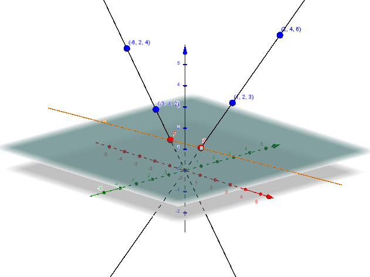
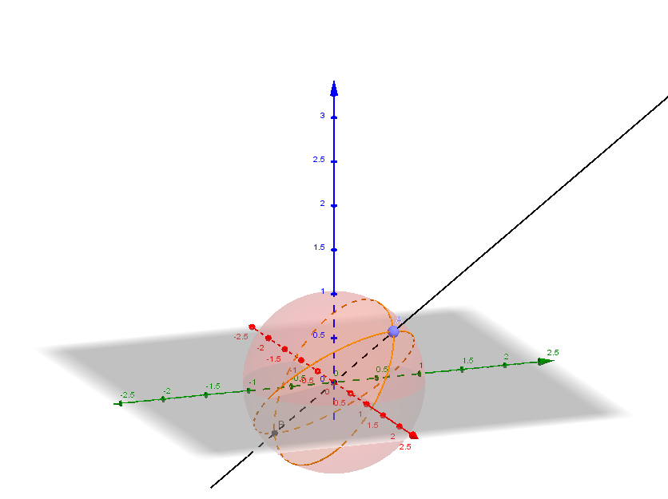

layout: true
class: typo, typo-selection

---

count: false
class: nord-dark, middle, center

# Projective Geometry in 1D

@luk036 👨🏻‍🏫

2020-06-06 📅

---

class: nord-light, middle, center

## 👋 Introduction

---

### 🔑 Key points

- A simplified version of the projective plane.

- Möbius transformation can be viewed as a projective transform of a complex projective point.

---

class: nord-light, middle, center

## Projective Line's Basic Elements

---

### Projective Line Concept

- Only involve "Points".

- "Points" is assumed to be distinguishable.

- Denote $A$ = $B$ as $A$ and $B$ are referred to the same point.

- E.g., $(1/3)$ = $(10/30)$

- We have the following rules:

  - $A$ = $A$ (reflective)
  - If $A$ = $B$, then $B$ = $A$ (symmetric)
  - If $A$ = $B$ and $B$ = $C$, then $A = C$ (transitive)

- Unless mention specifically, objects in different names are assumed
  to be distinct, i.e. $A \neq B$.

---

### Homogenous Coordinates

- Let $v_1 = [x_1, y_1]$ and $v_2 = [x_2, y_2]$.

  - dot product $v_1 \cdot v_2$ = $v_1^\mathsf{T} v_2$ = $x_1 x_2 + y_1 y_2$.
  - cross product $v_1 \times v_2$ = $x_1 y_2 - y_1 x_2$

- Then, we have:

  - $A = B$ if and only if $[A] \times [B] = 0$

- 📚 Example: the point $(5/10)$ and $(3/6)$ is the same because $5 \cdot 6 - 3 \cdot 10 = 0$

- The cross product is also used as a basic measure between two points.

- The cross ratio of four points $R_1(a, b; c, d)$ is given by:
  $$R_1(a, b; c, d) = (a \times c)(b \times d)/(a \times d)(b \times c)$$

---

### 📚 Example 1: Euclidean Geometry

- Point: projection of a 2D vector $p = [x, y]$ to 1D line $y = 1$:
  $$(x') = (x/y)$$

- $p_\infty = [x, 0]$ is a point at _infinity_.

- $[0, 0]$ is not a valid point.

---

### 📚 Example 1: Euclidean Geometry (measurement)

- The **quadrance** $Q$ between points $A_1$ and $A_2$ is:
  $$Q = (x'_1 - x'_2)^2 = (x_1 / y_1 - x_2 / y_2)^2$$

- Let $A_1$, $A_2$ and $A_3$ are points with $Q_1 \equiv Q(A_2, A_3)$, $Q_2 \equiv Q(A_1, A_3)$ and $Q_3 \equiv Q(A_1, A_2)$.

- TQF (Triple quad formula):
  $$(Q_1 + Q_2 + Q_3)^2 = 2(Q_1^2 + Q_2^2 + Q_3^2)$$

- TQF (non-symetric form):
  $$(Q_1 + Q_2 - Q_3)^2 = 4(Q_1 Q_2)$$

---

### Euclidean 1D plane from 2D vector

<!--
{#fig:euclidean}
-->

---

### 📚 Example 2: Elliptic Geometry

- "Point": projection of 2D vector $[x, y]$ to the unit circle.
  $$(x', y') = (x/r, y/r)$$

  where $r^2 = x^2 + y^2$.

- Two points on the opposite poles are considered the same point here.

---

### 📚 Example 2: Elliptic Geometry (measurement)

- The measure of two points is the "spread" of the point.

- The **spread** $S$ between points $A_1$ and $A_2$ is:
  $$s(A_1, A_2) = 1 - (x_1 x_2 + y_1 y_2)^2 / (x_1^2 + y_1^2)(x_2^2 + y_2^2)$$

- Let $A_1$, $A_2$ and $A_3$ are points with $S_1 \equiv S(A_2, A_3)$, $S_2 \equiv S(A_1, A_3)$ and $S_3 \equiv S(A_1, A_2)$.

- TSF (Triple spread formula):
  $$(S_1 + S_2 + S_3)^2 = 2(S_1^2 + S_2^2 + S_3^2) + 4 S_1 S_2 S_3.$$

<!--
{#fig:sphere}
-->

---

### 📚 Example 4: Hyperbolic Geometry

- A velocity "point": projection of a 2D vector $[p] = [x, t]$ to 1D line $t = 1$:
  $$(v) = (x/t)$$

- The measure of two velocity points is the relative speed of two points.

$$
\begin{array}{ll}
  \text{Speed}(p, q) &= (x_p t_q - t_p x_q)^2 / (x_p^2 - t_p^2)(x_q^2 - t_q^2) \\\\
    &= (v_p - v_q)^2 / (v_p^2 - 1)(v_q^2 - 1)
\end{array}
$$

- Assume that the speed of light is normalized as 1. Then Speed($p$, $q$) can never exceed 1 when $|v_p| \leq 1$ and $|v_q| \leq 1$.

---

### Projective Transformation

- Given a nonsingular matrix $T$ = $\begin{bmatrix} a & b \\\\ c & d \end{bmatrix}$. The transformation
  $$[x', y'] = \tau([x, y]) = [a x + b y, c x + d y]$$

- Let $z = x/y$, the formula becomes:
  $$z' = (a z + b)/(c z + d)$$

- This is exactly the Möbius transformation, where $z$ is a complex number.

- Möbius transformation plays an important role in the electromagetic theory.

- There are two fixed points in this transformation, considering infinity as also a fixed point.

---

class: nord-dark, middle, center

# 🙋 Q & A
