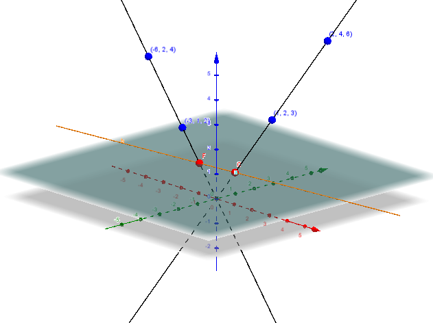
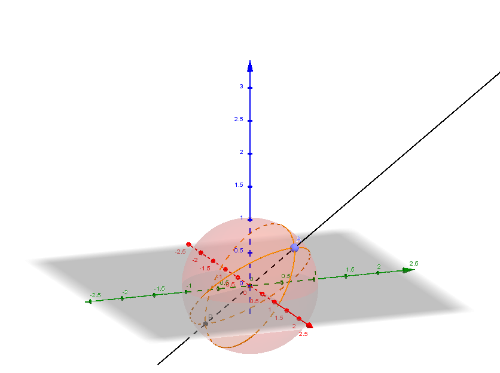

layout: true
class: typo, typo-selection

---

count: false
class: nord-dark, middle, center

# Projective Geometry in 1D

@luk036 👨‍💻 · 2026 📅

---

class: nord-light, middle, center

## 👋 Introduction

---

### 🔑 Key points

-   A simplified version of the projective plane.

-   Möbius transformation can be viewed as a projective transform of a complex projective point.

---

class: nord-light, middle, center

## Projective Line's Basic Elements

---

### Projective Line Concept

-   Only involve "Points".

-   "Points" is assumed to be distinguishable.

-   Denote ${\color{salmon}A}$ = ${\color{salmon}B}$ as ${\color{salmon}A}$ and ${\color{salmon}B}$ are referred to the same point.

-   E.g., ${\color{salmon}(1/3)}$ = ${\color{salmon}(10/30)}$

-   We have the following rules:

  -   ${\color{salmon}A}$ = ${\color{salmon}A}$ (reflective)
  -   If ${\color{salmon}A}$ = ${\color{salmon}B}$, then ${\color{salmon}B}$ = ${\color{salmon}A}$ (symmetric)
  -   If ${\color{salmon}A}$ = ${\color{salmon}B}$ and ${\color{salmon}B}$ = ${\color{salmon}C}$, then ${\color{salmon}A} = {\color{salmon}C}$ (transitive)

-   Unless mention specifically, objects in different names are assumed
  to be distinct, i.e. ${\color{salmon}A} \neq {\color{salmon}B}$.

---

### Homogenous Coordinates

-   Let ${\color{salmon}v_1} = [{\color{salmon}x_1}, {\color{salmon}y_1}]$ and ${\color{salmon}v_2} = [{\color{salmon}x_2}, {\color{salmon}y_2}]$.

  -   dot product ${\color{salmon}v_1} \cdot {\color{salmon}v_2}$ = ${\color{salmon}v_1}^\mathsf{T} {\color{salmon}v_2}$ = ${\color{salmon}x_1} {\color{salmon}x_2} + {\color{salmon}y_1} {\color{salmon}y_2}$.
  -   cross product ${\color{salmon}v_1} \times {\color{salmon}v_2}$ = ${\color{salmon}x_1} {\color{salmon}y_2} - {\color{salmon}y_1} {\color{salmon}x_2}$

-   Then, we have:

  -   ${\color{salmon}A} = {\color{salmon}B}$ if and only if $[{\color{salmon}A}] \times [{\color{salmon}B}] = 0$

-   📚 Example: the point ${\color{salmon}(5/10)}$ and ${\color{salmon}(3/6)}$ is the same because $5 \cdot 6 - 3 \cdot 10 = 0$

-   The cross product is also used as a basic measure between two points.

-   The cross ratio of four points ${\color{coral}R_1}({\color{salmon}a}, {\color{salmon}b}; {\color{salmon}c}, {\color{salmon}d})$ is given by:
  $${\color{coral}R_1}({\color{salmon}a}, {\color{salmon}b}; {\color{salmon}c}, {\color{salmon}d}) = ({\color{salmon}a} \times {\color{salmon}c})({\color{salmon}b} \times {\color{salmon}d})/({\color{salmon}a} \times {\color{salmon}d})({\color{salmon}b} \times {\color{salmon}c})$$

---

### 📚 Example 1: Euclidean Geometry

-   Point: projection of a 2D vector ${\color{salmon}p} = [{\color{salmon}x}, {\color{salmon}y}]$ to 1D line ${\color{steelblue}y} = 1$:
  $$({\color{salmon}{x'} }) = ({\color{salmon}x}/{\color{salmon}y})$$

-   ${\color{salmon}{p_\infty} } = [{\color{salmon}x}, 0]$ is a point at _infinity_.

-   ${\color{salmon}{[0, 0]} }$ is not a valid point.

---

### 📚 Example 1: Euclidean Geometry (measurement)

-   The **quadrance** ${\color{salmon}Q}$ between points ${\color{salmon}A_1}$ and ${\color{salmon}A_2}$ is:
  $${\color{salmon}Q} = ({\color{salmon}{x'_1} } - {\color{salmon}{x'_2} })^2 = ({\color{salmon}x_1} / {\color{salmon}y_1} - {\color{salmon}x_2} / {\color{salmon}y_2})^2$$

-   Let ${\color{salmon}A_1}$, ${\color{salmon}A_2}$ and ${\color{salmon}A_3}$ are points with ${\color{salmon}Q_1} \equiv {\color{salmon}Q}({\color{salmon}A_2}, {\color{salmon}A_3})$, ${\color{salmon}Q_2} \equiv {\color{salmon}Q}({\color{salmon}A_1}, {\color{salmon}A_3})$ and ${\color{salmon}Q_3} \equiv {\color{salmon}Q}({\color{salmon}A_1}, {\color{salmon}A_2})$.

-   TQF (Triple quad formula):
  $$({\color{salmon}Q_1} + {\color{salmon}Q_2} + {\color{salmon}Q_3})^2 = 2({\color{salmon}Q_1}^2 + {\color{salmon}Q_2}^2 + {\color{salmon}Q_3}^2)$$

-   TQF (non-symetric form):
  $$({\color{salmon}Q_1} + {\color{salmon}Q_2} - {\color{salmon}Q_3})^2 = 4({\color{salmon}Q_1} {\color{salmon}Q_2})$$

---

### Euclidean 1D plane from 2D vector

<!--
{#fig:euclidean}
-->

---

### 📚 Example 2: Elliptic Geometry

-   "Point": projection of 2D vector $[{\color{salmon}x}, {\color{salmon}y}]$ to the unit circle. ⭕
  $$({\color{salmon}{x'} }, {\color{salmon}{y'} }) = ({\color{salmon}x}/{\color{coral}r}, {\color{salmon}y}/{\color{coral}r})$$

    where ${\color{coral}r}^2 = {\color{salmon}x}^2 + {\color{salmon}y}^2$.

-   Two points on the opposite poles are considered the same point here.

---

### 📚 Example 2: Elliptic Geometry (measurement)

-   The measure of two points is the "spread" of the point.

-   The **spread** ${\color{salmon}S}$ between points ${\color{salmon}A_1}$ and ${\color{salmon}A_2}$ is:
  $${\color{green}s}({\color{salmon}A_1}, {\color{salmon}A_2}) = 1 - ({\color{salmon}x_1} {\color{salmon}x_2} + {\color{salmon}y_1} {\color{salmon}y_2})^2 / ({\color{salmon}x_1}^2 + {\color{salmon}y_1}^2)({\color{salmon}x_2}^2 + {\color{salmon}y_2}^2)$$

-   Let ${\color{salmon}A_1}$, ${\color{salmon}A_2}$ and ${\color{salmon}A_3}$ are points with ${\color{salmon}S_1} \equiv {\color{salmon}S}({\color{salmon}A_2}, {\color{salmon}A_3})$, ${\color{salmon}S_2} \equiv {\color{salmon}S}({\color{salmon}A_1}, {\color{salmon}A_3})$ and ${\color{salmon}S_3} \equiv {\color{salmon}S}({\color{salmon}A_1}, {\color{salmon}A_2})$.

-   TSF (Triple spread formula):
  $$({\color{salmon}S_1} + {\color{salmon}S_2} + {\color{salmon}S_3})^2 = 2({\color{salmon}S_1}^2 + {\color{salmon}S_2}^2 + {\color{salmon}S_3}^2) + 4 {\color{salmon}S_1} {\color{salmon}S_2} {\color{salmon}S_3}.$$

<!--
{#fig:sphere}
-->

---

### 📚 Example 4: Hyperbolic Geometry

-   A velocity "point": projection of a 2D vector $[{\color{salmon}p}] = [{\color{salmon}x}, {\color{salmon}t}]$ to 1D line ${\color{steelblue}t} = 1$:
  $$({\color{salmon}v}) = ({\color{salmon}x}/{\color{salmon}t})$$

-   The measure of two velocity points is the relative speed of two points.

$$
\begin{array}{ll}
  \text{Speed}({\color{salmon}p}, {\color{salmon}q}) &= ({\color{salmon}x_p} {\color{salmon}t_q} - {\color{salmon}t_p} {\color{salmon}x_q})^2 / ({\color{salmon}x_p}^2 - {\color{salmon}t_p}^2)({\color{salmon}x_q}^2 - {\color{salmon}t_q}^2) \\\\
    &= ({\color{salmon}v_p} - {\color{salmon}v_q})^2 / ({\color{salmon}v_p}^2 - 1)({\color{salmon}v_q}^2 - 1)
\end{array}
$$

-   Assume that the speed of light is normalized as 1. Then Speed(${\color{salmon}p}$, ${\color{salmon}q}$) can never exceed 1 when $|{\color{salmon}v_p}| \leq 1$ and $|{\color{salmon}v_q}| \leq 1$.

---

### Projective Transformation

-   Given a nonsingular matrix ${\color{green}T}$ = $\begin{bmatrix} {\color{coral}a} & {\color{coral}b} \\\\ {\color{coral}c} & {\color{coral}d} \end{bmatrix}$. The transformation
  $$[{\color{salmon}{x'} }, {\color{salmon}{y'} }] = {\color{green}\tau}([{\color{salmon}x}, {\color{salmon}y}]) = [{\color{coral}a} {\color{salmon}x} + {\color{coral}b} {\color{salmon}y}, {\color{coral}c} {\color{salmon}x} + {\color{coral}d} {\color{salmon}y}]$$

-   Let ${\color{coral}z} = {\color{salmon}x}/{\color{salmon}y}$, the formula becomes:
  $${\color{coral}{z'} } = ({\color{coral}a} {\color{coral}z} + {\color{coral}b})/({\color{coral}c} {\color{coral}z} + {\color{coral}d})$$

-   This is exactly the Möbius transformation, where ${\color{coral}z}$ is a complex number.

-   Möbius transformation plays an important role in the electromagetic theory.

-   There are two fixed points in this transformation, considering infinity as also a fixed point.

---

### 🔄 1D Projective Line Concepts

.mermaid[

<pre>
graph LR
    HC["Homogeneous\n Coordinates"] --> CP[Cross Product]
    CP --> CR[Cross Ratio]
    CR --> MT["Möbius\n Transformation"]

    style HC fill:#4caf50
    style CP fill:#2196f3
    style CR fill:#ff9800
    style MT fill:#9c27b0
</pre>

]

---

class: nord-dark, middle, center

## Q&A 🎤
