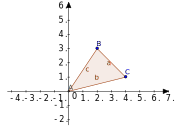
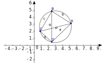

# Euclidean geometry

Wai-Shing Luk

2017-10-25 📅

---

# Basic

- Line at infinity $l_\infty = [0, 0, 1]$

- Two special points $\mathrm{I}$ and $\mathrm{J}$ on $l_\infty$ play an important role in Euclidean Geometry:

  - $\mathrm{I} = [1, -i, 0]$, $\mathrm{J} = [1, i, 0]$

- $\mathbf{A} = l_\infty \cdot l_\infty^\mathsf{T}$

- $\mathbf{B} = \mathrm{I} \cdot \mathrm{J}^\mathsf{T} + \mathrm{J} \cdot \mathrm{I}^\mathsf{T}$

- If we choose another line $l = M \cdot l_\infty$ as line of infinity

# Rational Trigonometry in Euclidean geometry

---

## Notations

- To distinguish with Euclidean geometry, points are written in capital letters.

---

## Quadrance and Spread in Euclidean geometry

- The **quadrance** $Q$ between points $A_1$ and $A_2$ is:
  $$Q = (x'_1 - x'_2)^2 + (y'_1 - y'_2)^2$$

- The **spread** $s$ between lines $l_1$ and $l_2$ is:
  $$s = (a_1 b_2 - a_2 b_1)^2/(a_1^2 + b_1^2)(a_1^2 + b_1^2)$$

- The **cross** $c$ between lines $l_1$ and $l_2$ is:
  $$c = 1 - s = (a_1 a_2 + b_1 b_2)^2/(a_1^2 + b_1^2)(a_1^2 + b_1^2)$$

---

## Triple formulate

- Let $A_1$, $A_2$ and $A_3$ are points with $Q_1 \equiv Q(A_2, A_3)$, $Q_2 \equiv Q(A_1, A_3)$ and $Q_3 \equiv Q(A_1, A_2)$. Let $l_1$, $l_2$ and $l_3$ are lines with $s_1 \equiv s(l_2, l_3)$, $s_2 \equiv s(l_1, l_3)$ and $s_3 \equiv s(l_1, l_2)$.

- Theorem (Triple quad formula): If $A_1$, $A_2$ and $A_3$ are collinear points then
  $$(Q_1 + Q_2 + Q_3)^2 = 2(Q_1^2 + Q_2^2 + Q_3^2)$$

- Theorem (Triple spread formula): If $l_1$, $l_2$ and $l_3$ are concurrent lines then
  $$(s_1 + s_2 + s_3)^2 = 2(s_1^2 + s_2^2 + s_3^2) + 4 s_1 s_2 s_3.$$

---

## Spread Law

- Suppose that triangle $\{A_1 A_2 A_3\}$ form quadrances $Q_1 \equiv Q(A_2, A_3)$, $Q_2 \equiv Q(A_1, A_3)$ and $Q_3 \equiv Q(A_1, A_2)$, and it dual trilateral $\{l_1 l_2 l_3\}$ form spreads $s_1 \equiv s(l_2, l_3)$, $s_2 \equiv s(l_1, l_3)$ and $s_3 \equiv s(l_1, l_2)$. Then:

- Theorem (Spread Law)
  $$\color{Green}{Q_1/s_1 = Q_2/s_2 = Q_3/s_3.}$$

- (Compare with the sine law in Euclidean Geometry):
  $$\color{red}{d_1/\sin \theta_1 = d_2/\sin \theta_2 = d_3/\sin \theta_3}.$$

---

# Cross Law

- Theorem (Cross law)
  $$\color{Green}{(Q_1 + Q_2 - Q_3)^2 = 4 Q_1 Q_2 (1 - s_3)}.$$

- (Compare with the Cosine law)
  $$\color{red}{d_3^2 = d_1^2 + d_2^2 - 2 d_1 d_2 \cos \theta_3}.$$

---

## Right triangles and Pythagoras

- Suppose that $\{A_1 A_2 A_3\}$ is a right triangle with $s_3 = 1$. Then

- Theorem (Thales)
  $$s_1 = Q_1 / Q_3 \; \text{and} \; s_2 = Q_2 / Q_3.$$

- Theorem (Pythagoras)
  $$Q_3 = Q_1 + Q_2.$$

---

## Archimedes' function

- Archimedes' function $A(Q_1, Q_2, Q_3)$

  $$
  Ar(Q_1, Q_2, Q_3)
    = (Q_1 + Q_2 + Q_3)^2 - 2(Q_1^2 + Q_2^2 + Q_3^2)
  $$

- Non-symmetric but more efficient version:
  $$
  \color{Green}{Ar(Q_1, Q_2, Q_3)
    = 4 Q_1 Q_2 - (Q_1 + Q_2 - Q_3)^2}
  $$

---

## Theorems

- Theorem (Archimedes' formula): If $Q_1 = d_1^2$, $Q_2 = d_2^2$ and $Q_3 = d_3^2$,
  then $Ar(Q_1, Q_2, Q_3)$ =
  $$(d_1 + d_2 + d_3) (d_1 + d_2 - d_3) (d_2 + d_3 - d_1) (d_3 + d_1 - d_2)$$

---

## Theorems (cont'd)

- Theorem: As a quadratic equation in $Q_3$, the TQF
  $Ar(Q_1, Q_2, Q_3) = 0$ can be rewritten as:
  $$Q_3^2 - 2(Q_1 + Q_2) Q_3 + (Q_1 - Q_2)^2 = 0$$

- Theorem: The quadratic equations
  $$(x - p_1)^2 = q_1$$ and
  $$(x - p_2)^2 = q_2$$ has a common solutions iff $A(q_1, q_2, (p_1 - p_2)^2) = 0$

---

## Heron's formula (Hero of Alexandria 60BC)

- The area of a triangle with side lengths $a, b, c$ is
  $$\color{red}{\text{area} = \sqrt{s (s - a)(s - b)(s - c)} }$$
  where
  $s = (a + b + c)/2$ is the semi-perimeter.

{#fig:heron}

---

## Archimedes' theorem

- The area of a planar triangle with quadrances $Q_1, Q_2, Q_3$ is given by
  $$\color{Green}{16(\text{area})^2 = Ar(Q_1, Q_2, Q_3)}$$

- Note: Given $Q_1, Q_2$. The area is maximum precisely when $Q_3 = Q_1 + Q_2$.

---

## Brahmagupta's formula (convex)

- Brahmagupta's theorem:
  $$\color{red}{\text{area} = \sqrt{(s - a) (s - b) (s - c) (s - d)} }$$ where
  $s = (a + b + c + d)/2$

- Preferred form: $16\text{area}^2$ =
  $$
  (-a + b + c + d)(a - b + c + d)
  (a + b - c + d)(a + b + c - d)
  $$

---

## Quadratic compatibility theorem

- Two quadratic equations
  $$(x - p_1)^2 = q_1, \qquad (x - p_2)^2 = q_2$$ are compatible iff
  $$[(p_1 + p_2)^2 - (q_1 + q_2)]^2 = 4 q_1 q_2$$ or
  $$Ar(q_1, q_2, (p_1 - p_2)^2) = 0$$

- In this case, if $p_1 \neq p_2$ then there is a unique sol'n:
  $$2 x = (p_1 + p_2) - (q_1 - q_2)/(p_1 - p_2)$$

---

## Quadruple Quad Formula

- Quadruple Quad Formula $Q(a,b,c,d)$
  $$= [(a+b+c+d)^2 - 2(a^2 + b^2 + c^2 + d^2)]^2 - 64 a b c d$$

- Note that $(a+b+c+d)^2 - 2(a^2 + b^2 + c^2 + d^2)$

  can be computed efficiently as:
  $$4(ab + cd) - (a + b - c - d)^2$$

---

## Brahmagupta's formula

- Brahmagupta's formula (convex): $B(a,b,c,d)$ =
  $$(b + c + d - a)(a + c + d - b)(a + b + d - c)(a + b + c - d) $$

- Robbin's formula (non-convex): $R(a,b,c,d)$ =
  $$(a + b + c + d)(a + b - c - d)(a - b + c - d)(b + c - a - d) $$

- Brahmagupta's identity
  $$Q(a^2,b^2,c^2,d^2) = B(a,b,c,d) \cdot R(a,b,c,d)$$

---

## Cyclic quadrilateral quadrea theorem

$$(\text{Area})^2 - 2 m (\text{Area}) + p = 0$$

where

$$
\begin{array}{lll}
   m &=& (Q_{12} + Q_{23} + Q_{34} + Q_{14})^2 - 2(Q_{12}^2 + Q_{23}^2 + Q_{34}^2 + Q_{14}^2)\\
     &=& 4(ab + cd) - (a + b - c - d)^2 \\
     &=& 4(Q_{12}Q_{23} + Q_{34}Q_{14}) - (Q_{12} + Q_{23} - Q_{34} - Q_{14})^2) \\
   p &=& Q(Q_{12}, Q_{23}, Q_{34}, Q_{14})
 \end{array}
$$

---

## Ptolemy's theorem & generalizations

- **Claudius Ptolemy**: 90-168 A.D. (Alexandria) Astronomer & geographer & mathematician

- **Ptolemy's theorem** If $\{ABCD\}$ is a cyclic quadrilateral with the lengths $a, b, c, d$ and diagonal lengths $p, q$, then
  $$a\,b + c\,d = p\,q$$
  [Actually needs convexity!]

---

## Ptolemy's theorem

{#fig:Ptolemy}

---

## Exercise

- Ex. $A_1 = (1,0)$, $A_2 = (3/5, 4/5)$, $A_3 = (-12/13, 5/13)$, $A_4 = (15/17, -8/17)$

- Then the quadrances are:
  $$Q_{12} = 4/5, Q_{23} = 162/65, Q_{34} = 882/221, Q_{14} = 4/17$$

- The diagonal quadrances are:
  $$Q_{24} = 144/85, Q_{13} = 50/13$$

---

## Ptolemy's theorem (rational version)

- Ptolemy's theorem (rational version): If $A_1 A_2 A_3 A_4$_ is a cyclic quadrilateral
  with quadrances $Q_{ij} \equiv Q(A_i, A_j), i,j=1,2,3,4$ then

  $$\color{Green}{Ar(Q_{12}Q_{34},Q_{23}Q_{14},Q_{13}Q_{24}) = 0}$$

- Ex. For $A_1 = (1,0)$, $A_2 = (3/5, 4/5)$, $A_3 = (-12/13, 5/13)$, $A_4 = (15/17, -8/17)$ with

  $$Q_{12} = 4/5, Q_{23} = 162/65$$

  $$Q_{34} = 882/221, Q_{14} = 4/17$$

  $$Q_{24} = 144/85, Q_{13} = 50/13$$

- we can verify directly that $A(Q_{12}Q_{34},Q_{23}Q_{14},Q_{13}Q_{24}) = 0$.

- Note that with the rational form of Ptolemy's theorem, the three quantities appear _symmetrically_: so _convexity_ of the cyclic quadrilateral is no longer required!

---

## Proof of Ptolemy's theorem

Sketch of the proof:

- Without loss of generality, we can assume that the circle is a unit circle.
- Recall that a point on a unit circle can be parameterized as:
  $$uc = [\lambda^2 - \mu^2, 2 \lambda \mu, \lambda^2 + \mu^2],$$
  where $\lambda$ and $\mu$ are not both zero.
- Let $A_i = uc(\lambda_i, \mu_i), i = 1, 2, 3, 4$.
- Express $Q_{ij} \equiv Q(A_i, A_j), i,j=1,2,3,4$ in terms of $\lambda$'s and $\mu$'s
- Express $Ar(Q_{12}Q_{34},Q_{23}Q_{14},Q_{13}Q_{24})$ in terms of $\lambda$'s and $\mu$'s.
- Simplify the expression and derive that it is equal to 0. (we may use the Python's symbolic package for the calculation. It took about 8 minutes on my computer :-)

---

## 🐍 Python Code

```python
from __future__ import print_function
from pprint import pprint
import numpy as np
from fractions import *
from proj_geom import *

def quad1(x1, z1, x2, z2):
    if isinstance(x1, int):
        return (Fraction(x1,z1) - Fraction(x2,z2))**2
    else:
        return (x1/z1 - x2/z2)**2

def quadrance(a1, a2):
    return quad1(a1[0], a1[2], a2[0], a2[2]) + \
            quad1(a1[1], a1[2], a2[1], a2[2])

def uc_point(lambda1, mu1):
    return pg_point([lambda1**2 - mu1**2,
                2*lambda1*mu1, lambda1**2 + mu1**2])

def Ar(a, b, c):
    ''' Archimedes's function '''
    return (4*a*b) - (a + b - c)**2
```

---

## 🐍 Python Code

```python
if __name__ == "__main__":
    import sympy
    sympy.init_printing()

    lambda1, mu1 = sympy.symbols("lambda1 mu1", integer=True)
    lambda2, mu2 = sympy.symbols("lambda2 mu2", integer=True)
    lambda3, mu3 = sympy.symbols("lambda3 mu3", integer=True)
    lambda4, mu4 = sympy.symbols("lambda4 mu4", integer=True)
    a1 = uc_point(lambda1, mu1)
    a2 = uc_point(lambda2, mu2)
    a3 = uc_point(lambda3, mu3)
    a4 = uc_point(lambda4, mu4)
    q12 = quadrance(a1, a2)
    q23 = quadrance(a2, a3)
    q34 = quadrance(a3, a4)
    q14 = quadrance(a1, a4)
    q24 = quadrance(a2, a4)
    q13 = quadrance(a1, a3)
    t = Ar(q12*q34, q23*q14, q13*q24)
    t = sympy.simplify(t)
    print(t) # get 0
```

---

## Backup

```terminal
>  pandoc -t latex -F pandoc-crossref -o temp2.svg .\01proj_geom.md .\02ck_geom.md .\03RT.md .\04RT_2.md latex.yaml .\crossref.yaml
>  pandoc -t beamer -F pandoc-crossref -o temp2.svg .\01proj_geom.md .\02ck_geom.md .\03RT.md .\04RT_2.md beamer.yaml .\crossref_2.yaml
```

# Q & A 🎤
